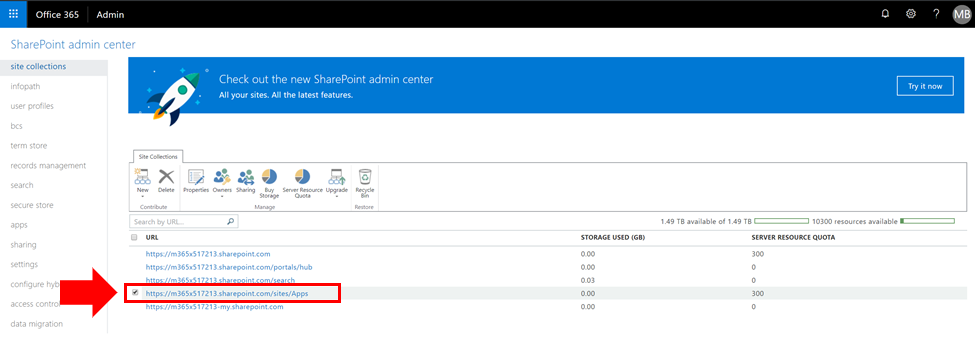
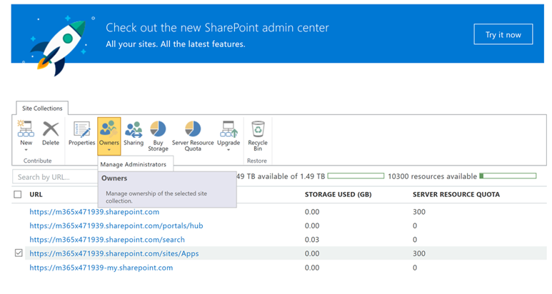
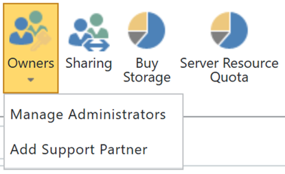

# Ver o agregar un administrador al Catálogo de aplicaciones de SharePoint Online

Para instalar CORRECTAmente CLO365, la persona que realiza el aprovisionamiento de la solución debe aparecer como administrador del catálogo de aplicaciones de inquilino.

1. Desde el portal de administración de Office 365 vaya al Centro de administración de SharePoint Online
1. **Seleccione** la dirección URL del catálogo de aplicaciones de la lista de colecciones de 
1. Confirme que el instalador de CLO365 aparece como uno de los administradores del catálogo de aplicaciones.

Si su nombre de usuario aparece, puede volver al aprovisionamiento del sitio de aprendizaje personalizado.  Si no se completan los pasos siguientes. 

## Agregar un administrador

1. En el Centro de administración de SharePoint, active la casilla situada junto a la dirección URL del catálogo de aplicaciones y seleccione el cuadro desplegable Propietarios.

1. Seleccione Administrar administradores en la vista de detalles del menú desplegable 
1. Agregue la persona correcta como administrador de la colección de sitios y haga clic en Aceptar para guardar los cambios.
