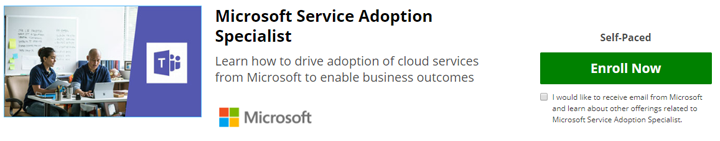

# Validar sus habilidades - Conviértase en un especialista de adopción de servicio

Si la adopción de servicio es una parte de su función o desea ir más allá con aprendizaje formal en este tema puede inscribirse en el curso en línea proporcionado por Microsoft en nuestro sitio de socio, EdX.org. 

En este [curso en línea para especialistas de adopción de servicio](https://aka.ms/AdoptionCert) es **libre de auditoría**.  Si desea recibir su certificado EdX para la finalización de una tarifa de $99,00 es necesario.  En este curso se ha creado por [Karuana Gatimu](https://linkedin.com/in/karuanagatimu) de los equipos de ingeniería de Microsoft con la entrada de varios expertos MVP de Microsoft y Microsoft IT.  Los procedimientos recomendados incluidos en recopilada de observación de toda la industria y son complementarios a una educación de administración de cambios en la organización formal.  

Una guía práctica, herramientas y contenido adicional se encuentran en este curso que le permitirá validar sus conocimientos en esta capacidad empresariales importantes.  

Obtenga más información en nuestro [anuncio](https://aka.ms/AdoptionCertAnnouncement) acerca de la publicación de este curso. 

Unirse a nuestro Comunidad en línea de los usuarios profesionales y aprendizaje de los profesionales de TI sobre adopción en https://aka.ms/DriveAdoption. 