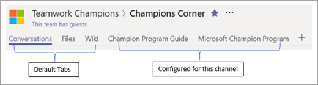

# Encontrar a los campeonesFinding your Champions 

Es probable que ya sepa quiénes son sus campeones, incluso si actualmente no tiene un programa formal.It is likely you already know who your champions are, even if you do not currently have a formal program.  Se trata de personas que:These are people who:

A menudo se ve cómo ayudar a otros usuarios con tecnología existente Disfrutar de la enseñanza y el aprendizaje sobre las nuevas tecnologías Puede ser una voz sobre las limitaciones de las soluciones actuales Están interesados en probar cosas nuevas, incluso antes que otros compañeros de trabajoAre often seen helping others with existing technology Enjoy teaching and learning about new technology May be vocal about the limitations of current solutions Are keen to try new things, even before other co-workers

> [!NOTE]
> Los campeones son diferentes de las personas que disfrutan probando nuevo software solo para la tecnología.Champions are different from people who enjoy testing new software for the technology alone. Los campeones prosperan **al ayudar a otros,** independientemente del contexto.Champions thrive on **helping others** regardless of context. 

## Empezar pequeño y crecerStart small and grow

Si su organización no tiene un programa champion actual o desea volver a vigorizar el que ha enviado una invitación a un pequeño grupo de personas conocidas que se ajustan al perfil anterior.If your organization does not have a current Champion program or you would like to reinvigorate the one you have send an invitation to a small group of known people who fit the above profile.  Reúnase para analizar los objetivos del nuevo programa y obtener sus comentarios.Gather then together to discuss the goals of the new program and get their feedback. A los verdaderos campeones les gusta que su voz se escuche y sienta como si forma parte de la creación de algo.True Champions like to have their voice heard and feel as if they are a part of creating something.  

## Proporcionar estructuraProvide structure

Los programas de campeones exitosos tienen un líder y una programación regular para reunirse y tratar los problemas actuales.Successful champion programs have a leader and a regular schedule to meet and discuss current issues.  Las reuniones mensuales como mínimo son una parte importante de crear una cultura positiva en la comunidad y fomentar el crecimiento.Monthly meetings at a minimum are an important part of creating a positive culture in the community and fostering growth.  

También puedes usar Microsoft Teams para crear un centro para el programa de campeones de trabajo en equipo.You can also use Microsoft Teams to create a hub for your Teamwork Champions' program.  En este artículo se puede encontrar un ejemplo de esa estructura [de grupo.](/MicrosoftTeams/teams-adoption-your-first-teams)An example for that team structure can be found in [this article](/MicrosoftTeams/teams-adoption-your-first-teams).

