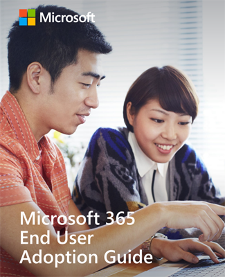

# Guía de adopción de Microsoft para usuarios finales de 365

Para obtener más información sobre este tema, use la [Guía de adopción del usuario final de Microsoft 365](https://aka.ms/adoptionguide). Esta guía presenta los pasos para impulsar la adopción por parte del usuario final en las siguientes áreas clave:

- Las partes interesadas
- Escenarios
- Reconocimiento
- Aprendizaje 
- Planeación, implementación y administración de cambios
- 
- Actualizamos esta guía con frecuencia para incorporar nueva información.