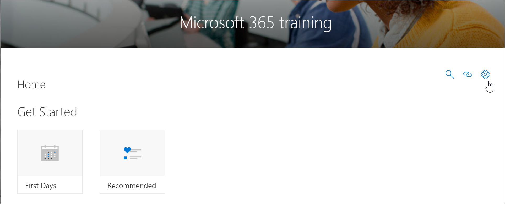
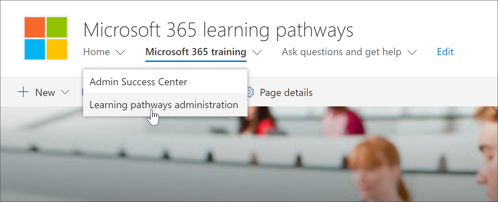

# Acceso a la página de administración de caminos de aprendizaje

La administración de rutas de aprendizaje se administra desde la página CustomLearningAdmin. aspx. Esta página de administración solo está disponible para los administradores de SharePoint. Los usuarios con privilegios de miembro que visiten el sitio no verán el icono de engranaje de **Administración** en el elemento Web. Además, solo los administradores tendrán la posibilidad de abrir la página de administración desde el elemento de menú **Administración de rutas de aprendizaje** en el menú de **Inicio** de SharePoint. 

> [!IMPORTANT]
> Los cambios realizados en la página de administración de aprendizaje personalizada, como ocultar una subcategoría de producto o una lista de reproducción, se reflejarán en todas las instancias del elemento Web. Además, se recomienda que en el momento de cada administrador realice cambios desde la página de administración, ya que el aprendizaje personalizado no ofrece la detección de colisiones si varias personas usan la página al mismo tiempo.  

## Acceso desde el método preferido del elemento Web caminos de aprendizaje
La apertura de la página de administración desde el elemento Web es el método preferido, ya que abre la página en una nueva pestaña del explorador. Con este método, es fácil desplazarse hacia delante y hacia atrás entre las páginas con fichas para comprobar o modificar el trabajo.  

1. En la página **principal** de los caminos de aprendizaje de Microsoft 365, haga clic en el icono de **aprendizaje de Office 365** .
2. Haga clic en el icono **Administración** en el elemento Web como se muestra en el siguiente ejemplo  

## Acceso desde el elemento de menú Inicio
En lugar de ir a una página con un elemento Web, los administradores pueden tener acceso a la página de administración desde el elemento de menú **principal** de SharePoint. 

- En la Página principal de Microsoft 365 Learning Pathways, haga clic en el menú **Inicio** y, a continuación, haga clic en **Administración de Microsoft Learning**.

