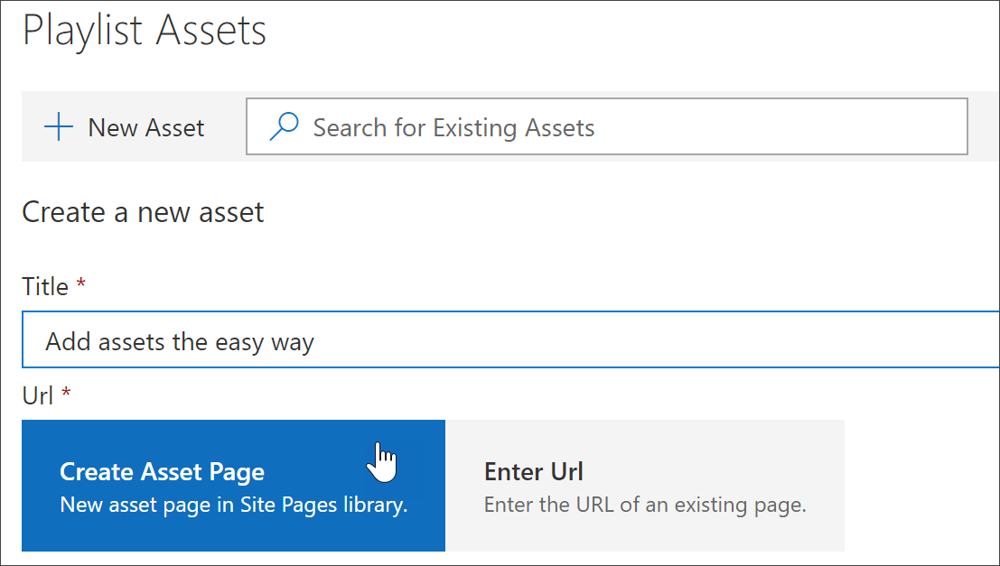
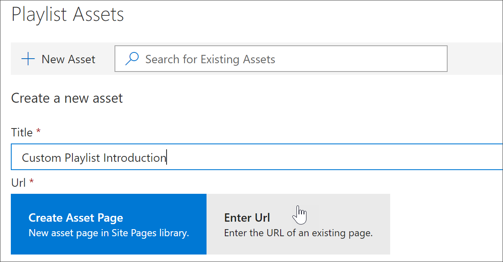
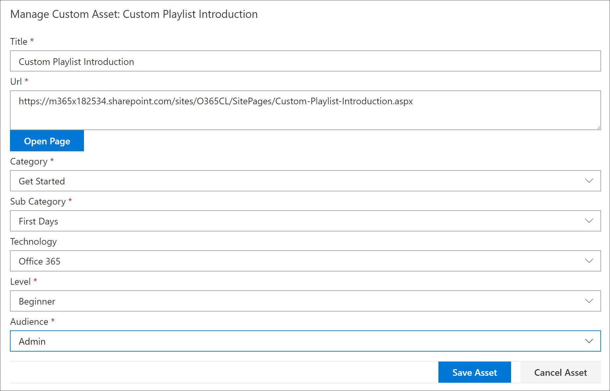
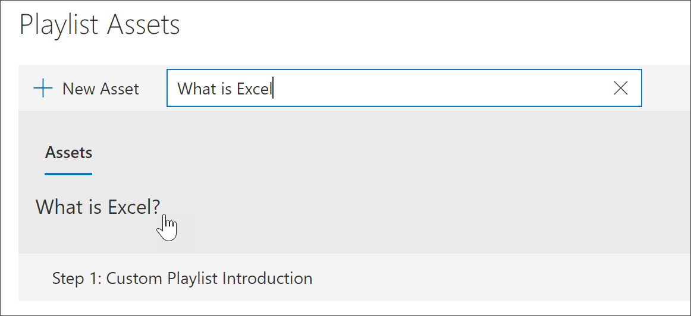
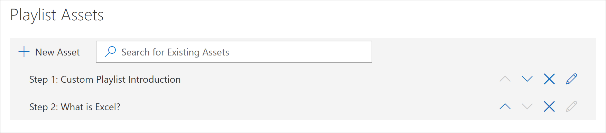
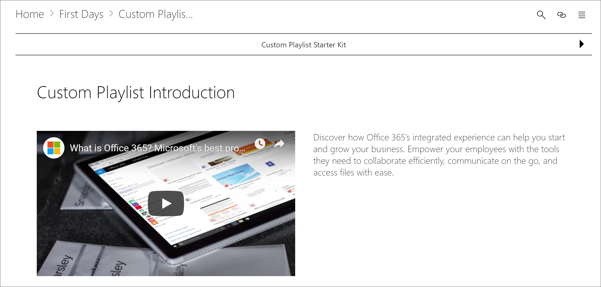

# Agregar activos a una lista de reproducción personalizada

Con aprendizaje personalizado, puede Agregar los siguientes activos a una lista de reproducción:

- **Recursos de aprendizaje personalizados existentes** : son activos que forman parte del catálogo de Microsoft online o activos que su organización ya ha agregado al aprendizaje personalizado.
- **Activos nuevos** : son activos que se agregan a los conocimientos personalizados creados a partir de páginas de SharePoint que se crean o activos de SharePoint que ya están disponibles en un sitio de SharePoint de la organización. 

> [!TIP]
> Si un activo de la lista de reproducción de Microsoft no satisface sus necesidades, cree una nueva lista de reproducción y, a continuación, agregue los activos de Microsoft y los activos recién creados a la lista de reproducción para crear la experiencia que desee. No puede modificar listas de reproducción de aprendizaje personalizadas proporcionadas por Microsoft, pero puede agregar recursos personalizados proporcionados por el aprendizaje a una lista de reproducción personalizada.   

## Crear un nuevo activo para una lista de reproducción

Hay dos opciones para agregar un nuevo activo a una lista de reproducción.

- **Crear página de activos** : con esta opción, el aprendizaje personalizado generará una nueva página de SharePoint en blanco y la agregará a la lista de reproducción. A continuación, puede agregar contenido a la página y guardarla.  
- **Escriba la dirección URL** con esta opción, se genera la página previamente o ya está disponible la página y se especifica la dirección URL para agregar la página a la lista de reproducción.

### Página de creación de activos 
Con la opción **Crear página de activos** , proporcione un título para el activo y, a continuación, haga clic en crear página de activos para crear y abrir una nueva página de SharePoint para su edición. 

1.  Si la lista de reproducción no está abierta para su edición, en la página **Administración de aprendizaje personalizada** , haga clic en la lista de reproducción que desea editar. 
2. Para agregar un nuevo activo a una lista de reproducción, haga clic en **nuevo activo**. 
3. Escriba un título. En este ejemplo, escriba "agregar activos a una lista de reproducción" y, a continuación, haga clic en **Crear página de activos**.

4. Haga clic en **abrir página**.
5. Haga clic en el icono **Editar** y, a continuación, haga clic en **Editar elemento Web** en el área de título.
6. En **diseño**, haga clic en **sin formato**. 
7. Agregue una nueva sección de una columna y, a continuación, agregue texto de ejemplo a la página para que tenga un aspecto similar al del ejemplo siguiente. 

7. Haga clic en **Publicar**.
8. Volver a la página **Administración de aprendizaje personalizada** . 
9. ReLlene el resto de las propiedades del activo y, a continuación, haga clic en **Guardar activo.**

### Escriba la dirección URL
Con la opción **escribir la dirección URL** , proporcione un título para el activo y, a continuación, haga clic en **escribir la dirección URL** para especificar la página de SharePoint que desea agregar a la lista de reproducción. 

1.  Si la lista de reproducción no está abierta para su edición, en la página **Administración de aprendizaje personalizada** , haga clic en la lista de reproducción que desea editar. 
2. Para agregar un nuevo activo a una lista de reproducción, haga clic en **nuevo activo**. 
3. Escriba un título. En este ejemplo, escriba "Introducción a la lista de reproducción personalizada" y, a continuación, haga clic en **escribir dirección URL**. 

4. Escriba la dirección URL de la página de SharePoint que ha creado en una sección anterior [crear páginas de SharePoint para listas de reproducción personalizadas](custom_createnewpage.md) y, a continuación, rellene el resto de los campos, tal como se muestra en la siguiente ilustración.

5. Haga clic en **Guardar activo**. 

## Agregar un activo existente a una lista de reproducción

Los activos existentes están formados por recursos de aprendizaje personalizados de Microsoft o activos que ya se agregaron al aprendizaje personalizado de su organización. 

- En el cuadro de **búsqueda** , escriba una frase de búsqueda y, a continuación, seleccione un activo de los resultados de búsqueda. En este ejemplo, escriba "¿Qué es Excel?". para agregar un tema de introducción de Excel a la lista de reproducción.

## Editar, mover y eliminar activos
Puede modificar los activos personalizados que cree, pero no los activos de Microsoft. Sin embargo, puede quitar todos los activos de una lista de reproducción y cambiar los activos del pedido. 

### Edición de un activo
- Haga clic en el botón Editar de un activo, modifique el activo y, a continuación, haga clic en guardar activo. 

### Mover un activo en una lista de reproducción
- Haga clic en la flecha hacia arriba o hacia abajo situada a la derecha del recurso para mover el orden de los activos en la lista de reproducción

### Quitar un activo de una lista de reproducción
- Haga clic en el icono quitar de la lista de reproducción X del activo. 

## Ver la lista de reproducción en acción
Ahora que ha agregado activos a una lista de reproducción, vamos a cerrar la lista de reproducción y verla en funcionamiento. 

1. Haga clic en **cerrar lista de reproducción**.
2. Haga clic en la pestaña con la página de **aprendizaje de Office 365** .
3. Actualice la página y, a continuación, haga clic en **primeros días** en **Introducción**.
4. Haga clic en **Kit de inicio de aprendizaje personalizado** para ver la primera lista de reproducción en acción. 

