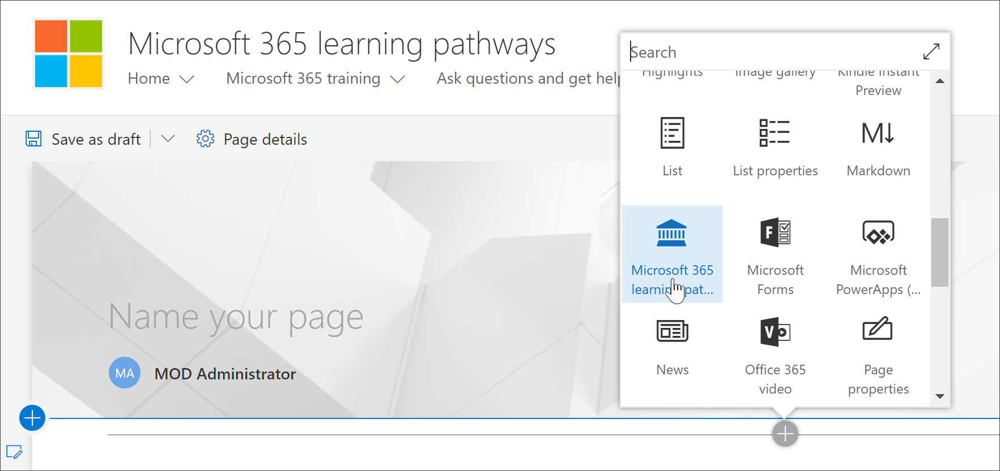
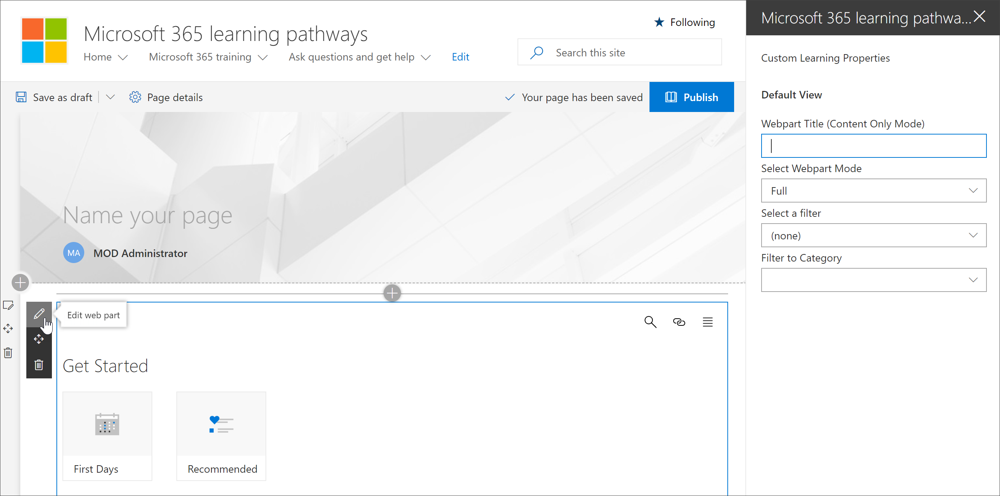
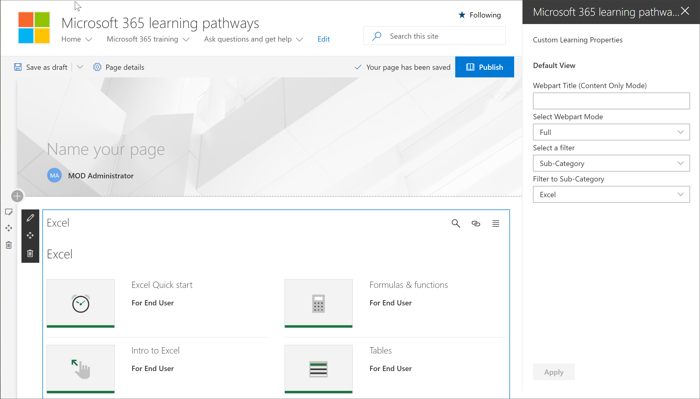

# Agregar y editar el elemento web Microsoft 365 rutas de aprendizajeAdd and Edit the Microsoft 365 learning pathways web part

Microsoft 365 caminos de aprendizaje le ofrece la flexibilidad de agregar el elemento web caminos de aprendizaje de Microsoft 365 a una página de SharePoint y, a continuación, filtrar el contenido del elemento web para cumplir los objetivos de aprendizaje de la página.Microsoft 365 learning pathways gives you the flexibility to add the Microsoft 365 learning pathways web part to a SharePoint page, and then filter the contents of the Web part to meet the learning objectives for the page. Por ejemplo, puede crear una página "Hacer que cambie a OneDrive" y, a continuación, agregar el elemento web y configurarlo para mostrar listas de reproducción de migración de OneDrive personalizadas creadas especialmente para su organización.For example, you could create a "Make the Switch to OneDrive" page, then add the Web part and configure it to show custom OneDrive migration playlists created especially for your organization.

1.  Haga clic en el SharePoint engranaje y, a continuación, haga clic **en Agregar una página**.Click the SharePoint Gear icon, and then click **Add a page**.
2.  Haga **clic en Agregar una nueva sección (+)** en el lado izquierdo de la página y, a continuación, haga clic en Una **columna**.Click **Add a new section (+)** on the left-hand side of the page, and then click **One Column**.
3.  Haga **+** clic en y, a **continuación, Microsoft 365 elemento** web caminos de aprendizaje.Click **+**, then select **Microsoft 365 learning pathways** web part. 

## Editar el elemento web aprendizaje personalizadoEdit the Custom Learning web part
Puede editar el elemento web Microsoft 365 caminos de aprendizaje para mostrar todo el contenido de Aprendizaje personalizado disponible o una categoría, subcategoría, lista de reproducción o activo específico.You can the edit the Microsoft 365 learning pathways web part to show all the available Custom Learning content or a specific category, subcategory, playlist, or asset. 

1.  Haga **clic en Editar elemento web**.Click **Edit web part**.

2. En el panel Propiedades de aprendizaje personalizadas, filtre el elemento web para lo siguiente.In the Custom Learning Properties pane, filter the Web part for the following. 

- Modo de elemento web: completoWebpart Mode: Full
- Filtro: SubcategoríaFilter: Subcategory
- Subcategoría: ExcelSubcategory: Excel

3. La página ahora debería tener un aspecto parecido a la siguiente imagen:Your page should now look something like the following image: 

## Agregar un título y publicar la páginaAdd a title and publish the page
1. En el área de título de la página, escriba "Crear su propia experiencia".In the title area of the page, type "Create your own experience".
2. Haga clic **en el icono Editar elemento web** en el área Título, seleccione Sin **formato** en **Diseño** y, a continuación, cierre el **panel** Propiedades.Click the **Edit web part** icon in the Title area, select **Plain** under **Layout**, and then close the **Properties** pane.
3. Haga clic en **Publicar**.Click **Publish**.
