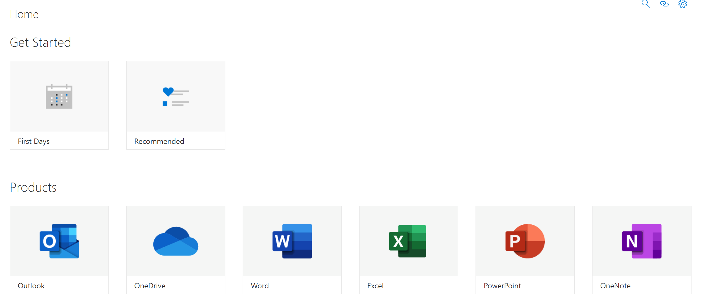

# Introducción a las páginas de aplicación de SharePoint

Las rutas de aprendizaje proporcionan dos páginas de aplicación de SharePoint que debe conocer como administrador. Estas dos páginas no son editables y no deben eliminarse. 

- CustomLearningAdmin.aspx
- CustomLearningViewer.aspx

## CustomLearningAdmin.aspx

La página CustomLearningAdmin.aspx proporciona características administrativas para las rutas de aprendizaje, como ocultar y mostrar contenido y crear y editar subcategorías y listas de reproducción. Vamos a cubrir esta página y su funcionalidad con más detalle en secciones posteriores.

### Ver CustomLearningAdmin.aspx

1. Haga clic en el icono Configuración **de** SharePoint y, a continuación, haga clic en **Páginas del** sitio contenido  >  **del sitio**. 
2. Haga **clic en CustomLearningAdmin.aspx**. 

## CustomLearningViewer.aspx
La página CustomLearningViewer.aspx proporciona un visor para mostrar el contenido de las rutas de aprendizaje en el elemento web. Por ejemplo, si copia un vínculo Lista de reproducción y lo comparte con un compañero de trabajo, el vínculo, cuando se hace clic, lleva al usuario a la página Visor y muestra el contenido vinculado. 

### Ver CustomLearningViewer.aspx

1. Haga clic en el icono Configuración **de** SharePoint y, a continuación, haga clic en **Páginas del** sitio contenido  >  **del sitio**. 
2. Haga **clic en CustomLearningViewer.aspx**. 

