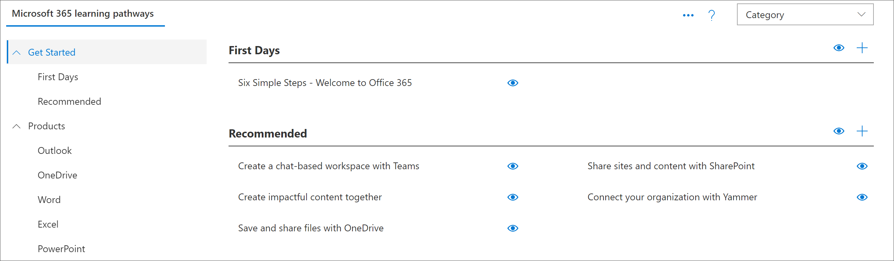

# Introducción a las páginas de aplicación de SharePoint

Caminos de aprendizaje proporciona dos páginas de aplicación de SharePoint que debe conocer como administrador. Estas dos páginas no se pueden editar y no deben eliminarse. 

- CustomLearningAdmin. aspx
- CustomLearningViewer. aspx

## CustomLearningAdmin. aspx

La página CustomLearningAdmin. aspx proporciona características administrativas para las rutas de aprendizaje, como ocultar y mostrar contenido, y crear y editar subcategorías y listas de reproducción. Abordaremos esta página y su funcionalidad con más detalle en secciones posteriores.

### Ver CustomLearningAdmin. aspx

1. Haga clic en el icono **configuración** de SharePoint y, a continuación, en**páginas de sitio**del contenido > del **sitio**. 
2. Haga clic en **CustomLearningAdmin. aspx**. 

## CustomLearningViewer. aspx
La página CustomLearningViewer. aspx proporciona un visor para mostrar contenido de rutas de aprendizaje en el elemento Web. Por ejemplo, si copia un vínculo de la lista de reproducción y lo comparte con un compañero de trabajo, el vínculo, al hacer clic en él, llevará al usuario a la página del visor y mostrará el contenido vinculado. 

### Ver CustomLearningViewer. aspx

1. Haga clic en el icono **configuración** de SharePoint y, a continuación, en**páginas de sitio**del contenido > del **sitio**. 
2. Haga clic en **CustomLearningViewer. aspx**. 

