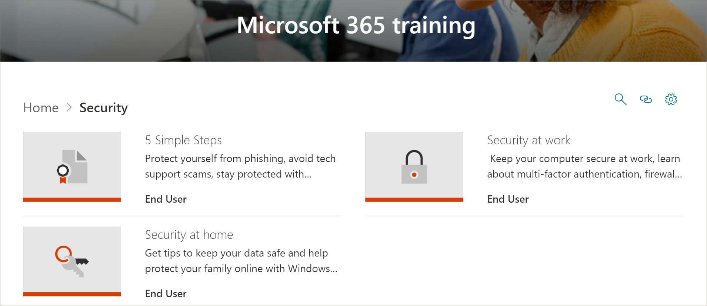

# Actualizaciones de contenido de Microsoft 365 Learning Pathways
Caminos de aprendizaje se esfuerza en adherirse a un ciclo de actualización de contenido trimestral. A continuación, se enumeran las actualizaciones de contenido de septiembre de 2020.

## Actualizaciones de contenido de septiembre de 2020
Caminos de aprendizaje se esfuerza en adherirse a un ciclo de actualización de contenido trimestral. Para obtener más información sobre cómo se aplican las actualizaciones de contenido y cómo administrar las actualizaciones de contenido, consulte [Manage Content updates](custom_contentupdatesmanage.md). 

> [!IMPORTANT]
> La actualización del contenido de septiembre se ha lanzado para inglés, Chino (simplificado), Francés, alemán, Italiano, Japonés, Portugués (brasileño), Ruso y español.  

### Seguridad
Se ha agregado una nueva Subcategoría seguridad con listas de reproducción y recursos para ayudar a los usuarios a trabajar de forma más segura en la oficina y en el hogar. 

#### Lista de reproducción "pasos sencillos"
- Protéjase de la suplantación de identidad
- Evitar estafas de soporte técnico
- Trabajar desde casa de forma más segura
- Mantén tu PC al día
- Manténgase protegido con la seguridad de Windows

#### Lista de reproducción "seguridad en casa"
- Sugerencias para mantener seguros sus datos
- Mantener el equipo seguro en casa
- Ayudar a proteger a su familia en línea con la seguridad de Windows   

#### Lista de reproducción "seguridad en el trabajo"
- Mantener el equipo protegido en el trabajo
- ¿Qué es la autenticación multifactor?
- Firewall y protección de red en la seguridad de Windows
- Impedir cambios en la configuración de seguridad con la protección contra alteraciones

### Lista de reproducción "Introducción a Teams"
Se ha agregado una nueva lista de reproducción "Introducción a Microsoft Teams" a la subcategoría "introducción/primeros días" para ayudar a los usuarios a ponerse en marcha con Microsoft Teams. La lista de reproducción incluye:
- Bienvenido a Microsoft Teams  
- Poner en marcha su equipo
- Trabajar en canales  
- Cargar y compartir archivos 
- Iniciar y anclar chats  
- Unirse a una reunión de Microsoft Teams 
- Administrar reuniones 
 
### Conceptos básicos de Microsoft 365
En la categoría productos, se ha actualizado la subcategoría "conceptos básicos de Office 365" a la categoría "conceptos básicos de Microsoft 365". Los activos retirados de la categoría "conceptos básicos de Office 365" seguirán estando disponibles si se han agregado a una lista de reproducción personalizada.

#### Lista de reproducción "introducción"
- ¿Qué es Microsoft 365?
- Iniciar sesión
- Office.com

#### Lista de reproducción "crear y guardar"
- Uso de las aplicaciones de escritorio
- Uso de aplicaciones de Office.com
- Guardar archivos en la nube
- Sincronizar archivos a petición con OneDrive

#### Lista de reproducción "compartir y colaborar"
- Compartir archivos en Microsoft 365
- Coautoría
- Usar @mentions
- Seguimientos

#### Lista de reproducción "trabajar con Microsoft Teams"
- Bienvenido a Microsoft Teams
- Información general de los equipos y canales
- Crear y dar formato a una publicación
- Iniciar y anclar chats
- Realizar llamadas
- Unirse a una reunión de Microsoft Teams
- Sugerencias para mejorar las reuniones

#### "Sacar el máximo partido de la lista de reproducción de Windows"
- Buscar documentos, aplicaciones y mucho más con la búsqueda
- Microsoft Edge
- Búsqueda de Microsoft en Bing

#### Lista de reproducción "trabajar desde cualquier lugar"
- Aplicación móvil de OneDrive
- Aplicación móvil de Outlook

#### Lista de reproducción "fantásticas características de Microsoft 365"
- Diseñador de PowerPoint
- Ideas en Excel
- Editor en Word
- Hacer que el contenido sea accesible

### Lista de reproducción "crear un gráfico" en Access
Se ha agregado un "crear lista de reproducción de gráfico" a la subcategoría "Products\Access".  
- Crear un gráfico de columnas
- Crear un gráfico de barras
- Crear un gráfico de líneas
- Crear un gráfico circular
- Crear un gráfico combinado

### Actualizaciones de Microsoft Teams
La subcategoría "Product\Microsoft Teams" se ha actualizado con los siguientes activos. 

#### Lista de reproducción de "administrar reuniones"
- Unirse a una reunión de Microsoft Teams
#### Lista de reproducción "trabajar con publicaciones y mensajes"
- Crear y dar formato a una publicación

### Planner 
Se han agregado los siguientes activos a la lista de reproducción "usar planeador" en "Products\Planner".
#### Usar lista de reproducción de Planner
- Para realizar vs Planner
- Ver las tareas de Planner en tareas pendientes
- Usar la aplicación tareas en Microsoft Teams

### Word
El siguiente activo se ha actualizado en la lista de reproducción "compartir y coautoría con Word".

#### Lista de reproducción "compartir y co-autoría con Word"
- Se ha actualizado el activo "colaborar en documentos de Word con co-autoría en tiempo real". 

### Office para la web
Se ha actualizado el siguiente activo en la lista de reproducción de "Office para la web: Word para el Web".

#### Lista de reproducción de "Office para la web: Word para el Web"
- Transcribir las grabaciones

### PowerPoint (nuevo, actualizado)
Los siguientes activos se han actualizado o agregado a las listas de reproducción de Products\PowerPoint. 

#### Lista de reproducción "texto & tablas con PowerPoint"
- Cambiar la tinta manuscrita a formas, texto o matemáticas en PowerPoint (nueva)

#### Presentar lista de reproducción de presentaciones
- Grabar una presentación (actualizado)

### Guías de inicio rápido de Office (actualizadas)
Se han actualizado las guías de inicio rápido de Office para todos los productos de Office. 

## Actualizaciones de contenido de abril de 2020
 En respuesta a eventos actuales, la actualización de contenido de abril de 2020 proporciona información sobre listas de reproducción y recursos diseñados para habilitar el trabajo remoto en su organización. Hemos agregado un nuevo conjunto de listas de reproducción de forma remota y actualizado el contenido de Microsoft Teams, sobre todo para las reuniones de Microsoft Teams. También se ha agregado un nuevo conjunto de Office para las listas de reproducción web y se han agregado activos nuevos de Microsoft Forms. También se ha incluido una lista de recursos de trabajo remoto para los administradores.  
 
 Para obtener más información sobre cómo se aplican las actualizaciones de contenido y cómo administrar las actualizaciones de contenido, consulte [Manage Content updates](custom_contentupdatesmanage.md). A continuación se enumeran las actualizaciones de contenido de abril de 2020 de Microsoft 365. 

### Office 365 cambió de marca a Microsoft 365
Office 365 se ha cambiado de marca a Microsoft 365. El cambio de nombre se refleja en todo el contenido de rutas de aprendizaje de Microsoft 365. 

### Listas de reproducción nuevas o actualizadas
Se han agregado o actualizado las siguientes listas de reproducción.  

#### Trabajar de forma remota (2 nuevas listas de reproducción/11 nuevos activos)
Se ha agregado una nueva Subcategoría trabajo de forma remota a las rutas de aprendizaje que incluye las siguientes listas de reproducción y activos: 

##### Trabajar de forma remota (cinco nuevos activos)
- Trabajar de forma remota con Office 365
- Introducción a Office.com
- Comunicarse o reunirse
- Almacenar los archivos de trabajo
- Alternativas avanzadas
##### Procedimientos recomendados para colaborar con Office 365 (6 nuevos activos)
- Introducción
- Compartir
- Coautoría
- Chatear en archivos
- Cumplir
- Móvil

### Teams (nueve activos nuevos/seis activos actualizados)
Se han realizado varias actualizaciones en el contenido de Teams. 
#### Colaborar en Microsoft Teams y Channels (un activo actualizado nuevo o uno)
- Crear y usar canales privados (nueva)
- Mostrar u ocultar canales (actualización)
#### Iniciar chats y llamadas (se actualizaron dos nuevos/uno)
- Iniciar y anclar chats (nuevo)
- Ocultar chats, eliminar mensajes (nuevo)
- Realizar llamadas (actualizadas)
#### Explorar aplicaciones y herramientas (una nueva)
- Usar aplicaciones (nuevo)
#### Trabajar con publicaciones y mensajes
- Publicar un mensaje en varios canales (nuevo)
#### Administración de reuniones (tres nuevos/cuatro activos actualizados)
- Unirse a una reunión de Microsoft Teams (nueva)
- Crear reuniones instantáneas con reunirse ahora (actualizada)
- Reunirse en un canal (nuevo)
- Administración de reuniones (nueva)
- Mostrar la pantalla durante una reunión (actualizada)
- Mostrar diapositivas de PowerPoint (actualizado)
- Desplazarse durante una reunión de Teams (actualizada)
#### Trabajar con publicaciones y mensajes (uno nuevo)
- Publicar un mensaje en varios canales (nuevo)

### Office para la web
Office para la web proporciona un conjunto de listas de reproducción para escenarios en los que los usuarios desean crear, compartir y colaborar con Office en la Web. Este conjunto de contenido también es útil para las organizaciones que realizan el cambio de Google G Suite a Microsoft 365.
#### Introducción (cinco nuevos activos)
- Introducción
- Buscar con buscar
- Crear nuevos documentos
- Volver al trabajo
- Archivos recomendados
#### Outlook para la web
- Familiarizarse con Outlook para la web
- Crear una respuesta a un correo electrónico
- Organizar la bandeja de entrada
- Crear una firma y una respuesta automática
- Programar una cita o una reunión
- Crear un contacto editar un contacto
- Buscar el correo electrónico, los contactos y los eventos
#### Word para la web
- Introducción a Word para la web
- Cambiar el diseño del documento
- Insertar tablas e imágenes
- Colaborar en línea
- Cosas interesantes en Word para la web
#### Excel para la web
- Introducción a Excel para la web
- Crear fórmulas
- Insertar una tabla dinámica
- Obtener información sobre las ideas
- Colaboración
- Ahorrar tiempo con relleno flash
- Pintar una imagen con formato condicional
#### PowerPoint para la web
- Familiarizarse con PowerPoint para la web
- Insertar imágenes, formas y más
- Animación y transiciones
- Crear una presentación con otras personas
- Cuando esté listo para presentar
- Diseñar diapositivas
#### Compartir documentos
- Compartir documentos
- Crear un vínculo que se pudiera compartir
- Proteger los documentos solo para personas específicas
- Compartir con alguien ajeno a su organización 

### Microsoft Forms 
Por solicitud, también hay algunos activos de formularios nuevos. 
#### Formularios (cuatro activos nuevos) 
- Crear un formulario 
- Compartir un formulario 
- Ver los resultados de un formulario 
- Preguntas más frecuentes sobre Microsoft Forms 

### Recursos de apoyo para sus recursos remotos 
Puede usar rutas de aprendizaje para crear una página de aterrizaje en su sitio de caminos de aprendizaje para la compatibilidad con trabajadores remotos. O bien, puede Agregar el elemento Web caminos de aprendizaje a una página de soporte técnico existente en su sitio de caminos de aprendizaje y filtrar el elemento Web para mostrar las listas de reproducción remotas del trabajo. Esta es una lista de algunos de los principales recursos de Microsoft para la compatibilidad con el trabajo remoto de su organización. 
- [Cómo implementar Microsoft Teams](https://docs.microsoft.com/microsoftteams/how-to-roll-out-teams)
- [Reuniones y conferencias en Microsoft Teams](https://docs.microsoft.com/microsoftteams/deploy-meetings-microsoft-teams-landing-page)
- [Admitir trabajadores remotos con Microsoft Teams](https://docs.microsoft.com/microsoftteams/support-remote-work-with-teams)
- [Preguntas más frecuentes: Soporte para los trabajadores remotos](https://docs.microsoft.com/microsoftteams/faq-support-remote-workforce)
- [Las nueve formas principales en las que Microsoft IT Habilita el trabajo remoto para sus empleados](https://www.microsoft.com/microsoft-365/blog/2020/03/12/top-9-ways-microsoft-it-enabling-remote-work-employees/)
- [Aprendizaje de Microsoft Teams](https://docs.microsoft.com/microsoftteams/training-microsoft-teams-landing-page)
- [Educación: Microsoft Education Center](https://education.microsoft.com) 
- [Educación: Introducción al aprendizaje remoto](https://education.microsoft.com/resource/4c0c02c0)

Para obtener más información acerca de cómo personalizar las rutas de aprendizaje, consulte [Customizing Learning Pathways](custom_overview.md). 

## Actualizaciones de contenido de noviembre de 2019
Bienvenido a la actualización de contenido de caminos de aprendizaje de Microsoft 365. A partir de nuestra actualización del 2019 de noviembre, proporcionaremos un inventario actualizado del catálogo de caminos de aprendizaje cada trimestre. Para la actualización de noviembre de 2019, se han agregado las siguientes subcategorías y listas de reproducción de contenido al catálogo de caminos de aprendizaje. Para obtener más información sobre cómo se aplican las actualizaciones de contenido y cómo administrar las actualizaciones de contenido, consulte [Manage Content updates](custom_contentupdatesmanage.md).    

### Teams
Se han agregado varias listas de reproducción nuevas a la subcategoría de Teams.
- Trabajar con publicaciones y mensajes (cuatro activos)
- Cargar y buscar archivos (dos activos)
- Configurar y asistir a eventos en directo (cuatro activos)
- Administrar la fuente de actividades (dos activos)
- Teams Go (dos activos)

### Centro de éxito de Microsoft 365
Hemos agregado una subcategoría del centro de éxito de caminos de aprendizaje de Microsoft 365 a la experiencia de rutas de aprendizaje. El centro de éxito proporciona las siguientes listas de reproducción.
- Novedades, qué ha cambiado (tres activos)
- Planeación del contenido de aprendizaje (dos activos)
- Personalización de rutas de aprendizaje (ocho activos)
- Impulsar la adopción de caminos de aprendizaje (un activo)
- Medir el impacto de las rutas de aprendizaje (un activo)

### Outlook
Las listas de reproducción siguientes se han agregado a la subcategoría de Outlook. 
- Outlook Mobile: administrar la bandeja de entrada (ocho activos)
- Outlook Mobile: personas y conexiones (cinco activos)
- Outlook Mobile: buscar y compartir (cuatro activos)

### OneDrive
Se han agregado los siguientes activos de vídeo para OneDrive. 
- Configurar el iPhone o iPad se ha agregado a la introducción a la lista de reproducción de OneDrive
- Activar la copia de seguridad de OneDrive se ha agregado a la lista de reproducción administrar archivos con OneDrive

### Planner
Las listas de reproducción y los activos siguientes se han agregado al catálogo.  
- Inicio rápido de Planner (seis activos)
- Uso de Planner (ocho activos)

### Accesibilidad
Se ha agregado la subcategoría de accesibilidad del contenido con las siguientes listas de reproducción. 
- Recursos y visión general de accesibilidad de Microsoft 365 (tres activos)
- Crear mensajes de correo electrónico más accesibles en Outlook (tres activos)
- Crear documentos de Word más accesibles (ocho activos)
- Crear libros de Excel más accesibles (tres activos)
- Crear diapositivas más accesibles en PowerPoint (cinco activos)

### Sway
Se ha agregado la subcategoría de contenido de Sway con las siguientes listas de reproducción. 
- Inicio rápido de Sway (cuatro activos)
- Compartir y acceder a Sway (cinco activos)
- Agregar contenido a Sway (11 activos)
- Personalización de Sway (cinco activos)

### Acceso
- Inicio rápido de Access (cuatro activos)
- Introducción a Access (tres activos)
- Crear una base de datos de Access (dos activos)
- Agregar tablas (dos activos)
- Usar relaciones (cinco activos)
- Adición y edición de datos (dos activos)
- Administración de datos con consultas (cinco activos)
- Crear formularios (un activo)
- Crear informes (dos activos)
- Protección de bases de datos (un activo)

