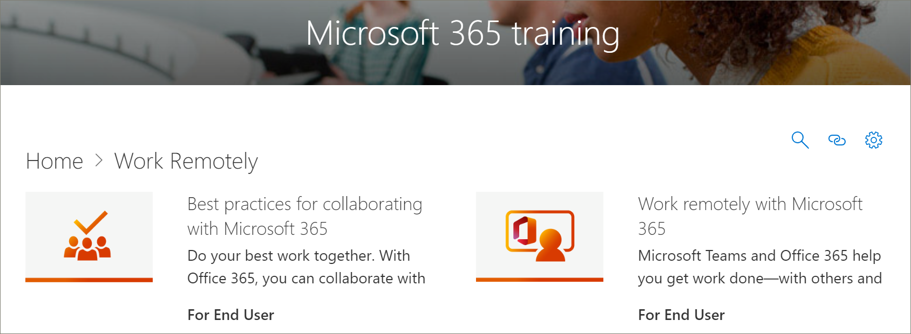

# Actualizaciones de contenido de Microsoft 365 Learning PathwaysMicrosoft 365 Learning Pathways Content Updates
Caminos de aprendizaje se esfuerza en adherirse a un ciclo de actualización de contenido trimestral.Learning pathways strives to adhere to a quarterly content update cycle. A continuación, se enumeran las actualizaciones de contenido de septiembre de 2020.The following list the content updates for September 2020.

## Actualizaciones de contenido de septiembre de 2020September 2020 Content Updates
Caminos de aprendizaje se esfuerza en adherirse a un ciclo de actualización de contenido trimestral.Learning pathways strives to adhere to a quarterly content update cycle. Para obtener más información sobre cómo se aplican las actualizaciones de contenido y cómo administrar las actualizaciones de contenido, consulte [Manage Content updates](custom_contentupdatesmanage.md).To learn more about how content updates are applied, and how to manage content updates, see [Manage Content Updates](custom_contentupdatesmanage.md). 

> [!IMPORTANT]
> La actualización del contenido de septiembre se ha lanzado para el inglés.The September content update has been released for English. Pronto estarán disponibles las actualizaciones de contenido para chino (simplificado), Francés, alemán, Italiano, Japonés, Portugués (brasileño), Ruso y español.Content updates for Chinese (Simplified), French, German, Italian, Japanese, Portuguese (Brazilian), Russian, and Spanish are coming soon.  

### SeguridadSecurity
Se ha agregado una nueva Subcategoría seguridad con listas de reproducción y recursos para ayudar a los usuarios a trabajar de forma más segura en la oficina y en el hogar.A new security subcategory has been added with playlists and assets to help users work more securely in the office and at home. 

#### Lista de reproducción "pasos sencillos""Five simple steps" playlist
- Protéjase de la suplantación de identidadProtect yourself from phishing
- Evitar estafas de soporte técnicoAvoid tech support scams
- Trabajar desde casa de forma más seguraWork from home more securely
- Mantenga su PC actualizadoKeep your PC up-to-date
- Manténgase protegido con la seguridad de WindowsStay protected with Windows security

#### Lista de reproducción "seguridad en casa""Security at home" playlist
- Sugerencias para mantener seguros sus datosTips to keep your data safe
- Mantener el equipo seguro en casaKeep your computer safe at home
- Ayude a proteger a su familia en línea con la seguridad de Windows: ¿está aquí por accidente?Help protect your family online with Windows Security – is this in here by accident?

#### Lista de reproducción "seguridad en el trabajo""Security at work" playlist
- Mantener el equipo protegido en el trabajoKeep your computer secure at work
- ¿Qué es la autenticación multifactor?What is Multi-factor Authentication?
- Firewall y protección de red en la seguridad de WindowsFirewall and network protection in Windows security
- Impedir cambios en la configuración de seguridad con la protección contra alteracionesPrevent changes in security settings with Tamper Protection

### Lista de reproducción "Introducción a Teams""Get started with Teams" playlist
Se ha agregado una nueva lista de reproducción "Introducción a Microsoft Teams" a la subcategoría "introducción/primeros días" para ayudar a los usuarios a ponerse en marcha con Microsoft Teams.A new "Get Started with Teams" playlist has been added to the "Get Started/First Days" subcategory to help users get up and running with Teams. La lista de reproducción incluye:The playlist includes:
- Bienvenido a Microsoft TeamsWelcome to Microsoft Teams  
- Poner en marcha su equipoGet your team up and running
- Trabajar en canalesWork in channels  
- Cargar y compartir archivosUpload and share files 
- Iniciar y anclar chatsStart and pin chats  
- Unirse a una reunión de Microsoft TeamsJoin a Teams meeting 
- Administrar reunionesManage meetings 
 
### Conceptos básicos de Microsoft 365Microsoft 365 Basics
En la categoría productos, se ha actualizado la subcategoría "conceptos básicos de Office 365" a la categoría "conceptos básicos de Microsoft 365".In the Products category, the "Office 365 Basics" subcategory has been updated to the "Microsoft 365 Basics" category. Los activos retirados de la categoría "conceptos básicos de Office 365" seguirán estando disponibles si se han agregado a una lista de reproducción personalizada.Retired assets in the "Office 365 Basics" category are still available if they've been added to a custom playlist.

#### Lista de reproducción "introducción""Get started" playlist
- ¿Qué es Microsoft 365?What is Microsoft 365?
- Iniciar sesiónSign in
- Office.comOffice.com

#### Lista de reproducción "crear y guardar""Create and save" playlist
- Uso de las aplicaciones de escritorioUsing the desktop apps
- Uso de aplicaciones de Office.comUsing Office.com apps
- Guardar archivos en la nubeSave files to the cloud
- Sincronizar archivos a petición con OneDriveSync Files on Demand with OneDrive

#### Lista de reproducción "compartir y colaborar""Share and collaborate" playlist
- Compartir archivos en Microsoft 365Share files in Microsoft 365
- CoautoríaCo-author
- Usar @mentionsUse @mentions
- SeguimientosFollow-ups

#### Lista de reproducción "trabajar con Microsoft Teams""Work with Microsoft Teams" playlist
- Bienvenido a Microsoft TeamsWelcome to Microsoft Teams
- Información general de los equipos y canalesOverview of teams and channels
- Crear y dar formato a una publicaciónCreate and format a post
- Iniciar y anclar chatsStart and pin chats
- Realizar llamadasMake calls
- Unirse a una reunión de Microsoft TeamsJoin a Teams meeting
- Sugerencias para mejorar las reunionesTips for better meetings

#### "Sacar el máximo partido de la lista de reproducción de Windows""Get the most out of Windows" playlist
- Buscar documentos, aplicaciones y mucho más con la búsquedaFind your documents, apps, and more with Search
- Microsoft EdgeMicrosoft Edge
- Búsqueda de Microsoft en BingMicrosoft Search in Bing

#### Lista de reproducción "trabajar desde cualquier lugar""Work from anywhere" playlist
- Aplicación móvil de OneDriveOneDrive mobile app
- Aplicación móvil de OutlookOutlook mobile app

#### Lista de reproducción "fantásticas características de Microsoft 365""Cool Microsoft 365 features" playlist
- Diseñador de PowerPointPowerPoint Designer
- Ideas en ExcelIdeas in Excel
- Editor en WordEditor in Word
- Hacer que el contenido sea accesibleMake your content accessible

### Lista de reproducción "crear un gráfico" en Access"Create a chart" playlist in Access
Se ha agregado un "crear lista de reproducción de gráfico" a la subcategoría "Products\Access".A "Create a chart playlist" has been added to the "Products\Access" subcategory.  
- Crear un gráfico de columnasCreate a column chart
- Crear un gráfico de barrasCreate a bar chart
- Crear un gráfico de líneasCreate a line chart
- Crear un gráfico circularCreate a pie chart
- Crear un gráfico combinadoCreate a combo chart

### Actualizaciones de Microsoft TeamsTeams updates
La subcategoría "Product\Microsoft Teams" se ha actualizado con los siguientes activos.The "Product\Microsoft Teams" subcategory has been updated with the following assets. 

#### Lista de reproducción de "administrar reuniones""Manage meetings" playlist
- Unirse a una reunión de Microsoft TeamsJoin a Teams meeting
#### Lista de reproducción "trabajar con publicaciones y mensajes""Work with posts and messages" playlist
- Crear y dar formato a una publicaciónCreate and format a post

### PlannerPlanner 
Se han agregado los siguientes activos a la lista de reproducción "usar planeador" en "Products\Planner".The follow assets have been added to the "Use Planner" playlist in "Products\Planner".
#### Usar lista de reproducción de PlannerUse Planner playlist
- Para realizar vs PlannerTo Do vs Planner
- Ver las tareas de Planner en tareas pendientesSee your Planner Tasks in To Do
- Usar la aplicación tareas en Microsoft TeamsUse the Tasks App in Teams

### WordWord
El siguiente activo se ha actualizado en la lista de reproducción "compartir y coautoría con Word".The following asset has been updated in the "Share and co-author with Word" playlist.

#### Lista de reproducción "compartir y co-autoría con Word""Share and co-author with Word" playlist
- Se ha actualizado el activo "colaborar en documentos de Word con co-autoría en tiempo real"."Collaborate on Word documents with real-time co-authoring" asset has been updated. 

### Office para la webOffice for the web
Se ha actualizado el siguiente activo en la lista de reproducción de "Office para la web: Word para el Web".The following asset has been updated in the "Office for the web: Word for the web" playlist.

#### Lista de reproducción de "Office para la web: Word para el Web""Office for the web: Word for the web" playlist
- Transcribir las grabacionesTranscribe your recordings

### PowerPoint (nuevo, actualizado)PowerPoint (new, updated)
Los siguientes activos se han actualizado o agregado a las listas de reproducción de Products\PowerPoint.The following assets have been updated or added to the Products\PowerPoint playlists. 

#### Lista de reproducción "texto & tablas con PowerPoint""Text & tables with PowerPoint" playlist
- Cambiar la tinta manuscrita a formas, texto o matemáticas en PowerPoint (nueva)Change handwritten ink to shapes, text, or math in PowerPoint (new)

#### Presentar lista de reproducción de presentacionesPresent slideshows playlist
- Grabar una presentación (actualizado)Record a presentation (updated)

### Guías de inicio rápido de Office (actualizadas)Office Quick Start guides (updated)
Se han actualizado las guías de inicio rápido de Office para todos los productos de Office.The Office Quick Start guides for all the Office products have been updated. 

## Actualizaciones de contenido de abril de 2020April 2020 Content Updates
 En respuesta a eventos actuales, la actualización de contenido de abril de 2020 proporciona información sobre listas de reproducción y recursos diseñados para habilitar el trabajo remoto en su organización.In response to current events, the April 2020 Content Update provides learning playlists and resources designed to enable remote work in your organization. Hemos agregado un nuevo conjunto de listas de reproducción remotas de trabajo, actualizado significativamente el contenido de Microsoft Teams, sobre todo para las reuniones de Microsoft Teams, se ha agregado un nuevo conjunto de listas de reproducción para la web y se han agregado activos nuevos de Microsoft Forms.We’ve added a new set of Work remotely playlists, significantly updated the Microsoft Teams content, especially for Teams meetings, added a new set of Office for the web playlists, and added new Microsoft Forms assets. Como parte de la actualización, también hemos proporcionado una lista de recursos de trabajo remoto para los administradores.As part of the update, we've also provided a list of Remote Work resources for administrators.  
 
 Para obtener más información sobre cómo se aplican las actualizaciones de contenido y cómo administrar las actualizaciones de contenido, consulte [Manage Content updates](custom_contentupdatesmanage.md).To learn more about how content updates are applied, and how to manage content updates, see [Manage Content Updates](custom_contentupdatesmanage.md). A continuación se enumeran las actualizaciones de contenido de abril de 2020 de Microsoft 365.The following lists the April 2020 Microsoft 365 learning pathways content updates. 

### Office 365 cambió de marca a Microsoft 365Office 365 was rebranded to Microsoft 365
Office 365 se ha cambiado de marca a Microsoft 365.Office 365 has been rebranded to Microsoft 365. El cambio de nombre se refleja en todo el contenido de rutas de aprendizaje de Microsoft 365.The name change is reflected throughout the Microsoft 365 learning pathways content. 

### Listas de reproducción nuevas o actualizadasNew or Updated Playlists
Se han agregado o actualizado las siguientes listas de reproducción.The following playlists have been added or updated.  

#### Trabajar de forma remota (2 nuevas listas de reproducción/11 nuevos activos)Work remotely (2 new playlists/11 new assets)
Se ha agregado una nueva Subcategoría trabajo de forma remota a las rutas de aprendizaje que incluye las siguientes listas de reproducción y activos:A new Work remotely subcategory was added to learning pathways that features the following playlists and assets: 

##### Trabajar de forma remota (5 nuevos activos)Work remotely (5 new assets)
- Trabajar de forma remota con Office 365Work remotely with Office 365
- Introducción a Office.comGet started at Office.com
- Comunicarse o reunirseCommunicate or meet
- Almacenar los archivos de trabajoStore your work files
- Alternativas avanzadasAdvanced alternatives
##### Procedimientos recomendados para colaborar con Office 365 (6 nuevos activos)Best practices for collaborating with Office 365 (6 new assets)
- IntroducciónGet started
- CompartirShare
- CoautoríaCo-author
- Chatear en archivosChat in files
- CumplirMeet
- MóvilMobile

### Teams (9 nuevos activos/6 activos actualizados)Teams (9 new assets/6 updated assets)
Se han realizado varias actualizaciones en el contenido de Teams.A variety of updates have been made to Teams content. 
#### Colaborar en los equipos y canales (1 nuevo/1 activo actualizado)Collaborate in teams and channels (1 new/1 updated asset)
- Crear y usar canales privados (nueva)Create and use private channels (new)
- Mostrar u ocultar canales (actualización)Show or hide channels (updated)
#### Iniciar chats y llamadas (2 nuevos/1 actualizados)Start chats and calls (2 new/1 updated)
- Iniciar y anclar chats (nuevo)Start and pin chats (new)
- Ocultar chats, eliminar mensajes (nuevo)Hide chats, delete messages (new)
- Realizar llamadas (actualizadas)Make calls (updated)
#### Explorar aplicaciones y herramientas (1 nuevo)Explore apps and tools (1 new)
- Usar aplicaciones (nuevo)Use apps (new)
#### Trabajar con publicaciones y mensajesWork with posts and messages
- Publicar un mensaje en varios canales (nuevo)Post a message to multiple channels (new)
#### Administración de reuniones (3 nuevos/4 activos actualizados)Manage meetings (3 new/4 updated assets)
- Unirse a una reunión de Microsoft Teams (nueva)Join a Teams meeting (new)
- Crear reuniones instantáneas con reunirse ahora (actualizada)Create instant meetings with Meet now (updated)
- Reunirse en un canal (nuevo)Meet in a channel (new)
- Administración de reuniones (nueva)Manage meetings (new)
- Mostrar la pantalla durante una reunión (actualizada)Show your screen during a meeting (updated)
- Mostrar diapositivas de PowerPoint (actualizado)Show PowerPoint slides (updated)
- Desplazarse durante una reunión de Teams (actualizada)Move around during a Teams meeting (updated)
#### Trabajar con publicaciones y mensajes (1 nuevo)Work with post and messages (1 new)
- Publicar un mensaje en varios canales (nuevo)Post a message to multiple channels (new)

### Office para la webOffice for the web
Office para la web proporciona un conjunto de listas de reproducción para escenarios en los que los usuarios desean crear, compartir y colaborar con Office en la Web.Office for the web provides a set of playlists for scenarios where users want to create, share, and collaborate with Office on the web. Este conjunto de contenido también es útil para las organizaciones que realizan el cambio de Google G Suite a Microsoft 365.This set of content is also valuable for organizations that are making the switch from Google G Suite to Microsoft 365.
#### Introducción (5 nuevos activos)Get started (5 new assets)
- IntroducciónGet started
- Buscar con buscarFind it with Search
- Crear nuevos documentosCreate new documents
- Volver al trabajoGet back to work
- Archivos recomendadosRecommended files
#### Outlook para la webOutlook for the web
- Familiarizarse con Outlook para la webGet to know Outlook for the Web
- Crear una respuesta a un correo electrónicoCreate an reply to email
- Organizar la bandeja de entradaOrganize your Inbox
- Crear una firma y una respuesta automáticaCreate a signature and automatic reply
- Programar una cita o una reuniónSchedule an appointment or meeting
- Crear un contacto editar un contactoCreate an edit a contact
- Buscar el correo electrónico, los contactos y los eventosSearch for email, contacts, and events
#### Word para la webWord for the web
- Introducción a Word para la webGet to know Word for the Web
- Cambiar el diseño del documentoChange document layout
- Insertar tablas e imágenesInsert tables and pictures
- Colaborar en líneaCollaborate online
- Cosas interesantes en Word para la webCool things in Word for the Web
#### Excel para la webExcel for the web
- Introducción a Excel para la webGet to know Excel for the Web
- Crear fórmulasCreate formulas
- Insertar una tabla dinámicaInsert a PivotTable
- Obtener información sobre las ideasGet insight with ideas
- ColaboraciónCollaborate
- Ahorrar tiempo con relleno flashSave time with Flash Fill
- Pintar una imagen con formato condicionalPaint a picture with Conditional Formatting
#### PowerPoint para la webPowerPoint for the web
- Familiarizarse con PowerPoint para la webGet to know PowerPoint for the Web
- Insertar imágenes, formas y másInsert pictures, shapes, and more
- Animación y transicionesAnimation and transitions
- Crear una presentación con otras personasCreate a presentation with others
- Cuando esté listo para presentarWhen you’re ready to present
- Diseñar diapositivasDesigning slides
#### Compartir documentosShare your documents
- Compartir documentosShare your documents
- Crear un vínculo que se pudiera compartirCreate a shareable link
- Proteger los documentos solo para personas específicasSecure your docs only to specific people
- Compartir con alguien ajeno a su organizaciónShare with someone outside your organization 

### Microsoft FormsMicrosoft Forms 
Por solicitud, también hay algunos activos de formularios nuevos.By request, there are also some new Forms assets. 
#### Formularios (4 nuevos activos)Forms (4 new assets) 
- Crear un formularioCreate a form 
- Compartir un formularioShare a form 
- Ver los resultados de un formularioView results of a form 
- Preguntas más frecuentes sobre Microsoft FormsFrequently Asked Questions about Microsoft Forms 

### Recursos de apoyo para sus recursos remotos Resources for supporting your remote workforce
Puede usar rutas de aprendizaje para crear una página de aterrizaje en su sitio de caminos de aprendizaje para la compatibilidad con trabajadores remotos.You can use learning pathways to build a landing page in your learning pathways site for supporting remote workers. O bien, puede Agregar el elemento Web caminos de aprendizaje a una página de soporte técnico existente en su sitio de caminos de aprendizaje y filtrar el elemento Web para mostrar las listas de reproducción remotas del trabajo.Or you can add the learning pathways web part to an existing support page on your learning pathways site and filter the web part to show the Work Remotely playlists. Esta es una lista de algunos de los principales recursos de Microsoft para la compatibilidad con el trabajo remoto de su organización.Here’s a list of some of the top resources from Microsoft for supporting remote work in your organization. 
- [Cómo implementar Microsoft TeamsHow to roll out Microsoft Teams](https://docs.microsoft.com/microsoftteams/how-to-roll-out-teams)
- [Reuniones y conferencias en Microsoft TeamsMeetings and conferencing in Microsoft Teams](https://docs.microsoft.com/microsoftteams/deploy-meetings-microsoft-teams-landing-page)
- [Admitir trabajadores remotos con Microsoft TeamsSupport Remote Workers using Microsoft Teams](https://docs.microsoft.com/microsoftteams/support-remote-work-with-teams)
- [Preguntas más frecuentes: Soporte para los trabajadores remotosFAQ: Support your remote workforce](https://docs.microsoft.com/microsoftteams/faq-support-remote-workforce)
- [Las nueve formas principales en las que Microsoft IT Habilita el trabajo remoto para sus empleadosThe top 9 ways Microsoft IT is enabling remote work for its employees](https://www.microsoft.com/microsoft-365/blog/2020/03/12/top-9-ways-microsoft-it-enabling-remote-work-employees/)
- [Aprendizaje de Microsoft TeamsMicrosoft Teams Training](https://docs.microsoft.com/microsoftteams/training-microsoft-teams-landing-page)
- [Educación: Microsoft Education CenterEducation: Microsoft Education Center](https://education.microsoft.com) 
- [Educación: Introducción al aprendizaje remotoEducation: Getting started with remote learning](https://education.microsoft.com/resource/4c0c02c0)

Para obtener más información acerca de cómo personalizar las rutas de aprendizaje, consulte [Customizing Learning Pathways](custom_overview.md).For more information about how to customize Learning Pathways, see [Customize learning pathways](custom_overview.md). 

## Actualizaciones de contenido de noviembre de 2019November 2019 Content Updates
Bienvenido a la actualización de contenido de caminos de aprendizaje de Microsoft 365.Welcome to the Microsoft 365 learning pathways content update. A partir de nuestra actualización del 2019 de noviembre, proporcionaremos un inventario actualizado del catálogo de caminos de aprendizaje cada trimestre.Starting with our November 2019 update, we'll provide an updated inventory of the learning pathways catalog on a quarterly basis. Para la actualización de noviembre de 2019, se han agregado las siguientes subcategorías y listas de reproducción de contenido al catálogo de caminos de aprendizaje.For the November 2019 update, the following new content subcategories and playlists have been added to the learning pathways catalog. Para obtener más información sobre cómo se aplican las actualizaciones de contenido y cómo administrar las actualizaciones de contenido, consulte [Manage Content updates](custom_contentupdatesmanage.md).To learn more about how content updates are applied, and how to manage content updates, see [Manage Content Updates](custom_contentupdatesmanage.md).    

### TeamsTeams
Se han agregado varias listas de reproducción nuevas a la subcategoría de Teams.Several new playlist have been added to the Teams subcategory.
- Trabajar con publicaciones y mensajes (3 activos)Work with posts and messages (3 assets)
- Cargar y buscar archivos (2 activos)Upload and find files (2 assets)
- Configurar y asistir a eventos en directo (4 activos)Set up and attend live events (4 assets)
- Administrar la fuente de actividades (2 activos)Manage your activity feed (2 assets)
- Equipos en marcha (2 activos)Teams on the go (2 assets)

### Centro de éxito de Microsoft 365Microsoft 365 Success Center
Hemos agregado una subcategoría del centro de éxito de caminos de aprendizaje de Microsoft 365 a la experiencia de rutas de aprendizaje.We've added a Microsoft 365 learning pathways Success Center subcategory to the learning pathways experience. El centro de éxito proporciona las siguientes listas de reproducción.The Success Center provides the following playlists.
- Novedades, qué ha cambiado (3 activos)What’s New, What Changed (3 asset)
- Planeación del contenido de aprendizaje (2 activos)Plan your learning content (2 assets)
- Personalización de caminos de aprendizaje (8 activos)Customize learning pathways (8 assets?)
- Impulsar la adopción de caminos de aprendizaje (1 activo)Drive Adoption of learning pathways (1 asset)
- Medir el impacto de las vías de aprendizaje (1 activo)Measure impact of learning pathways (1 asset)

### OutlookOutlook
Las listas de reproducción siguientes se han agregado a la subcategoría de Outlook.The following playlists has been added to the Outlook subcategory. 
- Outlook Mobile: administrar la bandeja de entrada (4 activos)Outlook mobile: Manage your inbox (4 assets)
- Outlook Mobile: administre su tiempo (8 activos)Outlook mobile: Manage your time (8 assets)
- Outlook Mobile: contactos y conexiones (5 activos)Outlook mobile: People and connections (5 assets)
- Outlook Mobile: buscar y compartir (4 activos)Outlook mobile: Search and share (4 assets)

### OneDriveOneDrive
Se han agregado los siguientes activos de vídeo para OneDrive.The following video assets have been added for OneDrive. 
- Configurar el iPhone o iPad se ha agregado a la introducción a la lista de reproducción de OneDriveSet up your iPhone or iPad has been added to the Intro to OneDrive playlist
- Activar la copia de seguridad de OneDrive se ha agregado a la lista de reproducción administrar archivos con OneDriveTurn on OneDrive Backup has been added to the Manage your files with OneDrive playlist

### PlannerPlanner
Las listas de reproducción y los activos siguientes se han agregado al catálogo.The following playlists and assets have been added to the catalog.  
- Inicio rápido de Planner (6 activos)Planner Quick Start (6 assets)
- Usar Planner (8 activos)Use Planner (8 assets)

### AccesibilidadAccessibility
Se ha agregado la subcategoría de accesibilidad del contenido con las siguientes listas de reproducción.The Accessibility subcategory of content has been added with the following playlists. 
- Recursos y visión general de accesibilidad de Microsoft 365 (3 activos)Microsoft 365 Accessibility Overview and Resources (3 assets)
- Crear mensajes de correo electrónico más accesibles en Outlook (3 activos)Create more accessible email messages in Outlook (3 assets)
- Crear documentos de Word más accesibles (8 activos)Create more accessible Word documents (8 assets)
- Crear libros de Excel más accesibles (3 activos)Create more accessible Excel workbooks (3 assets)
- Crear diapositivas más accesibles en PowerPoint (5 activos)Create more accessible slides in PowerPoint (5 assets)

### OneDriveOneDrive
Nota: los cambios deben agregarse aquí.....NOTE: Changes need to be added here.....

### SwaySway
Se ha agregado la subcategoría de contenido de Sway con las siguientes listas de reproducción.The Sway subcategory of content has been added with the following playlists. 
- Inicio rápido de Sway (4 activos)Sway Quick Start (4 assets)
- Compartir y acceder a Sway (5 activos)Share and access Sway (5 assets)
- Agregar contenido a Sway (11 activos)Add content to Sway (11 assets)
- Personalización de Sway (5 activos)Customize Sway (5 assets)

### AccessAccess
- Inicio rápido de Access (4 activos)Access Quick Start (4 assets)
- Introducción a Access (3 activos)Intro to Access (3 assets)
- Crear una base de datos de Access (2 activos)Create an Access database (2 assets)
- Agregar tablas (2 activos)Add tables (2 assets)
- Usar relaciones (5 activos)Use relationships (5 assets)
- Adición y edición de datos (2 activos)Add and edit data (2 assets)
- Administración de datos con consultas (5 activos)Manage data with queries (5 assets)
- Crear formularios (1 activo)Create forms (1 asset)
- Crear informes (2 activos)Create reports (2 assets)
- Protección de bases de datos (1 activo)Protect databases (1 asset)

