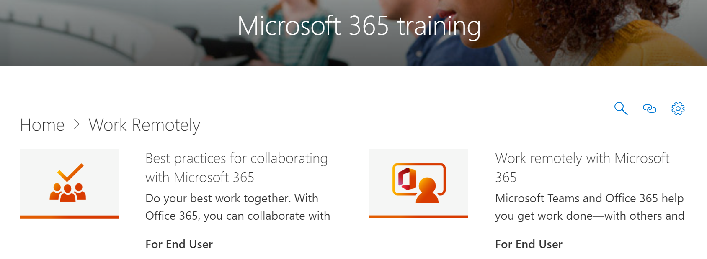

# Actualizaciones de contenido de Microsoft 365 Learning Pathways para abril
Las rutas de aprendizaje se esfuerzan por cumplir un ciclo de actualización de contenido trimestral. La siguiente lista de las actualizaciones de contenido de abril de 2020.

## Actualizaciones de contenido de abril de 2020
 En respuesta a los eventos actuales, la actualización de contenido de abril de 2020 proporciona listas de reproducción de aprendizaje y recursos diseñados para habilitar el trabajo remoto en su organización. Hemos agregado un nuevo conjunto de listas de reproducción de Trabajo de forma remota, hemos actualizado significativamente el contenido de Microsoft Teams, especialmente para reuniones de Teams, hemos agregado un nuevo conjunto de listas de reproducción de Office para las listas de reproducción web y agregado nuevos activos de Microsoft Forms. Como parte de la actualización, también hemos proporcionado una lista de recursos de trabajo remoto para los administradores.  
 
 Para obtener más información sobre cómo se aplican las actualizaciones de contenido y cómo administrar las actualizaciones de [contenido,](custom_contentupdatesmanage.md)vea Manage Content Updates . A continuación se enumeran las actualizaciones de contenido de caminos de aprendizaje de Microsoft 365 de abril de 2020. 

### Office 365 se ha cambiado de nombre a Microsoft 365
Office 365 se ha cambiado de nombre a Microsoft 365. El cambio de nombre se refleja en todo el contenido de las rutas de aprendizaje de Microsoft 365. 

### Listas de reproducción nuevas o actualizadas
Se han agregado o actualizado las listas de reproducción siguientes.  

#### Trabajar de forma remota (2 nuevas listas de reproducción/11 activos nuevos)
Se agregó una nueva subcategoría Trabajo de forma remota a las rutas de aprendizaje que cuentan con las siguientes listas de reproducción y activos: 

##### Trabajar de forma remota (5 activos nuevos)
- Trabajar de forma remota con Office 365
- Introducción a Office.com
- Comunicarse o reunirse
- Almacenar los archivos de trabajo
- Alternativas avanzadas
##### Procedimientos recomendados para colaborar con Office 365 (6 activos nuevos)
- Introducción
- Compartir
- Coautoría
- Chat en archivos
- Reunirse
- Móvil

### Teams (9 activos nuevos/6 activos actualizados)
Se han realizado varias actualizaciones en el contenido de Teams. 
#### Colaborar en equipos y canales (1 nuevo/1 activo actualizado)
- Crear y usar canales privados (nuevo)
- Mostrar u ocultar canales (actualizados)
#### Iniciar chats y llamadas (2 nuevos/1 actualizados)
- Inicio y anclar chats (nuevo)
- Ocultar chats, eliminar mensajes (nuevo)
- Realizar llamadas (actualizadas)
#### Explorar aplicaciones y herramientas (1 nuevo)
- Usar aplicaciones (nuevas)
#### Trabajar con mensajes y publicaciones
- Publicar un mensaje en varios canales (nuevo)
#### Administrar reuniones (3 activos nuevos/4 actualizados)
- Unirse a una reunión de Teams (nuevo)
- Crear reuniones instantáneas con Reunirse ahora (actualizado)
- Reunirse en un canal (nuevo)
- Administrar reuniones (nueva)
- Mostrar la pantalla durante una reunión (actualizada)
- Mostrar diapositivas de PowerPoint (actualizadas)
- Desplazarse durante una reunión de Teams (actualizada)
#### Trabajar con mensajes y mensajes (1 nuevo)
- Publicar un mensaje en varios canales (nuevo)

### Office para la web
Office para la web proporciona un conjunto de listas de reproducción para escenarios en los que los usuarios desean crear, compartir y colaborar con Office en la web. Este conjunto de contenido también es valioso para las organizaciones que están cambiando de Google G Suite a Microsoft 365.
#### Introducción (5 activos nuevos)
- Introducción
- Buscarlo con la búsqueda
- Crear nuevos documentos
- Volver al trabajo
- Archivos recomendados
#### Outlook para la web
- Conozca Outlook para la Web
- Crear una respuesta al correo electrónico
- Organizar la Bandeja de entrada
- Crear una firma y una respuesta automática
- Programar una cita o reunión
- Crear una edición de un contacto
- Buscar correo electrónico, contactos y eventos
#### Word para la web
- Conozca Word para la Web
- Cambiar el diseño del documento
- Insertar tablas e imágenes
- Colaborar en línea
- Cool things in Word for the Web
#### Excel para la web
- Conozca Excel para la Web
- Crear fórmulas
- Insertar una tabla dinámica
- Obtener información con ideas
- Colaborar
- Ahorrar tiempo con relleno flash
- Pintar una imagen con formato condicional
#### PowerPoint para la web
- Conocer PowerPoint para la Web
- Insertar imágenes, formas y mucho más
- Animaciones y transiciones
- Crear una presentación con otros usuarios
- Cuando estés listo para presentar
- Diseño de diapositivas
#### Compartir documentos
- Compartir documentos
- Crear un vínculo que se puede compartir
- Proteger los documentos solo para personas específicas
- Compartir con alguien fuera de la organización 

### Microsoft Forms 
Por solicitud, también hay algunos activos de Formularios nuevos. 
#### Formularios (4 activos nuevos) 
- Crear un formulario 
- Compartir un formulario 
- Ver los resultados de un formulario 
- Preguntas más frecuentes sobre Microsoft Forms 

### Recursos de apoyo para sus recursos remotos 
Puede usar las rutas de aprendizaje para crear una página de aterrizaje en el sitio de rutas de aprendizaje para admitir trabajadores remotos. También puede agregar el elemento web Caminos de aprendizaje a una página de soporte técnico existente en el sitio de rutas de aprendizaje y filtrar el elemento web para mostrar las listas de reproducción Trabajar de forma remota. Esta es una lista de algunos de los principales recursos de Microsoft para admitir el trabajo remoto en su organización. 
- [Cómo implementar Microsoft Teams](/microsoftteams/how-to-roll-out-teams)
- [Reuniones y conferencias en Microsoft Teams](/microsoftteams/deploy-meetings-microsoft-teams-landing-page)
- [Admitir trabajadores remotos con Microsoft Teams](/microsoftteams/support-remote-work-with-teams)
- [Preguntas más frecuentes: Soporte para los trabajadores remotos](/microsoftteams/faq-support-remote-workforce)
- [Las 9 formas principales en que Microsoft TI está habilitando el trabajo remoto para sus empleados](https://www.microsoft.com/microsoft-365/blog/2020/03/12/top-9-ways-microsoft-it-enabling-remote-work-employees/)
- [Aprendizaje de Microsoft Teams](/microsoftteams/training-microsoft-teams-landing-page)
- [Educación: Microsoft Education Center](https://education.microsoft.com) 
- [Educación: introducción al aprendizaje remoto](https://education.microsoft.com/resource/4c0c02c0)

Para obtener más información acerca de cómo personalizar caminos de aprendizaje, vea [Personalizar caminos de aprendizaje.](custom_overview.md) 

## Actualizaciones de contenido de noviembre de 2019
Bienvenido a la actualización de contenido de caminos de aprendizaje de Microsoft 365. A partir de nuestra actualización de noviembre de 2019, proporcionaremos un inventario actualizado del catálogo de rutas de aprendizaje de forma trimestral. Para la actualización de noviembre de 2019, se agregaron las siguientes subcategorías de contenido y listas de reproducción al catálogo de rutas de aprendizaje. Para obtener más información sobre cómo se aplican las actualizaciones de contenido y cómo administrar las actualizaciones de [contenido,](custom_contentupdatesmanage.md)vea Manage Content Updates .    

### Teams
Se han agregado varias listas de reproducción nuevas a la subcategoría Teams.
- Trabajar con mensajes y publicaciones (3 activos)
- Cargar y buscar archivos (2 activos)
- Configurar y asistir a eventos en directo (4 activos)
- Administrar la fuente de actividades (2 activos)
- Teams sobre la marcha (2 activos)

### Centro de éxito de Microsoft 365
Hemos agregado una subcategoría centro de éxito de caminos de aprendizaje de Microsoft 365 a la experiencia de caminos de aprendizaje. El Centro de éxito proporciona las siguientes listas de reproducción.
- Novedades, Qué cambió (3 activos)
- Planear el contenido de aprendizaje (2 activos)
- Personalizar caminos de aprendizaje (¿8 activos?)
- Impulsar la adopción de caminos de aprendizaje (1 activo)
- Medir el impacto de las rutas de aprendizaje (1 activo)

### Outlook
Las siguientes listas de reproducción se han agregado a la subcategoría de Outlook. 
- Outlook mobile: administrar la bandeja de entrada (4 activos)
- Outlook mobile: administrar el tiempo (8 activos)
- Outlook mobile: personas y conexiones (5 activos)
- Outlook mobile: búsqueda y recurso compartido (4 activos)

### OneDrive
Se han agregado los siguientes activos de vídeo para OneDrive. 
- Configurar el iPhone o iPad se ha agregado a la lista de reproducción Introducción a OneDrive
- Activar Copia de seguridad de OneDrive se ha agregado a la lista de reproducción Administrar los archivos con OneDrive

### Planner
Las siguientes listas de reproducción y activos se han agregado al catálogo.  
- Inicio rápido de Planner (6 activos)
- Usar Planner (8 activos)

### Accesibilidad
La subcategoría Accesibilidad del contenido se ha agregado con las siguientes listas de reproducción. 
- Información general sobre accesibilidad y recursos de Microsoft 365 (3 activos)
- Crear mensajes de correo electrónico más accesibles en Outlook (3 activos)
- Crear documentos de Word más accesibles (8 activos)
- Crear libros de Excel más accesibles (3 activos)
- Crear diapositivas más accesibles en PowerPoint (5 activos)

### OneDrive
NOTA: Los cambios deben agregarse aquí.....

### Sway
La subcategoría de contenido Sway se ha agregado con las siguientes listas de reproducción. 
- Inicio rápido de Sway (4 activos)
- Compartir y acceder a Sway (5 activos)
- Agregar contenido a Sway (11 activos)
- Personalizar Sway (5 activos)

### Acceso
- Acceso inicio rápido (4 activos)
- Introducción a Access (3 activos)
- Crear una base de datos de Access (2 activos)
- Agregar tablas (2 activos)
- Usar relaciones (5 activos)
- Agregar y editar datos (2 activos)
- Administrar datos con consultas (5 activos)
- Crear formularios (1 activo)
- Crear informes (2 activos)
- Proteger bases de datos (1 activo)