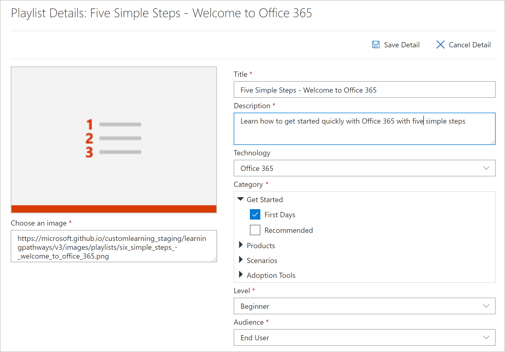

# Copiar una lista de reproducciónCopy a Playlist
Con bastante frecuencia, las organizaciones necesitan modificar una lista de reproducción proporcionada por Microsoft quitando o reemplazando un activo por un activo creado por la organización.Quite often, organizations need to modify a Microsoft-supplied playlist by removing or replacing an asset with an asset created by the organization. Por ejemplo, es posible que quiera quitar un paso del principio con seis sencillos lista de reproducción de pasos.For example, you might want to remove a step from the Start with Six Simple Steps playlist. Ahora puede usar la característica copiar lista de reproducción de rutas de aprendizaje para copiar fácilmente los seis pasos sencillos de lista de reproducción y quitar un activo, reemplazar un activo o agregar activos nuevos.Now you can use the learning pathways Copy Playlist feature to easily copy the Six Simple Steps playlist and simply remove an asset, replace an asset, or add new assets. 

## Para copiar una lista de reproducciónTo copy a playlist

1. En la página **principal** de Microsoft 365 Learning Pathways, haga clic en **Office 365 Training**.From the Microsoft 365 learning pathways **Home** page, click **Office 365 training**.
2. Haga clic en el icono **Administración** .Click the **Administration** icon.
3. En **primeros días**, haga clic en la lista **de reproducción pasos sencillos-bienvenido a Office 365** y, a continuación, haga clic en **copiar lista de reproducción**.Under **First Days**, click the **Six Simple Steps - Welcome to Office 365** playlist, and then click **Copy Playlist**. 
4. Haga clic en **Editar detalle**y, a continuación, rellene los campos **título** y **Descripción** tal y como se muestra en el siguiente ejemplo y, a continuación, haga clic en **Guardar detalle**.Click **Edit Detail**, and then fill in the **Title** and **Description** fields as shown in the following example, then click **Save Detail**.  
 

## Agregar o quitar activos de una lista de reproducciónAdd or remove assets from a playlist
Con las listas de reproducción personalizadas, puede:With custom playlists, you can:
- Agregar y quitar activos de Microsoft, pero no editar los activos de Microsoftadd and remove Microsoft assets, but not edit the assets from Microsoft
- Agregar, quitar y editar recursos personalizados de SharePoint existentes de la organización o de los activos de SharePoint que cree.add, remove, and edit custom existing SharePoint assets from your organization or SharePoint assets that you create. 

### Quitar un activo de una lista de reproducciónRemove an asset from a playlist
- Desplácese hacia abajo por la página de **Administración** y, a continuación, en **activos de lista de reproducción** , haga clic en el icono eliminar del **paso 5. Configurar aplicaciones móviles**.Scroll down the **Administration** page, and then under **Playlist Assets** click the delete icon for **Step 5. Set up mobile apps**. 

## Comprobar que el activo se ha quitado de la lista de reproducciónVerify the asset is removed from the playlist
1. Vuelva a la pestaña con la página de **aprendizaje de Microsoft 365** .Return to the tab with the **Microsoft 365 training** page.
2. Haga clic en **primeros días**y, a continuación, haga clic en los **cinco pasos sencillos-Bienvenido a la lista de reproducción de Office 365** .Click **First Days**, then click the **Five Simple Steps - Welcome to Office 365** playlist. 
3. Haga clic en la lista de reproducción para comprobar que el recurso se ha quitado.Click through the playlist to verify that the asset has been removed.

