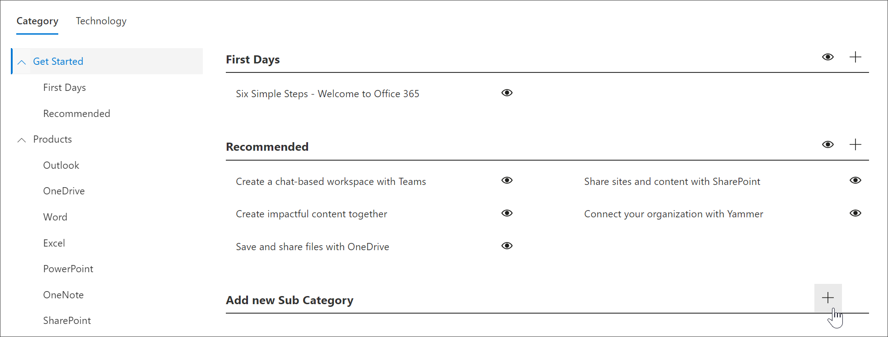

# Crear una subcategoría 
En algunos casos, querrá crear una nueva subcategoría. Por ejemplo, si la subcategoría First Days no funciona para su organización, puede crear una subcategoría nueva y, a continuación, agregarle listas de reproducción para satisfacer las necesidades de su organización. 

1. En la página Principal de  Caminos de aprendizaje de Microsoft 365, haga clic en Aprendizaje de **Microsoft 365,** haga clic en el menú Sistema del elemento web y, a continuación, haga clic en Administrar lista **de reproducción.**  
2. Seleccione una **categoría**. En este ejemplo, seleccione **Introducción**.  
3. Desplácese hacia abajo en la página, 
3. Haga clic en **el icono Agregar nueva subcategoría +** .  

> [!TIP]
> Las subcategorías proporcionadas por Microsoft pueden ocultarse, pero no editarse ni eliminarse. 

## Editar una subcategoría
- Seleccione el **icono Editar** para la subcategoría, realice ediciones en el título subcategoría y, a continuación, haga clic en **Guardar**.

## Ocultar una subcategoría
- Seleccione el globo ocular de la subcategoría para ocultarlo. 

## Eliminar una subcategoría
- Seleccione el **icono Editar** para la subcategoría y, a continuación, **seleccione Eliminar.** 
