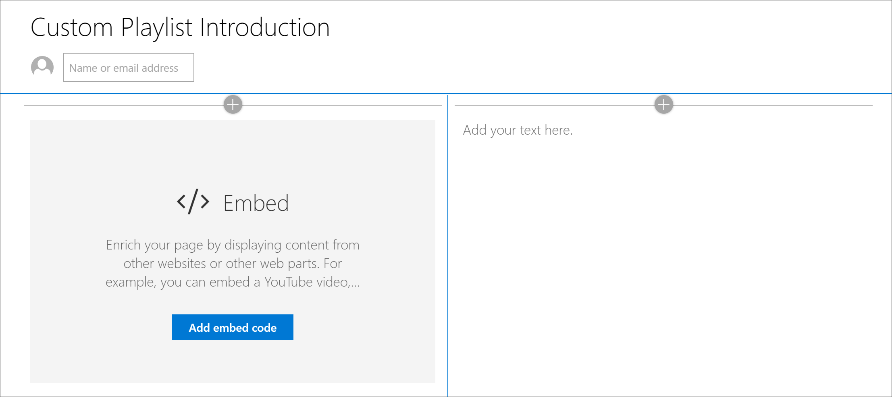
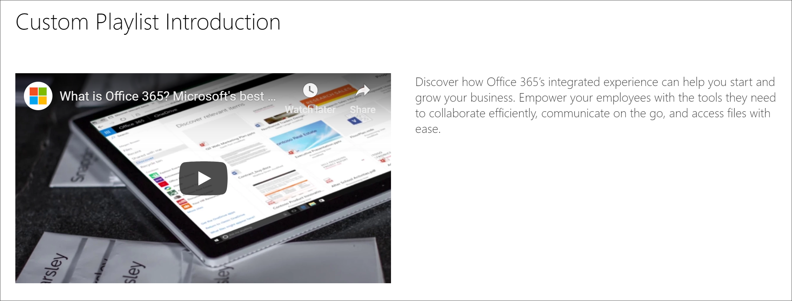

# Crear páginas de SharePoint para listas de reproducción personalizadas

Una de las características únicas de las rutas de aprendizaje es la capacidad de crear listas de reproducción que se ensamblan a partir de activos de Microsoft y de los activos de SharePoint que se crean. En este ejemplo, crearemos una página de SharePoint antes de crear una lista de reproducción. La capacidad de crear listas de reproducción desde páginas de SharePoint ofrece varias oportunidades para crear páginas con los elementos Web disponibles en Microsoft o en su organización. Por ejemplo, una lista de reproducción puede incluir una página de SharePoint con vídeos incrustados de YouTube, o un formulario creado a partir de formularios de Office 365, o un informe de Power BI incrustado. En este ejemplo, le mostraremos cómo crear una página con el elemento Web insertar y el elemento Web texto.  

## Crear una página de SharePoint para una lista de reproducción personalizada

1. Haga clic en el icono de **engranaje** de SharePoint y, a continuación, haga clic en **Agregar una página**.
2. Haga clic en **Agregar una nueva sección (+)** en el lado izquierdo de la página y, a continuación, haga clic en **dos columnas** para el diseño de la sección.
3. En la columna izquierda, haga clic en + y, a continuación, haga clic en el elemento Web **incrustar** . 
4. En la columna derecha, haga clic en + y, a continuación, haga clic en el elemento Web de **texto** . La página debe tener un aspecto similar a este.

### Agregar un vídeo y texto desde YouTube

1. En el explorador, vaya a YouTube. Para este ejemplo, busque "¿Qué es Office 365 – mejor aplicación de productividad de Microsoft".
2. Haga clic en el vídeo para reproducirlo, luego PAUSE y haga clic con el botón derecho en él. 
3. Haga clic en **Copiar código para insertar**y, a continuación, vuelva a la página de SharePoint. 
4. Haga clic en **Agregar código para insertar** en el elemento Web **Insertar** y, a continuación, agregue el código del vídeo de YouTube.
5. Vuelva a la página de YouTube y copie el texto de la **Descripción** del vídeo. 
6. Vuelva a la página de SharePoint, seleccione el elemento Web de **texto** y, a continuación, copie el texto del vídeo de YouTube.
7. Seleccione el icono **Editar elemento Web** en el área de título de la página de SharePoint y, a continuación, asigne a la página el nombre "Introducción a la lista de reproducción personalizada". 
8. En **diseño**, seleccione **normal**y, a continuación, cierre panel Propiedades del **área de título** . La página debería tener ahora un aspecto similar al siguiente. 

### Publicar la página

- Seleccione el botón **publicar** . Ahora está listo para agregar esta página de SharePoint a la lista de reproducción personalizada. 