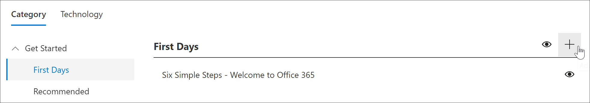
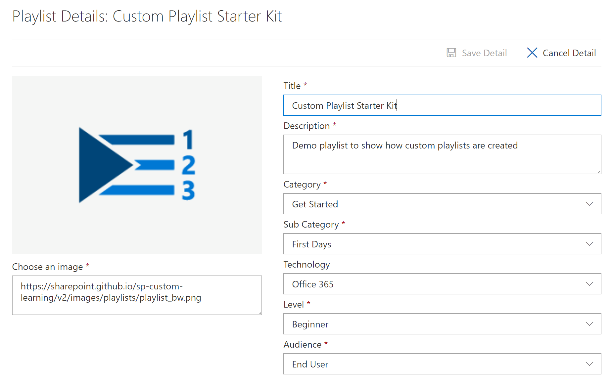
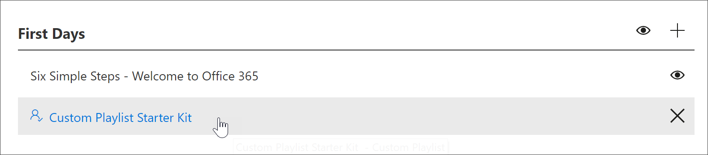
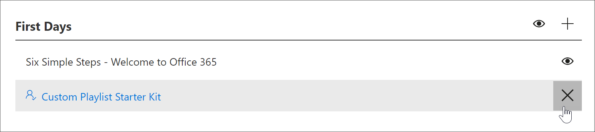

# Crear una lista de reproducción personalizadaCreate a Custom Playlist

Con las rutas de aprendizaje de Microsoft 365, puede crear listas de reproducción personalizadas desde cero que se adapten a las necesidades únicas de su organización.With Microsoft 365 learning pathways, you can create custom playlists from scratch that are tailored to the unique needs of your organization. Por ejemplo, crea una lista de reproducción para incorporar nuevos empleados a Microsoft Teams.For example, create a playlist for onboarding new hires to Microsoft Teams. O cree listas de reproducción para administradores ejecutivos con información adecuada para su rol único.Or create playlists for executive administrators with information suited to their unique role. O cree una lista de reproducción primer día para Microsoft 365 que tenga tres pasos sencillos en lugar de seis.Or create a First Day for Microsoft 365 playlist that has three simple steps instead of six. Puedes agregar una lista de reproducción personalizada a cualquier subcategoría.You can add a custom playlist to any subcategory. Por ejemplo, **First Days**, una **subcategoría Product** como **Excel** o incluso una subcategoría que cree.For example, **First Days**, a **Product** subcategory like **Excel**, or even a subcategory that you create. En esta sección, se explica cómo crear una lista de reproducción y, a continuación, se trata la adición de activos a una lista de reproducción en la siguiente sección, Agregar activos [a una lista de reproducción personalizada.](custom_addassets.md)In this section, we’ll cover how to create a playlist, and then cover adding assets to a playlist in the following section, [Add assets to a custom playlist](custom_addassets.md).

## Crear una lista de reproducciónCreate a playlist 

1. En la página Principal de  Caminos de aprendizaje de Microsoft 365,  haga clic en Aprendizaje de **Office 365** y, a continuación, seleccione el icono Administrar del elemento web.From the Microsoft 365 learning pathways **Home** page, click **Office 365 training**, and then select the **Administer** icon from the Web part. 
2. Seleccione la **subcategoría Administrar**" icono.Select the **Administer**" icon  subcategory. En este ejemplo, seleccione **First Days**.In this example, select **First Days**.  
3. Haga clic en el icono +.Click the + icon.  

4.  Rellene los campos de la lista de reproducción como se muestra en el ejemplo siguiente.Fill out the fields in the playlist as shown in the following example. Puede dejar el icono predeterminado para este ejemplo.You can leave the default icon for this example. 

5.  Cuando haya terminado, seleccione **Guardar detalle**.When you are done, select **Save Detail**. 

## Editar una lista de reproducciónEdit a playlist

- En la **página Administración de aprendizaje personalizado,** haga clic en la lista de reproducción y, a continuación, haga clic en Editar **detalle**.From the **Custom Learning Administration** page, click the playlist, and then click **Edit Detail**.  

### Eliminar una lista de reproducciónDelete a playlist

- En la página Administración de aprendizaje personalizado, haga clic en **el icono Eliminar** de la lista de reproducción.From the Custom Learning Administration page, click the **Delete** icon for the playlist.  

