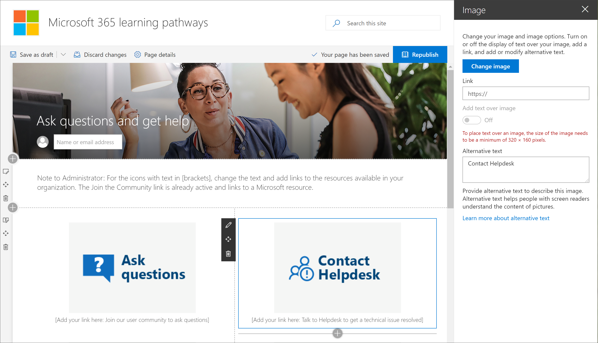

# Personalizar el sitio de rutas de aprendizaje

El Microsoft 365 de rutas de aprendizaje se basa en una plantilla de comunicación SharePoint, por lo que es fácil modificar el sitio para satisfacer las necesidades de su organización. Puede cambiar el nombre del sitio, el logotipo, los elementos de menú y el contenido de las páginas. 

> [!TIP]
> Recopila los comentarios de sus empleados y actualice periódicamente el sitio. Por ejemplo, puede actualizar el calendario de eventos de aprendizaje a medida que estén disponibles los nuevos eventos. Al iniciar nuevos servicios, puedes mostrar contenido y crear listas de reproducción de aprendizaje dirigidas diseñadas para el inicio de los nuevos servicios. 

## Personalizar el sitio y las páginas web

El sitio de rutas de aprendizaje es totalmente personalizable. Si no está familiarizado con cómo personalizar su sitio o páginas web  de SharePoint, le recomendamos que revise el artículo Personalizar su sitio SharePoint en support.office.com. 

### Personalizar Hacer preguntas y obtener ayuda

Como administrador del sitio de rutas de aprendizaje, una de las cosas que querrá hacer es cambiar los vínculos de la página **Obtener ayuda** y soporte técnico para que apunten a los recursos de la organización. 

1.  En la página principal de caminos de aprendizaje, haga clic en **el elemento de menú** Hacer preguntas y obtener ayuda.
2.  Haga clic en el botón **Editar**.
3.  Mantenga el mouse sobre una imagen de opción de ayuda y, a continuación, haga clic **en Editar elemento web**.

4.  En el **cuadro Vínculo,** escriba la dirección URL del recurso interno. 
5.  Repita los pasos 3 y 4 para las otras dos imágenes que no están vinculadas.

### Cambiar el texto de la página

1. Mantenga el mouse sobre el área de texto y, a continuación, edite el texto de la página. 
2. Haga clic **en el botón** Publicar cuando haya terminado

## Otras opciones de personalización
Otras páginas que quizás quieras considerar la edición son:

- Eventos de aprendizaje calendar.aspx
- Elemento web Hero en Home.aspx

