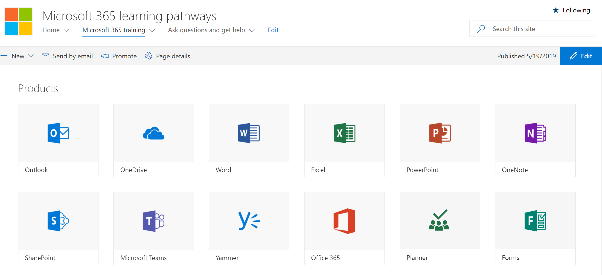

# Explorar el sitio de rutas de aprendizajeExplore the learning pathways site

> Nota: Para explorar el sitio de caminos de aprendizaje y sus características administrativas, necesitará permisos de administrador, propietario o miembro de la colección de sitios para el sitio.Note: To explore the learning pathways site and it's administrative features, you'll need Site Collection Admin, Owner, or Member permissions to the site. Si no tiene los permisos necesarios, póngase en contacto con el administrador del sitio para el sitio.If you don't have the neccesary permissions, contact the Site Administrator for the site. El sitio de rutas de aprendizaje se hospeda en el inquilino de Office 365, por lo que deberá iniciar sesión en Office 365 para llegar al sitio.The learning pathways site is hosted in your Office 365 tenant, so you'll need to sign in to Office 365 to get to the site. Si aún no ha iniciado sesión en Office 365, inicie sesión ahora.If you haven’t already signed into Office 365, sign in now. 

## Iniciar sesión en Office 365Sign in to Office 365 

1.  Abra el explorador web y vaya a office.com o a la ubicación del inicio de sesión de su organización.Open your Web browser and navigate to office.com or your organization’s sign-in location. 
2.  Inicie sesión con su nombre de usuario y contraseña.Sign in with your user name and password.
3.  Vaya a la ubicación del sitio mediante la dirección URL proporcionada por el administrador de inquilinos o seleccione SharePoint en la página principal de Office 365 y, a continuación, seleccione el sitio.Navigate to the location of the site using the URL supplied by your tenant administrator or select SharePoint from the Office 365 Home page, and then select the site. 

## Explorar el sitio de rutas de aprendizajeExplore the learning pathways site

El sitio de rutas de aprendizaje se basa en una plantilla de comunicación de SharePoint, por lo que es fácil modificar el sitio para satisfacer las necesidades de su organización.The learning pathways site is based on a SharePoint communication template, so it's easy to modify the site to meet the needs of your organization. Puede cambiar el nombre del sitio, el logotipo, los elementos de menú y el contenido de las páginas.You can change the site name, logo, menu items, and the content on the pages. Una de las páginas que querrá modificar para su organización es la página Hacer preguntas y obtener ayuda.One of the pages you'll want to modify for your organization is the Ask questions and get help page. Echemos un vistazo.Let's take a look.

### Ver la página Hacer preguntas y obtener ayudaView the Ask questions and get help page

El sitio de rutas de aprendizaje proporciona contenido predeterminado para ayudarle a empezar a crear el portal de aprendizaje y soporte técnico.The learning pathways site provides default content to help you get starting building your training and support portal. Como administrador o propietario del sitio, una de las cosas que querrá hacer es  cambiar los vínculos de la pregunta y obtener el punto de página de ayuda a los recursos de la organización.As an admininstrator or owner of the site, one of the things you’ll want to do is change the links on the **Ask question and get help page** point to resources in your organization. 

1.  En la página Principal de Caminos de aprendizaje de Microsoft 365, haga clic en el elemento de **menú** Hacer preguntas y obtener ayuda.From the Microsoft 365 learning pathways Home page, click the **Ask questions and get help** menu item.
2.  Haga clic en el botón **Editar**.Click the **Edit** button.
3.  Mantenga el mouse sobre una imagen de opción de ayuda y, a continuación, haga clic **en Editar elemento web**.Hover over a Help option image, then click **Edit web part**.

Para obtener instrucciones sobre cómo personalizar páginas de sitio, vea [Personalizar el sitio](custom_edithelp.md).For instructions on customizing site pages, see [Customize the site](custom_edithelp.md).

### Ver el contenido de las rutas de aprendizaje en el elemento webView the learning pathways content in the web part
La página de aprendizaje de Microsoft 365 hospeda el elemento web caminos de aprendizaje configurado para mostrar toda la formación disponible para las rutas de aprendizaje.The Microsoft 365 training page hosts the learning pathways Web part configured to show all the training available for learning pathways. 

1. Desplácese hacia abajo en la página para ver todas las categorías y subcategorías.Scroll down the page to view all the categories and subcategories.
2. Patea los neumáticos un poco.Kick the tires a bit. Haga clic en algunas subcategorías y, a continuación, haga clic en unas cuantas listas de reproducción para conocer cómo se organiza el contenido de las rutas de aprendizaje.Click a few subcategories, and then click a few playlists to get a feel for how learning pathways content is organized. 

Para obtener instrucciones sobre cómo personalizar el elemento web caminos de aprendizaje, vea [Personalizar la experiencia de aprendizaje](custom_overview.md).For instructions on customizing the learning pathways web part, see [Customize the Learning Experience](custom_overview.md).

### Obtener una guía completa de personalización y recorrido por el sitioGet a complete site tour and customization guidance
Para obtener una vista detallada de las rutas de aprendizaje, incitar al sitio, al elemento web, a las características administrativas y a las instrucciones sobre cómo crear experiencias de aprendizaje únicas para su entorno, consulte Personalizar la experiencia [de aprendizaje](custom_overview.md)For a detailed look at learning pathways, incuding the site, the web part, administrative features, and guidance on how to build unique learning experiences for your environment, see [Customize the Learning Experience](custom_overview.md)

## Siguientes pasosNext Steps
- [Personalizar la experiencia de aprendizajeCustomize the Learning Experience](custom_overview.md)
- [Impulsar la adopciónDrive adoption](driveadoption.md) 
