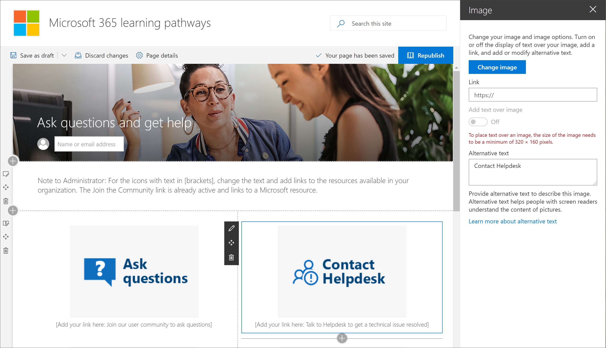

# Explorar el sitio de aprendizaje personalizado

> Nota: para explorar el sitio de aprendizaje personalizado y sus características administrativas, necesitará el administrador de la colección de sitios, el propietario o los permisos de miembros para el sitio. Si no tiene los permisos de neccesary, póngase en contacto con el administrador del sitio. El sitio de aprendizaje personalizado para Office 365 está hospedado en su inquilino de Office 365, por lo que tendrá que iniciar sesión en Office 365 para llegar al sitio. Si todavía no ha iniciado sesión en Office 365, inicie sesión ahora. 

## Iniciar sesión en Office 365 

1.  Abra el explorador Web y vaya a office.com o a la ubicación de inicio de sesión de su organización. 
2.  Inicie sesión con su nombre de usuario y contraseña.
3.  Navegue a la ubicación del sitio con la dirección URL proporcionada por el administrador del espacio empresarial o seleccione SharePoint en la página de inicio de Office 365 y, a continuación, seleccione el sitio. 

## Explorar el sitio de aprendizaje personalizado

El sitio de aprendizaje personalizado se basa en una plantilla de comunicación de SharePoint, por lo que es fácil modificar el sitio para satisfacer las necesidades de su organización. Puede cambiar el nombre del sitio, el logotipo, los elementos de menú y el contenido de las páginas. Una de las páginas que desea modificar para su organización es la página preguntas y obtener ayuda. Vamos a echar un vistazo.

### Ver la página preguntas y obtener ayuda

El sitio de aprendizaje personalizado proporciona contenido predeterminado para ayudarle a empezar a crear su portal de aprendizaje y soporte técnico. Como por o propietario del sitio, una de las cosas que debería hacer es cambiar los vínculos de la **pregunta Ask y obtener la página ayuda** señalan a los recursos de su organización. 

1.  En la Página principal de aprendizaje personalizado, haga clic en el elemento de menú **formular preguntas y obtener ayuda** .
2.  Haga clic en el botón **Editar**.
3.  Mantenga el mouse sobre una imagen de opción de ayuda y haga clic en **Editar elemento Web**.

Para obtener instrucciones sobre cómo personalizar las páginas del sitio, vea [customize the site](custom_edithelp.md).

### Ver el contenido de aprendizaje personalizado en el elemento Web
La página de aprendizaje de Office 365 hospeda el elemento Web de aprendizaje personalizado configurado para mostrar todo el aprendizaje disponible para el aprendizaje personalizado. 

1. Desplácese hacia abajo en la página para ver todas las categorías y subcategorías.
2. Empuje los neumáticos un poco. Haga clic en algunas subcategorías y, a continuación, haga clic en algunas listas de reproducción para familiarizarse con el modo en que se organiza el contenido de aprendizaje personalizado. 

Para obtener instrucciones sobre cómo personalizar el elemento Web de aprendizaje personalizado, consulte [customize the Learning Experience](custom_overview.md).

### Obtener una guía de personalización y recorrido del sitio completos
Para obtener información detallada sobre el aprendizaje personalizado, incuding el sitio, el elemento Web, las características administrativas y las instrucciones sobre cómo crear experiencias de aprendizaje únicas para el entorno, vea [customize the Learning Experience](custom_overview.md) .

## Pasos siguientes
- [Personalización de la experiencia de aprendizaje](custom_overview.md)
- [Adopción de unidades](driveadoption.md) 
