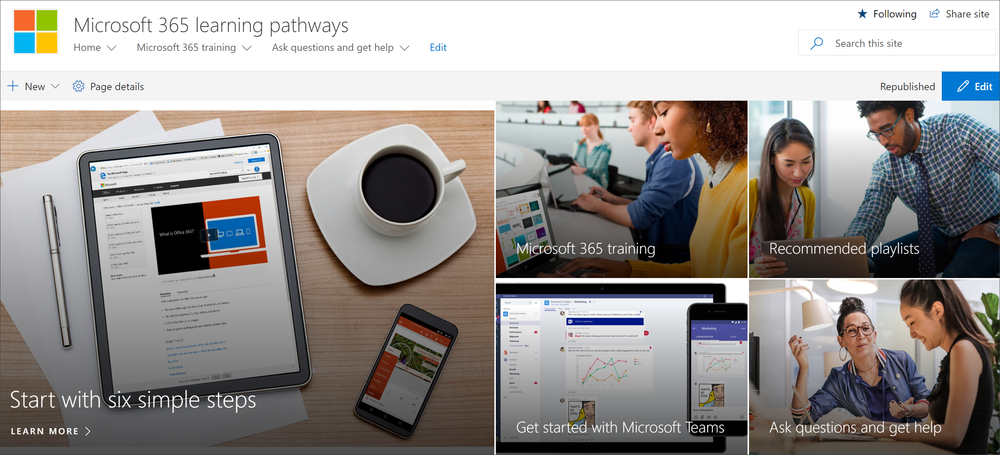

# Vaya al sitio de caminos de aprendizaje de Microsoft 365

El sitio de Microsoft 365 Learning Pathways para Office 365 se hospeda en su inquilino de Office 365, por lo que tendrá que iniciar sesión en Office 365 para llegar al sitio. Si todavía no ha iniciado sesión en Office 365, inicie sesión ahora. 

## Iniciar sesión  

1.  Abra el explorador Web y vaya a office.com o a la ubicación de inicio de sesión de su organización. 
2.  Inicie sesión con su nombre de usuario y contraseña.
3.  Navegue a la ubicación del sitio con la dirección URL proporcionada por el administrador del espacio empresarial o seleccione SharePoint en la página de inicio de Office 365 y, a continuación, seleccione el sitio **Microsoft 365 Learning Pathways** . 
5. Haga clic en el icono **Microsoft 365 Training** para ver el conjunto completo de lista de reproducción de formación disponible con los caminos de aprendizaje de Microsoft 365. 

## Ver todo el contenido de las rutas de aprendizaje
La página de aprendizaje de 365 de Microsoft hospeda el elemento Web de caminos de aprendizaje configurado para mostrar toda la formación disponible para las rutas de aprendizaje. 

1. Desplácese hacia abajo en la página para ver todas las categorías y subcategorías.
2. Empuje los neumáticos un poco. Haga clic en algunas subcategorías y, a continuación, haga clic en algunas listas de reproducción para familiarizarse con la forma en que se organiza el contenido de las rutas de aprendizaje. 

