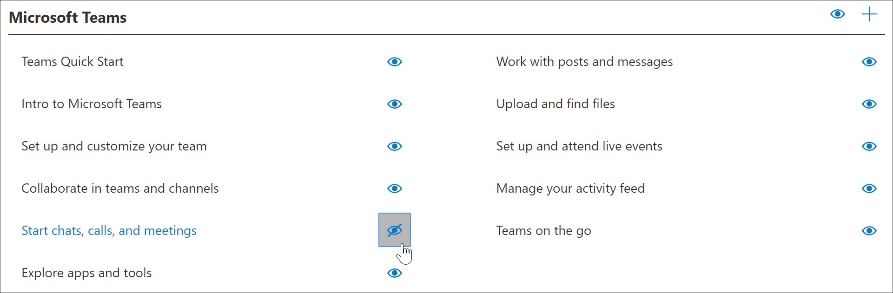
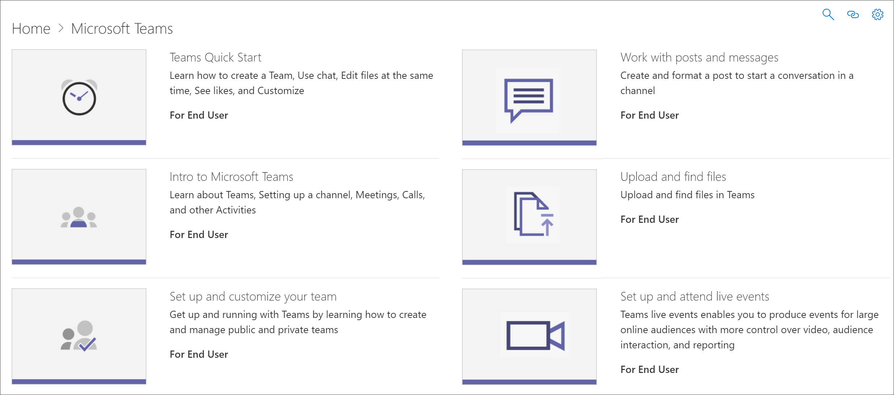

# Ocultar y mostrar listas de reproducciónHide and show Playlists

Para adaptar las rutas de aprendizaje a su entorno, puede ocultar listas de reproducción proporcionadas por Microsoft.To tailor learning pathways for your environment, you can hide playlists provided by Microsoft. 

- Puedes ocultar una lista de reproducción como Start with Six Simple Steps y reemplazarla por una lista de reproducción personalizada que crees para tu organización.You can hide a playlist like Start with Six Simple Steps and replace it with a custom playlist that your create for your organization.
- Puedes ocultar una lista de reproducción de un producto si la lista de reproducción abarca funciones no admitidas en tu organización.You can hide a playlist for a product if the playlist covers functionality not supported in your organization. Por ejemplo, si Microsoft Teams no está configurado para llamadas o reuniones, puede ocultar la lista de reproducción Iniciar **chats,** llamadas y reuniones.For example, if Microsoft Teams is not configured for calls or meetings, you can hide the **Start chats, calls, and meetings** playlist. 

## Ocultar una lista de reproducciónHide a playlist

1. En la página principal de caminos **de** aprendizaje, haga clic en el icono de aprendizaje de **Office 365.**From the learning pathways **Home** page, click the **Office 365 training** tile.
2. En el elemento web Caminos de aprendizaje, seleccione el **icono** Administrar.From the learning pathways web part, select the **Administer** icon. 
3. En el panel izquierdo de la **página** Administración, seleccione una subcategoría y, a continuación, seleccione el globo ocular de una lista de reproducción para ocultarla.From left pane in the **Administration** page, select a subcategory, and then select the eyeball for a playlist to hide it. En este ejemplo, haga clic en la subcategoría **de Microsoft Teams** y, a continuación, oculte la lista de reproducción \*\*\*\*Iniciar chats, llamadas y reuniones\*\*.For this example, click the **Microsoft Teams** subcategory, and then hide the \*\*\*\*Start chats, calls, and meetings\*\* playlist.  

### Comprobar que la lista de reproducción está ocultaVerify the playlist is hidden
- Para comprobar que la lista de reproducción está oculta, seleccione la pestaña del explorador con la página Introducción a **Office 365** cargada y, a continuación, actualice la página.To verify the playlist is hidden, select the browser tab with the **Get Started with Office 365** page loaded, and then refresh the page. Seleccione Microsoft Teams.Select Microsoft Teams. Ahora debería ver que la **subcategoría Iniciar chats, llamadas** y reuniones está oculta.You should now see the **Start chats, calls, and meetings** subcategory is hidden. 

## Mostrar una lista de reproducciónUnhide a playlist

- En la **página CAdministration,** seleccione una subcategoría, seleccione una lista de reproducción y, a continuación, seleccione el globo ocular de la lista de reproducción oculta para mostrarla.From the **CAdministration** page, select a subcategory, select a playlist, and then select the eyeball for the hidden playlist to unhide it. En este ejemplo, muestra la lista de reproducción De Microsoft Teams \**_Iniciar chats, llamadas y reuniones._*For this example, unhide the Microsoft Teams \**_Start chats, calls, and meetings_* playlist.   

