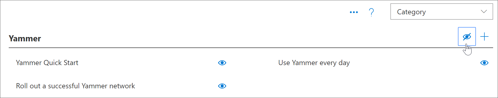
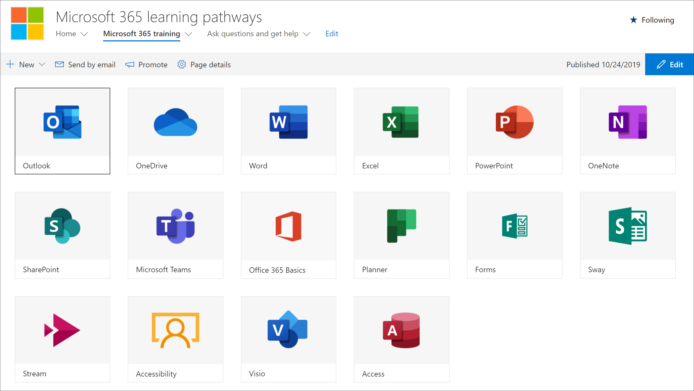

# Ocultar y mostrar subcategorías

Con la administración de Microsoft Learning, puede ocultar y mostrar subcategorías. Por ejemplo, las empresas que no implementan Yammer pueden ocultar la subcategoría Yammer, por lo que el contenido de Yammer no estará disponible para los usuarios. Esto evita llamadas no deseadas a los usuarios que, de lo contrario, podrían ver información relacionada con servicios que no están disponibles en la organización.

## Ocultar una subcategoría 

1. En la Página principal de los caminos de aprendizaje de Microsoft 365, haga clic en el icono **recomendado** .
2. En el elemento Web de caminos de aprendizaje de Microsoft 365, seleccione el menú sistema y, a continuación, seleccione **administrar lista de reproducción**. Ahora debería tener dos pestañas abiertas: una con la página de **Administración de aprendizaje personalizada** y otra con la página de **formación de Microsoft 365** . 
3. En la página **Administración de aprendizaje personalizada** , en **categoría**, seleccione una subcategoría y, a continuación, seleccione el ojo de la subcategoría para ocultarla. Para este ejemplo, oculte la subcategoría **Yammer** .  

### Comprobar que la subcategoría está oculta
- Para comprobar que la subcategoría está oculta, seleccione la pestaña explorador con la página Introducción **a Microsoft 365** cargada y, a continuación, actualice la página. Ahora debería ver la subcategoría de Yammer oculta en la categoría productos. 

## Mostrar una subcategoría 

- En la página **Administración de aprendizaje personalizada** , en **categoría**, seleccione una subcategoría y, a continuación, seleccione el ojo de la subcategoría oculta para mostrarla. Para este ejemplo, muestre la subcategoría Yammer.