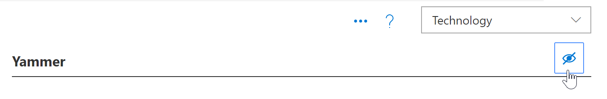
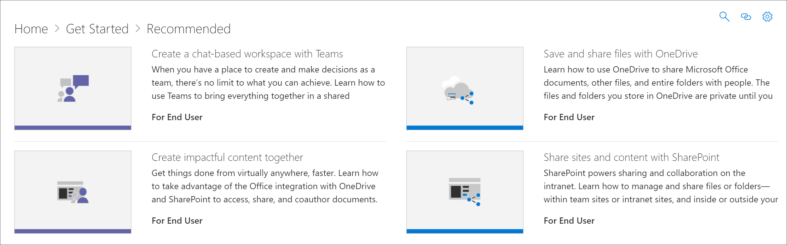

# Ocultar y mostrar tecnologíaHide and show Technology

En algunos casos, querrá ocultar el contenido de una tecnología que no es compatible con su organización.In some cases, you’ll want to hide content for a technology that’s not supported in your organization. La característica ocultar tecnología está diseñada para evitar que la tecnología aparezca en todo el elemento Web.The Hide Technology feature is designed to prevent technology from appearing throughout the Web part. Ofrece una forma más amplia de ocultar y mostrar contenido que ocultarlo por subcategoría o lista de reproducción.It offers a broader way to hide and show content than hiding it by subcategory or playlist. Por ejemplo, puede ocultar una subcategoría de Yammer, pero es posible que Yammer siga apareciendo en algunas listas de reproducción de escenarios como "conectar su organización con Yammer".For example, you can hide a Yammer subcategory, but Yammer may still show up in certain scenario playlists such as "Connect your organization with Yammer". Para asegurarse de que el contenido de una tecnología específica no se expone a los usuarios finales, ocúltelo por la tecnología.To ensure content for a specific technology is not exposed to end users, hide it by Technology. 

## Ocultar una tecnologíaHide a Technology

1. En la página **principal** de los caminos de aprendizaje de Microsoft 365, haga clic en el icono de **listas de reproducción recomendadas** .From the Microsoft 365 learning pathways **Home** page, click the **Recommended playlists** tile.
2. En el elemento Web de aprendizaje personalizado, seleccione el icono **Aministration** .From the Custom Learning Web part, select the **Aministration** icon.
3. En el cuadro de lista desplegable de la sección superior derecha de la página **Administración** , seleccione **tecnología**.In the dropdown list box in the upper-right section of the **Administration** page, select **Technology**.
Para este ejemplo, haga clic en **Yammer** en el panel izquierdo de la página y, a continuación, haga clic en el ojo que se encuentra junto a Yammer.For this example, click **Yammer** in the left pane of the page, then click the eyeball next to Yammer.  

### Comprobar que la lista de reproducción está ocultaVerify the playlist is hidden
- Para comprobar que la tecnología de **Yammer** está oculta, seleccione la pestaña explorador con la página **listas de reproducción recomendadas** cargada y, después, actualice la página.To verify **Yammer** technology is hidden, select the browser tab with the **Recommended playlists** page loaded, and then refresh the page. Observará que la lista de reproducción de Yammer está oculta **en conectar a la organización** .You'll notice that the **Connect your organization with Yammer** playlist is hidden. 

## Mostrar una tecnologíaUnhide a Technology

- En la página de **Administración** , seleccione una tecnología y, a continuación, seleccione el ojo de la tecnología oculta para mostrarlo.From the **Administration** page, select a technology, then select the eyeball for the hidden technology to unhide it. Para este ejemplo, muestre la tecnología **Yammer** .For this example, unhide the **Yammer** technology. 