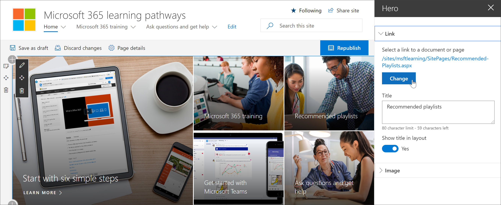
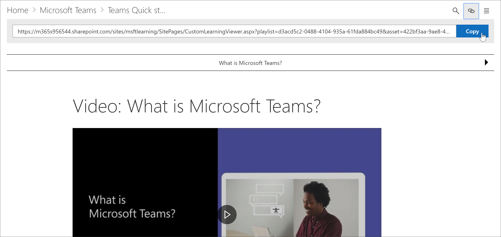
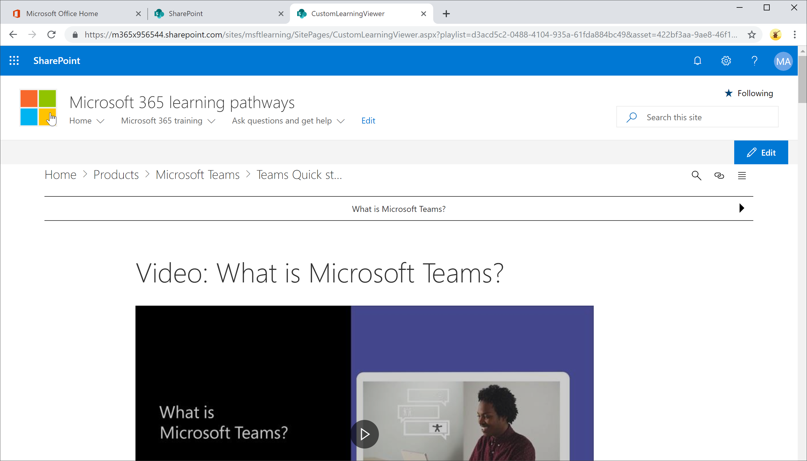

# Vínculo al contenido de rutas de aprendizajeLink to learning pathways content

Con las rutas de aprendizaje, hay dos formas de vincular al contenido:With learning pathways, there are two ways to link to content:

- Vínculo a la página que hospeda el elemento Web filtrado para el contenido que desea mostrarLink to the page that host the Web part filtered for the content you want to display 
- Vincular directamente a una instancia del elemento WebLink directly to an instance of the Web part

## Vínculo a una páginaLink to a page

Si ha creado nuevas páginas y experiencias de aprendizaje con el elemento Web caminos de aprendizaje de Microsoft 365, puede crear un vínculo a la página con el elemento web configurado para mostrar el contenido que desea mostrar.If you've created new pages and learning experiences with the Microsoft 365 learning pathways web part, you can link to the page with the Web part configured to show the content you want to display. En la sección anterior, hemos explicado cómo mostrar listas de reproducción de Excel en una página.In the previous section, we covered how to display Excel playlists on a page. Ahora puede editar la Página principal para vincularla a la página.You could now edit the Home page to link to the page. 

1. En la Página principal, haga clic en **Editar**.From the Home page, click **Edit**.
2. Haga clic en **editar detalles** en uno de los mosaicos de la Página principal.Click **Edit details** in one of the Home page tiles. En este ejemplo, se editan las fichas de **listas de reproducción recomendadas** .In this example, we edit the **Recommended playlists** tiles.
3. En **vínculo**, haga clic en **cambiar**.Under **Link**, click **Change**.

4. Haga clic en **sitio**, después en **páginas del sitio**, haga clic en la página que desea vincular y, a continuación, haga clic en **abrir**.Click **Site**, then **Site Pages**, click the page you want to link to, and then click **Open**. En este ejemplo, nos vinculamos a la página **Create-Your-Own-Experience. aspx** tratada en la sección anterior.In this example, we link to the **Create-your-own-experience.aspx** page covered in the previous section.
5. Cierre el panel Propiedades del héroe, haga clic en **publicar**y, a continuación, pruebe el vínculo.Close the Hero properties pane, click **Publish**, and then test the link. 

## Vínculo al elemento Web de caminos de aprendizaje de Microsoft 365Link to the Microsoft 365 learning pathways web part
Las rutas de aprendizaje le proporcionan, el administrador o un usuario final, la capacidad de vincular a una instancia del elemento web independiente de la página que contiene el elemento Web.Learning pathways gives you, the administrator, or an end-user, the ability to link to an instance of the Web part independent of the page that contains the Web part. Puede compartir el vínculo o el vínculo que se ha copiado desde otras páginas.You can share the copied link or link to it from other pages. Al hacer clic en el vínculo copiado, se muestra la instancia del elemento Web de rutas de aprendizaje de Microsoft 365 en la página CustomLLearningViewer. aspx.The copied link, when clicked, shows the Microsoft 365 learning pathways web part instance in the CustomLLearningViewer.aspx page. Veamos un ejemplo.Let's look at an example. 

1. En la Página principal, haga clic en **Microsoft365 Training**.From the Home page, click **Microsoft365 training**.
2. Haga clic en **Microsoft Teams**y, a continuación, en **Introducción a Microsoft Teams**.Click **Microsoft Teams**, and then click **Intro to Microsoft Teams**.
3. Haga clic en el icono **copiar** .Click the **Copy** icon.

4. Haga clic en Inicio en el menú del sitio de caminos de aprendizaje de Microsoft 365.Click Home from the Microsoft 365 learning pathways site menu.
5. Pegue la dirección URL copiada en la barra de direcciones del explorador y presione Entrar.Paste the copied URL in the address bar of the browser and press ENTER. 

Como se muestra en la siguiente ilustración, el vínculo va a la página CustomLearningViewer. aspx y muestra el contenido en función de los parámetros del vínculo copiado.As shown in the following illustration, the link goes to the CustomLearningViewer.aspx page and displays the content based on the parameters in the copied link. 

