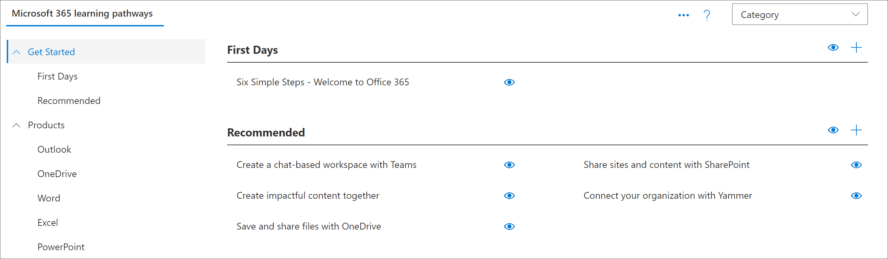

# Instalación manual de rutas de aprendizaje

Microsoft 365 Learning Pathways ofrece una configuración manual para las organizaciones que necesitan soporte para uno de los siguientes escenarios:

- Su organización tiene establecido un sitio de comunicación moderna de SharePoint online dedicado a la formación y desea agregar rutas de aprendizaje a ese sitio. En este escenario, el elemento Web de rutas de aprendizaje no se ha configurado en el sitio.

- Desea instalar rutas de aprendizaje para la compatibilidad multilingüe en uno de los sitios de comunicación de SharePoint de la organización. El sitio tiene, o tendrá, un idioma predeterminado que no es el inglés, pero es uno de los idiomas admitidos por las rutas de aprendizaje. Estos son los idiomas admitidos por las rutas de aprendizaje:

- English
- Chino (simplificado)
- Francés
- Alemán
- Italiano (Italia)
- Japonés (Japón)
- Portugués (Brasil)
- Ruso (Ruso)
- Spanish

La configuración manual de las vías de aprendizaje requiere experiencia en el trabajo con Windows PowerShell y el shell de administración de SharePoint Online. Estos son los pasos para la configuración manual de rutas de aprendizaje: 

- Compruebe que ha cumplido todos los requisitos previos.
- Compruebe la configuración de idioma predeterminada de su sitio. Si es correcto, continúe con la instalación manual. Si necesita una configuración de idioma predeterminada diferente, deberá crear un nuevo sitio. 
- Instale el archivo customlearning. sppkg en el catálogo de aplicaciones del espacio empresarial de SharePoint.
- Aprovisionar o identificar un sitio de comunicación moderno para que actúe como su sitio principal de caminos de aprendizaje de Microsoft 365.
- Ejecute un script de PowerShell que configurará a su inquilino con los artefactos apropiados de los que depende el aprendizaje de las rutas.
- Navegue a la página del sitio CustomLearningAdmin. aspx para cargar el elemento Web de administración para inicializar la configuración de contenido personalizada.

> [!NOTE]
> Si está buscando una forma rápida y sencilla de configurar rutas de aprendizaje, vea [provision Microsoft 365 Learning Pathways](custom_provision.md).

## Requisitos previos
Para garantizar una configuración manual correcta del elemento Web caminos de aprendizaje, deben cumplirse los requisitos previos siguientes. 

- Debe tener instalado y configurado el catálogo de aplicaciones de todo el inquilino. Consulte [configurar su inquilino de Office 365](https://docs.microsoft.com/sharepoint/dev/spfx/set-up-your-developer-tenant#create-app-catalog-site) y seguir la sección crear un sitio del catálogo de aplicaciones. 
- Si ya se ha aprovisionado el catálogo de aplicaciones de todo el espacio empresarial, necesitará tener acceso a una cuenta que tenga derechos para cargar un paquete para completar este proceso de configuración. Por lo general, esta cuenta tiene un rol de administrador de SharePoint. 
- Si una cuenta con ese rol no funciona, vaya al centro de administración de SharePoint y busque los administradores de la colección de sitios para la colección de sitios del catálogo de aplicaciones y inicie sesión como uno de los administradores de la colección de sitios, o bien agregue la cuenta de administrador de SharePoint que produjo errores a los administradores de la colección de sitios. 
- También necesitará tener acceso a una cuenta que sea administrador de inquilinos de SharePoint.

## Paso 1: comprobar la configuración de idioma
Como primer paso del proceso de instalación manual, Compruebe la configuración de idioma del sitio. Estas son las posibles opciones:

### Opción 1: no desea compatibilidad multilingüe
Si no desea que el sitio admita multilingüe, asegúrese de que está desactivado.
1.  En el sitio de comunicación de SharePoint, seleccione **configuración**del sitio ver la configuración de  >  **Site information**  >  idioma de toda la configuración del**sitio**  >  **Language settings**. 
2.  Establezca **la opción** **Habilitar páginas y noticias para que se traduzcan a varios idiomas** .
3.  Haga clic en **Guardar **. 
4.  Continúe con el paso 2.

## Opción 2: desea la compatibilidad multilingüe y es correcto con el idioma predeterminado
Un sitio de comunicación de SharePoint tiene un idioma predeterminado. El idioma predeterminado determina el idioma en el que se ven las rutas de aprendizaje, incluida la página de administración de rutas de aprendizaje. La configuración de idioma predeterminada se establece cuando se crea el sitio por primera vez y no se puede cambiar después. Antes de continuar con la configuración manual, asegúrese de que es correcto con el idioma predeterminado del sitio de destino.

1.  En el sitio de comunicación de SharePoint, seleccione **configuración**del sitio ver la configuración de  >  **Site information**  >  idioma de toda la configuración del**sitio**  >  **Language settings**. 
2.  Establezca **permitir que las páginas y las noticias se traduzcan en varios idiomas** cambie a **activado**.
    - Si está bien con el idioma que aparece en la parte superior de la lista en **idioma**, puede agregar idiomas adicionales y, a continuación, hacer clic en **Guardar**. Continúe con el paso 2.
    - Si quiere un idioma predeterminado diferente del que se ha seleccionado para el sitio, tendrá que crear un nuevo sitio de comunicación de SharePoint con el idioma que desee. Continúe con la opción 3. 

## Opción #3: desea una compatibilidad multilingüe, pero desea un idioma predeterminado diferente para el sitio
Con esta opción, se crea un nuevo sitio de comunicación de SharePoint Online con el idioma predeterminado que se desea y, a continuación, se establece la configuración de idioma del sitio. 
1.  Para crear un nuevo sitio de comunicación de SharePoint, vea [crear un sitio de comunicación en SharePoint Online](https://support.microsoft.com/office/create-a-communication-site-in-sharepoint-online-7fb44b20-a72f-4d2c-9173-fc8f59ba50eb). Al crear el sitio, asegúrese de establecer el idioma predeterminado para las rutas de aprendizaje. 
2. En el sitio que ha creado, seleccione **configuración**  >  **información del sitio**  >  **ver todas las**opciones de idioma de configuración del sitio  >  **Language settings**. 
2.  Establezca **permitir que las páginas y las noticias se traduzcan en varios idiomas** cambie a **activado**.
3. Agregue idiomas adicionales, si es necesario, y haga clic en **Guardar**. 
4. Continúe con el paso 2. 

>! Note Si necesita migrar contenido personalizado de un sitio a un sitio recién creado, consulte [migrar contenido personalizado](Migrate custom content). 

## Paso 2: obtener el paquete de elementos Web y la secuencia de comandos de instalación de GitHub
Como parte del proceso de instalación, necesitará el paquete de elementos Web de caminos de aprendizaje de Microsoft 365 y el script de instalación de PowerShell.

- Vaya al [repositorio de github de caminos de aprendizaje](https://github.com/pnp/custom-learning-office-365).
- Haga clic en **Descargar** para guardar el paquete de elementos Web y el script en una unidad local. Utilizará el script y el paquete de elementos Web en pasos posteriores de este proceso.

## Paso 2: cargar el elemento Web en el catálogo de aplicaciones del espacio empresarial
Para configurar los caminos de aprendizaje de Microsoft 365, debe cargar el archivo customlearning. sppkg en el catálogo de aplicaciones de todo el inquilino e implementarlo. Consulte [usar el catálogo de aplicaciones para hacer que las aplicaciones empresariales personalizadas estén disponibles en su entorno de SharePoint Online](https://docs.microsoft.com/sharepoint/use-app-catalog) para obtener instrucciones detalladas sobre cómo agregar una aplicación al catálogo de aplicaciones.

## Paso 3: aprovisionar o identificar un sitio de comunicación moderno
Identifique un sitio de comunicación de SharePoint existente o bien aprovisione uno nuevo en el espacio empresarial de SharePoint Online. Para obtener más información sobre cómo aprovisionar un sitio de comunicación, vea [crear un sitio de comunicación en SharePoint Online](https://support.office.com/en-us/article/create-a-communication-site-in-sharepoint-online-7fb44b20-a72f-4d2c-9173-fc8f59ba50eb) y siga los pasos para crear un sitio de comunicación.

## Paso 4: agregar la aplicación de caminos de aprendizaje de Microsoft 365 al sitio

1. En el sitio de SharePoint, haga clic en el menú sistema y, a continuación, haga clic en **Agregar una aplicación**. 
2. En **sus aplicaciones**, haga clic en **desde su organización**y, a continuación, haga clic en **rutas de aprendizaje para Office 365**. 

## Paso 5: establecer permisos para el sitio
Asegúrese de que se han establecido los siguientes permisos para el sitio:
- **Administrador de la colección de sitios o parte del grupo propietarios** : permisos necesarios para inicializar el elemento de lista CustomConfig que configura las rutas de aprendizaje para su primer uso. 
- **Grupo miembros** : permisos necesarios para administrar las rutas de aprendizaje, como ocultar y mostrar contenido, y administrar listas de reproducción personalizadas
- **Grupo visitantes** : permisos necesarios para ver el contenido del sitio. 

## Paso 6: ejecutar el script de configuración de PowerShell
Se incluye un script de PowerShell que tendrá que `CustomLearningConfiguration.ps1` ejecutar para crear tres [propiedades de inquilino](https://docs.microsoft.com/sharepoint/dev/spfx/tenant-properties) que use la solución. Además, el script crea dos [páginas de aplicación de elemento único](https://docs.microsoft.com/sharepoint/dev/spfx/web-parts/single-part-app-pages) en la biblioteca de páginas del sitio para hospedar los elementos Web de administrador y de usuario en una ubicación conocida.

1. Si aún no ha descargado el shell de administración de SharePoint Online, Descárguelo ahora. Vea [Descargar Shell de administración de SharePoint Online](https://go.microsoft.com/fwlink/p/?LinkId=255251).
2. Es posible que deba establecer una directiva de ejecución de PowerShell para ejecutar el script. Para obtener más información, consulte [acerca de las directivas de ejecución](https://docs.microsoft.com/powershell/module/microsoft.powershell.core/about/about_execution_policies?view=powershell-6).
3. Ejecute el `CustomLearningConfiguration.ps1` script. Además de las credenciales de administrador de espacios empresariales, el script le pedirá el nombre del espacio empresarial y el nombre del sitio. Teniendo en cuenta el siguiente ejemplo para la dirección URL del sitio, `https://contoso.sharepoint.com/sites/O365CL` , `contoso` es el nombre del espacio empresarial y `O365CL` es el nombre del sitio. 

### Deshabilitar la colección de telemetría
Parte de esta solución incluye el seguimiento de telemetría de anonimizan, que de forma predeterminada se establece en activado. Si va a realizar una instalación manual y desea desactivar el seguimiento de telemetría, cambie el `CustomlearningConfiguration.ps1` script para establecer la variable $optInTelemetry en $false y ejecute el script.

## Validar el aprovisionamiento correcto e inicializar la lista de CustomConfig

Una vez que el script de PowerShell se haya ejecutado correctamente, navegue hasta el sitio, inicialice el elemento de lista de **CustomConfig** que configura las rutas de aprendizaje para el primer uso y valide que el sitio esté funcionando.

- Vaya a `<YOUR-SITE-COLLECTION-URL>/SitePages/CustomLearningAdmin.aspx`. Al abrir **CustomLearningAdmin. aspx** se inicializa el elemento de lista **CustomConfig** que configura las rutas de aprendizaje para el primer uso. Debería ver una página similar a la siguiente:

## Agregar propietarios al sitio
Como administrador de inquilinos, es poco probable que sea la persona que va a personalizar el sitio, por lo que necesitará asignar algunos propietarios al sitio. Los propietarios tienen privilegios administrativos en el sitio para que puedan modificar las páginas del sitio y remarcar el sitio. También tienen la capacidad de ocultar y mostrar contenido entregado a través del elemento Web de caminos de aprendizaje. Además, tendrán la capacidad de crear listas de reproducción personalizadas y asignarlas a subcategorías personalizadas.  

1. En el menú **configuración** de SharePoint, haga clic en **permisos del sitio**.
2. Haga clic en **Configuración avanzada de permisos**.
3. Haga clic en **rutas de aprendizaje para los propietarios de Office 365**.
4. Haga clic en **nuevo**  >  **Agregar usuarios a este grupo**y, a continuación, agregue las personas que desea que sean propietarios. 
5. Agregue un vínculo para [explorar el sitio](https://docs.microsoft.com/Office365/CustomLearning/custom_explore) en el mensaje de uso compartido y, a continuación, haga clic en **compartir**.

## Migrar contenido personalizado
Después de restablecer el sitio de caminos de aprendizaje siguiendo los pasos anteriores, tendrá que mover el contenido de la lista de **CustomPlaylists** y la lista de **CustomAssets** . Si lo desea, también puede mover las páginas personalizadas reales que componen los activos personalizados si residen en el sitio de caminos de aprendizaje existente y su intención es eliminarla. La tarea puede ser difícil porque para todos los elementos de la lista **CustomPlaylists** , el identificador del elemento de lista de la lista **CustomAssets** está escondido en el campo JSONData de cada elemento de lista de lista de reproducción. Por lo tanto, simplemente mover el contenido de la lista de **CustomPlaylists** de un sitio a otro no será suficiente. Además, la lista **CustomAssets** contiene la dirección URL absoluta de la página del activo personalizado en el campo JSONData del elemento de lista. Si los activos no se mueven y no se cambia el nombre del sitio (lo que cambia la dirección URL absoluta a la página del activo), entonces **CustomAssets** puede permanecer. Pero tendrá que corregir manualmente las entradas. Teniendo en cuenta la complejidad de este tipo de migración, sugerimos que considere la posibilidad de enumerar uno de nuestros asociados de caminos de aprendizaje para ayudarle a realizar esta transición.

### Siguientes pasos
- [Personalice](custom_overview.md) la experiencia de aprendizaje para su organización.

