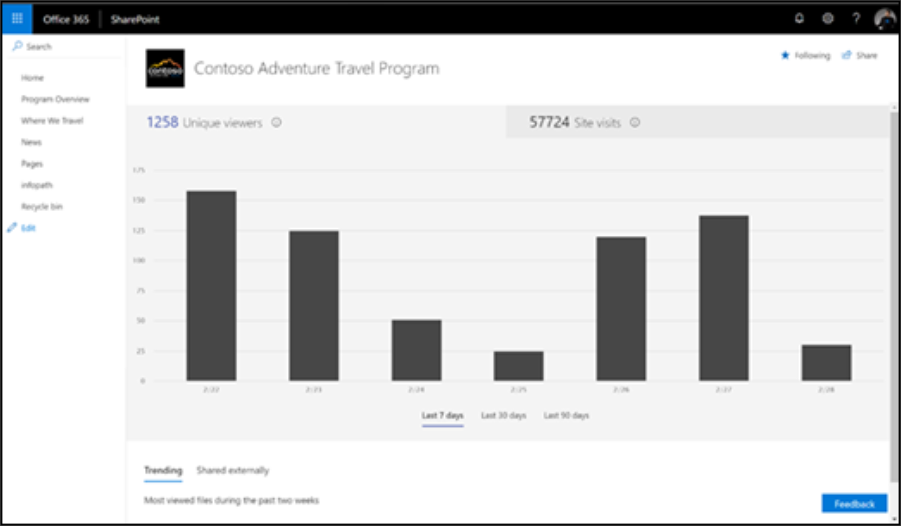

# Medir el impacto de los caminos de aprendizaje de Microsoft 365Measuring impact of Microsoft 365 learning pathways

Los administradores deben aprovechar las funciones integradas de informes de uso del sitio de SharePoint para medir el impacto organizacional de los caminos de aprendizaje de Microsoft 365.Administrators should leverage SharePoint’s built-in site usage reporting capabilities to measure organizational impact of the Microsoft 365 learning pathways. Hay dos escenarios principales para medir el impacto:There are two primary scenarios for measuring impact: 
- Impacto en el nivel de sitio: ver datos de uso para el sitio específico de aprendizaje personalizado para Office 365Site level impact – view usage data for the Custom Learning for Office 365 specific site 
- Impacto en el nivel de la organización: comprenda el aprendizaje al cliente sobre el uso de Office 365 con respecto a todos los demás sitios de la organización.Organization level impact – understand Customer Learning for Office 365 usage with respect to all other sites within your organization

## Impacto en el nivel de sitioSite-level impact

Como propietario de un sitio de SharePoint Online, puede ver la información que muestra cómo los usuarios interactúan con el sitio.As a SharePoint Online site owner, you can view information that shows you how users are interacting with your site. Por ejemplo, puede ver el número de personas que han visitado el sitio, las veces que se ha visitado el sitio y una lista de los archivos que han recibido el mayor número de visitas.For example, you can see the number of people who have visited the site, how many times people have visited the site, and a list of files that have received the most views. Vea los [detalles del informe](https://support.office.com/article/view-usage-data-for-your-sharepoint-site-2fa8ddc2-c4b3-4268-8d26-a772dc55779e).See [Report Details](https://support.office.com/article/view-usage-data-for-your-sharepoint-site-2fa8ddc2-c4b3-4268-8d26-a772dc55779e). 

## Impacto en el nivel de la organizaciónOrganization-level impact
El informe de uso del sitio de SharePoint del centro de administración de Office 365 permite a los administradores obtener una vista de alto nivel del valor que se obtiene del sitio de aprendizaje personalizado para Office 365 en relación con el resto de los sitios de SharePoint.The Office 365 Admin Center SharePoint site usage report enables Administrators to get a high level view of the value you are getting from the Custom Learning for Office 365 site relative to all other SharePoint sites. Vea los [detalles del informe](https://docs.microsoft.com/office365/admin/activity-reports/sharepoint-site-usage?view=o365-worldwide).See [Report Details](https://docs.microsoft.com/office365/admin/activity-reports/sharepoint-site-usage?view=o365-worldwide).
 
Siga el artículo a los que se hace referencia para:Follow the referenced article to: 
1. Obtener información sobre cómo acceder al informe de uso del sitio de SharePointLearn how to get to the SharePoint site usage report 
2. Interpretación de los detalles del informe de uso del sitio de SharePoint.Interpreting the SharePoint site usage report details. Ordene en el campo dirección URL del sitio para identificar más fácilmente su sitio de caminos de aprendizaje de Microsoft 365.Sort on the Site URL field to more easily identify your Microsoft 365 learning pathways site. 
3. Aproveche la funcionalidad de exportación de informes para un análisis de datos más avanzado o si su organización tiene más de 2.000 sitios.Leverage the report Export functionality for more advanced data analysis or if your organization has greater than 2,000 sites. 

## ComentariosFeedback

A partir de hoy, los informes se limitan al nivel de sitio de SharePoint.As of today, reporting is limited to the SharePoint site level. Preste su voto a nuestro foro de [voz de usuario](https://go.microsoft.com/fwlink/?linkid=2109552) para ayudar a priorizar las solicitudes de funcionalidad de informes mejoradas.Lend your vote to our [User Voice](https://go.microsoft.com/fwlink/?linkid=2109552) forum to help prioritize enhanced reporting functionality requests.   

