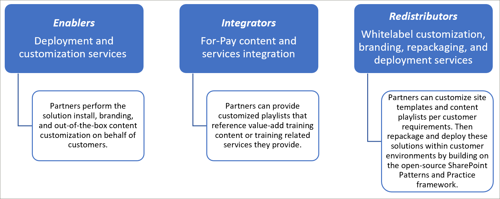
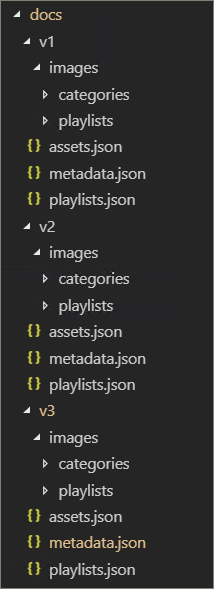
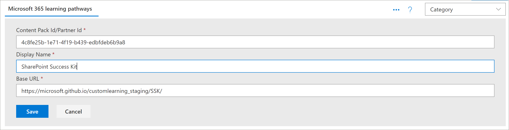
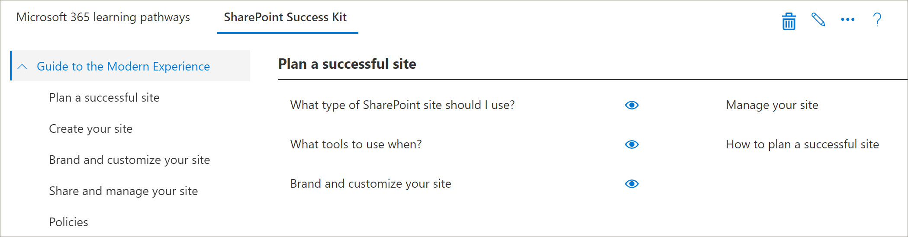
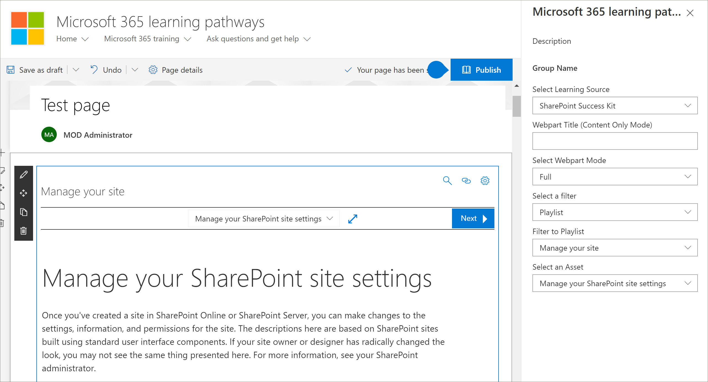

# Modelos de integración de socios
Aunque no es posible complementar el contenido de las rutas de aprendizaje de Microsoft 365 directamente desde el servicio de aprovisionamiento en línea de SharePoint, existen varios modelos de integración que los partners pueden aprovechar para crear ofertas de servicio de valor agregado alineadas. Los modelos de integración de partners anteriores se presentan en orden de complejidad ascendente y niveles de inversión. Por lo tanto, nuestra guía es desarrollar su experiencia y graduarse a niveles más avanzados en función de sus modelos de negocio.

## ¿Cómo debería empezar? 
Para empezar, estos son algunos procedimientos recomendados a seguir.     

### 1. Comience con la creación de conocimientos como habilitador. 
Puedes ayudar a un porcentaje de tu base de clientes de inmediato habilitando su portal de aprendizaje de caminos de aprendizaje y realizando la curación de contenido de Microsoft dirigida. Para obtener instrucciones sobre el aprovisionamiento de caminos de aprendizaje, vea [Aprovisionar una nueva solución de caminos de aprendizaje.](/office365/customlearning/custom_provision)  

### 2. A continuación, extienda sus servicios como integrador
Realice un retorno de automatización en el análisis de inversión, en función de la cantidad de sus necesidades de integración de contenido o servicios. Por ejemplo, puede que no tenga sentido asumir los costos operativos y de desarrollo con respecto a nuestras directrices de integración de contenido si puede crear manualmente manualmente listas de reproducción personalizadas dirigidas que apunten al contenido de pago o hagan referencia a sus servicios.

### 3. Cuando el retorno de la inversión tenga sentido: considere redistribuir 
Cuando el retorno de la inversión tenga sentido: considere redistribuir (o trabajar con asociados relacionados con caminos de aprendizaje) para crear soluciones reenvasadas. Se basan en el marco SharePoint patrones y prácticas que proporciona soluciones para extraer sitios personalizados y, a continuación, implementarlos en entornos de clientes 

## Directrices de integración de contenido proporcionadas por el partner
El contenido Microsoft 365 rutas de aprendizaje está controlado por un conjunto de archivos JSON que actúan como manifiestos de contenido para el paquete de aprendizaje. Hay tres archivos: metadata.js, playlists.jsy assets.js. Estos archivos deben estructurarse para que coincidan con los modelos que reconoce el elemento web y, a continuación, se hospedan desde una red de entrega de contenido (CDN) para permitir que el elemento web los cargue. Microsoft proporcionará plantillas de inicio de estos archivos para empezar.  

**Declinación de responsabilidades:** la estructura de archivos JSON está sujeta a cambios en función del trabajo de la próxima solución. El Microsoft 365 de aprendizaje temprano (EAP) del partner de caminos de aprendizaje se informará de cualquier cambio inminente de esta naturaleza. Junto con cualquier guía de compatibilidad o transición hacia atrás de los clientes. 

### Descargar la solución Microsoft 365 caminos de aprendizaje
Puede descargar la solución Microsoft 365 caminos de aprendizaje, junto con los archivos JSON, desde el repositorio GitHub: https://github.com/pnp/custom-learning-office-365 . Tenga en cuenta que, en este momento, Microsoft no está GitHub solicitud de extracción en la solución. Pero puede usar los archivos GitHub como punto de partida para crear su propio paquete de contenido personalizado. 

### Metadata.jsestructura
Puede pensar en este archivo como el cerebro de los menús y la estructura. Contiene toda la estructura de navegación, así como listas de selección de datos en los otros dos archivos. 

|              Nombre        |                     Descripción                                                               | 
|:-----------------------------|-------------------------------------------------------------------------------------------|
|**Tecnologías**              |El contenido está etiquetado y se puede ocultar en función de la tecnología asignada.                 |  
|&nbsp;&nbsp;Id.                |GUID que representa la tecnología                                                           |  
|&nbsp;&nbsp;Nombre              |Nombre para mostrar de la tecnología                                                             |
|&nbsp;&nbsp;*Subjects[ ]*     |Una matriz de temas que son un subconjunto de la tecnología                                   | 
|&nbsp;&nbsp;&nbsp;&nbsp;Id.    |GUID que representa el asunto                                                              |
|&nbsp;&nbsp;&nbsp;&nbsp;Nombre  |Nombre para mostrar del asunto                                                                |
|**Categorías [ ]**             |Las categorías informan de la navegación del elemento web. Cada categoría representa un nivel superior de la navegación                                                                                                                 |
|&nbsp;&nbsp;Id.                |GUID que representa la categoría o subcategoría                                                 |
|&nbsp;&nbsp;Nombre              |Nombre para mostrar de la categoría o subcategoría                                                  |
|&nbsp;&nbsp;Imagen             |Dirección URL de la imagen que debe mostrarse en la experiencia de usuario (con relación a la CDN base)            |
|&nbsp;&nbsp;TechnologyId      |Guid de la tecnología a la que está relacionado este contenido (opcional – cadena vacía)            |
|&nbsp;&nbsp;SubjectId         |Guid del asunto con el que está relacionado este contenido (opcional – cadena vacía)               |
|&nbsp;&nbsp;Origen            |Desde la matriz Source, no se usa específicamente en la experiencia de usuario que no sea los datos personalizados agregados por el usuario se marca como "Inquilino" y el área de administración de la experiencia de usuario no permite editar nada que no esté marcado como "Inquilino".                           |
|&nbsp;&nbsp;*Subcategorías[ ]*|Sub-Categories básicamente son el nivel de navegación desde el nivel 2 hacia abajo. La estructura es la misma que una categoría que acaba de anidar.          |
|**Audiencias [ ]**             |Cuando las listas de reproducción asociadas con una categoría o subcategoría son varias audiencias etiquetadas, un selector estará disponible para mostrar las audiencias disponibles. |         
|&nbsp;&nbsp;Id.                |GUID de la audiencia                                                                       |  
|&nbsp;&nbsp;Nombre              |Nombre para mostrar de la audiencia                                                               |       
|**Sources [ ]**               |La matriz de cadenas que etiquetan el contenido con su origen, que no se usa específicamente en la experiencia de usuario aparte de los datos personalizados agregados por el usuario, se marca como "Inquilino" y el área de administración de la experiencia de usuario no permite editar nada que no esté marcado como "Inquilino".                                                   |  
|**Niveles [ ]**               |Cuando las listas de reproducción asociadas a una categoría o subcategoría están etiquetadas en varios niveles, un selector estará disponible para mostrar los niveles disponibles.             |  
|&nbsp;&nbsp;Id.                |GUID del nivel                                                                          |  
|&nbsp;&nbsp;Nombre              |Nombre para mostrar del nivel                                                                  | 
|**StatusTag [ ]**           |La etiqueta Status es para identificar el contenido con varios estados que se mostrarán en la experiencia de usuario. Algunas de estas marcas se mostrarán al consumidor y otras solo al administrador.                                                   |  
|&nbsp;&nbsp;Id.                |GUID de StatugTag                                                                      |  
|&nbsp;&nbsp;Nombre              |Nombre para mostrar de StatusTag                                                              | 
|**Telemetría [ ]**            |                                                                                           |  
|&nbsp;&nbsp;AppInsightsKey    |GUID de la clave de información de la aplicación que has configurado para realizar un seguimiento de la carga del elemento web del visor. Un administrador puede desactivar el seguimiento para todo el inquilino, pero la información enviada es un usuario anónimo con el identificador de inquilino. Vea esta sección para obtener más información https://github.com/pnp/custom-learning-office-365#disabling-telemetry-collection               |  
|**Version**                   |La solución usa la información de versión para indicar a los administradores que el elemento web se ha actualizado y también permitir que el elemento web actualice automáticamente el contenido personalizado a la versión más reciente del manifiesto si se han realizado cambios significativos.         | 
|&nbsp;&nbsp;Manifiesto          |La versión del manifiesto                                               |
|&nbsp;&nbsp;ManifestMinWebPart|La versión mínima del elemento web que funciona con la versión del manifiesto             |
|&nbsp;&nbsp;CurrentWebPart    |Dirección URL de la imagen que debe mostrarse en la experiencia de usuario (con relación a la CDN base)            |
|&nbsp;&nbsp;RepoURL           |Dirección URL del repositorio donde se encuentran las instrucciones del elemento web de actualización.                    |
|**Paquetes de contenido**             |En este momento no se admiten paquetes de contenido para CDN adicionales. Los paquetes de contenido permiten a Microsoft sugerir otras soluciones creadas por Microsoft que se pueden aprovisionar a través del servicio de aprovisionamiento que aprovechan M365LP para entregar contenido y que están en y por sí mismas redes CDN personalizadas.       | 
|&nbsp;&nbsp;Id.                |GUID del paquete de contenido/CDN                                                              |
|&nbsp;&nbsp;Nombre              |Nombre para mostrar de la CDN                                                                   |
|&nbsp;&nbsp;Descripción       |Descripción que se mostrará en la interfaz de usuario para agregar un paquete de contenido                               |
|&nbsp;&nbsp;Imagen             |Imagen que se mostrará en la interfaz de usuario para agregar un paquete de contenido                                     |
|&nbsp;&nbsp;ProvisionURL      |La dirección URL del paquete de servicio de aprovisionamiento para crear la colección de sitios del paquete de contenido  |
|&nbsp;&nbsp;CDNbase           |La dirección URL base de los manifiestos para el paquete de contenido                                       |
|AssetOrigins                  |Una matriz de origen de dirección URL utilizada en el archivo assets.jsen descrito más adelante. Si la dirección URL de origen la admite, se enviará un mensaje de publicación a help_getClientHeight. Una respuesta en la propiedad data de: "help_getClientHeight={height of content}" (por ejemplo, "help_getClientHeight=5769") permitirá cambiar el tamaño del iFrame al alto adecuado del contenido enmarcado.         |

### Playlists.jsestructura
playlists.js: el manifiesto de listas de reproducción es una matriz de objetos que describen los metadatos sobre una lista de reproducción y los activos que se incluyen en la lista de reproducción.

|              Nombre        |                     Descripción                                                               | 
|:-----------------------------|-------------------------------------------------------------------------------------------|
|Id                            |GUID que representa la lista de reproducción                                                             |  
|Title                         |Nombre para mostrar de la lista de reproducción                                                               |
|Imagen                         |Dirección URL relativa (de CDN) a una imagen para visualizar la lista de reproducción                              |                      
|LevelId                       |Nivel asociado                                                                           |
|AudienceId                   |Audiencia asociada                                                                        |
|TechnologyId                 |Tecnología asociada                                                                      |
|SubjectId                    |Nombre para mostrar de la categoría o subcategoría                                                  |
|Origen                        |Desde la matriz de origen, no se usa específicamente en la experiencia de usuario que no sea los datos personalizados agregados por el usuario se marca como "Inquilino" y el área de administración de la experiencia de usuario no permite editar nada que no esté marcado como "Inquilino".                                              |
|CatId                         |El identificador de categoría o subcategoría que representa el contenedor en el que debe mostrarse la lista de reproducción. Actualmente, el manifiesto no admite la selección de una categoría o subcategoría como contenedor si también tiene secundarios SubCategory.        |
|Descripción                   |Una descripción que se muestra para cada lista de reproducción en la experiencia de usuario                                           |
|StatusTagId                   |Etiqueta de estado asociada                                                                      |
|StatusNote                    |Notas sobre el contenido que se muestra a los administradores                                            |
|*Assets[]*                        |Una matriz de GUID para los activos que forman parte de esta lista de reproducción, en orden de presentación.        |         

### Asset.jsestructura
playlists.js: el manifiesto de listas de reproducción es una matriz de objetos que describen los metadatos sobre una lista de reproducción y los activos que se incluyen en la lista de reproducción.

|              Nombre        |                     Descripción                                                               | 
|:-----------------------------|-------------------------------------------------------------------------------------------|
|Id                            |GUID que representa la lista de reproducción                                                             |  
|Title                         |Nombre para mostrar de la lista de reproducción                                                               |
|Descripción                   |---                                                                                           |                      
|URL                           |La dirección URL de origen del activo, que se aplicará al iFrame                                  |
|TechnologyId                  |Tecnología asociada                                                                      |
|SubjectId                     |Asunto asociado                                                                         |
|Origen                        |Nombre para mostrar de la categoría o subcategoría                                                  |
|StatusTagId                   |Etiqueta de estado asociada                                                                      |
|StatusNote                    |Notas sobre el contenido que se muestra a los administradores.                                           |

### Almacenamiento en caché
La versión actual del elemento web visor usa una versión almacenada en caché de los archivos de manifiesto durante 24 horas. Después de 24 horas, el primer usuario que ha alcanzado el elemento web aprovecha el éxito de rendimiento para actualizar la memoria caché descargando los manifiestos del CDN de origen y combinando esa información con tecnologías y listas de reproducción ocultas, así como combinando en subcategorías, listas de reproducción y activos personalizados. De forma alternativa, el elemento web de administración siempre descarga el contenido de los manifiestos y los combina y actualiza la memoria caché.  Por lo tanto, en otras palabras, el administrador puede forzar una actualización de caché en cualquier momento cargando el elemento web de administración, también conocido como ir a la página Administración.

## Directrices del paquete de contenido
La característica Content Pack desbloquea los siguientes escenarios:
- La capacidad de los partners para redistribuir contenido de aprendizaje personalizado de valor agregado personalizado adaptado al entorno de los clientes
- La capacidad de las organizaciones con un equipo de formación sólido y soporte técnico de TI para crear contenido de aprendizaje personalizado dirigido a sus propios sistemas internos y gobierno
- La capacidad de Microsoft para ofrecer rutas de aprendizaje adicionales en el futuro en las que los clientes pueden participar

Este conjunto de documentación actual está dirigido intencionadamente para partners debido a la complejidad de la característica. El equipo de servicio está trabajando activamente para mejorar la compatibilidad y habilitar los escenarios #2, en el futuro. 

### Cómo funcionan los paquetes de contenido
Microsoft usa GitHub páginas como un Content Delivery Network (CDN) para sus archivos de manifiesto e imágenes. Tenemos una carpeta docs en la raíz de nuestro repositorio GitHub que incluye subcarpetas para cada versión de los archivos de manifiesto. Dentro de cada carpeta hay tres archivos de manifiesto, además de una carpeta de imágenes para almacenar todas las imágenes de categoría, subcategoría e lista de reproducción. 

Es importante que mantenga la misma estructura de control de versiones que Microsoft si decide ampliar la solución de caminos de aprendizaje con su propio paquete de contenido. El extremo CDN no debe incluir la carpeta de versión, ya que la versión del manifiesto que admite el elemento web se agrega automáticamente a la dirección URL CDN archivo. Obviamente, le proporcionaremos tiempo para crear nuevas instancias de los archivos de manifiesto cada vez que lo revisionemos.

 

Para obtener más información sobre cómo usar GitHub páginas como su CDN, consulte la siguiente documentación de ayuda: [https://help.github.com/en/articles/configuring-a-publishing-source-for-github-pages](https://help.github.com/en/articles/configuring-a-publishing-source-for-github-pages) .

La solución de Microsoft hace que la información sobre los activos esté abierta al público, ya que no hay seguridad en torno a quién tiene acceso a estos archivos. Creemos que debe haber una capa gratuita de contenido para un consumidor, que dice que si necesita un muro de pago para parte o todo el contenido, deberá implementarlo de forma diferente dentro de las limitaciones técnicas de la solución y el uso de páginas GitHub no es en absoluto un requisito. Cualquier CDN que quiera usar está bien si mantiene la estructura de numeración de versiones que hemos descrito. Como se ha indicado anteriormente, la versión de la estructura del manifiesto que admite el elemento web se incorpora al código y se anexa automáticamente a la dirección URL CDN archivo. 

### Guía de integración de Content Pack 
Los elementos web de administrador y visor se han ampliado para permitir al consumidor configurar puntos de conexión CDN adicionales en su espacio empresarial, lo que permitirá al elemento web del visor seleccionar qué CDN deben obtener los datos que muestran. 

Marco clave que se debe tener en cuenta para esta característica: 
- Esto es aplicable principalmente a escenarios de redistribución de partners, donde la configuración manual de listas de reproducción es demasiado engorrosa 
- Los paquetes de contenido personalizados son una característica avanzada y solo deben usarse los partners con experiencia en la administración de contenido web. Los orígenes de contenido no confiables pueden introducir contenido no seguro en su sitio. Solo debe agregar orígenes en los que confíe.

> **IMPORTANTE** Antes de agregar un paquete de contenido personalizado, debe haber aprovisionado Microsoft 365 rutas de aprendizaje 3.0 o posterior. Para obtener información sobre el aprovisionamiento Microsoft 365 de aprendizaje, vea [Provision Microsoft 365 learning pathways](./custom_provision.md).

### Lista blanca de contenido
Como socio, es su responsabilidad ayudar a los consumidores a asegurarse de que el contenido está en la lista blanca en su entorno. Le recomendamos que cree un escenario de prueba en su entorno para validar que el contenido puede ser iFrame'd en una página de SharePoint dentro de su firewall. Siga las instrucciones SharePoint crear páginas para listas de [reproducción personalizadas](./custom_createnewpage.md) para confirmar que este es el caso.

### Agregar un paquete de contenido a caminos de aprendizaje
Una vez que haya creado el JSON modificado y definido su CDN, puede agregar el Paquete de contactos a las rutas de aprendizaje. 

1. En la página  principal del sitio de caminos de aprendizaje, elija **Inicio** y, a continuación, haga clic en **Administración de caminos de aprendizaje.** 
2. En la **página Administración,** haga clic en **... Agregar Content Pack** en la esquina superior derecha de la página.
3. Haga clic en Paquete de contenido personalizado y, a continuación, escriba un nombre del paquete de contenido y, a continuación, especifique el CDN donde se encuentran los archivos JSON.

   

4. Haga clic en **Guardar**. El contenido del paquete de contenido personalizado debería aparecer ahora en la página Administración. Aquí le mostramos un ejemplo. 

   

### Filtrar al paquete de contenido en el elemento web
Con las rutas de aprendizaje, puede agregar el elemento web caminos de aprendizaje a una página, filtrar el elemento web para que apunte al origen del paquete de contenido personalizado y, a continuación, filtrar el elemento web a la categoría, subcategoría, lista de reproducción y activo que desee. 

1. En el sitio caminos de aprendizaje, haga clic **en Nuevo** y, a continuación, **en Página**.
2. Haga **clic en En** blanco y, a **continuación, en Crear página**.
3. Asigne un nombre a la página. 
4. Haga **clic en + Agregar una nueva sección** en el lado izquierdo de la página.
5. Haga clic en el centro superior de la nueva sección y, a continuación, agregue el **+** Microsoft 365 web caminos **de** aprendizaje.
6. Haga clic en el elemento web y, a continuación, haga clic **en el icono** Editar.
7. En el **cuadro Seleccionar el origen de** aprendizaje, seleccione el paquete de contenido personalizado y, a continuación, filtre el elemento web al contenido que desee. A continuación se proporciona un ejemplo del elemento web filtrado a una lista de reproducción de un paquete de contenido personalizado.

   