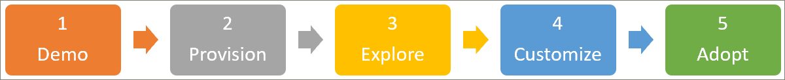

# Guía de incorporación de socios
Para empezar a trabajar con caminos de aprendizaje, siga los tres pasos que se describen a continuación. Con los tres pasos, puede crear una demostración convincente que puede usar para participar en presentaciones con clientes. 

## 1. crear un entorno de demostración de Microsoft 365
Puede usar demos.microsoft.com para crear un entorno de demostración en el que puede aprovisionar el servicio, validarlo y usarlo para presentar caminos de aprendizaje a los clientes. Todos los asociados tienen acceso https://demos.microsoft.com a para estos propósitos. Puede usar la guía de **Introducción** de demos.Microsoft.com si no está familiarizado con el entorno de demostración.

## 2. aprovisionar caminos de aprendizaje de Microsoft 365
Puede aprovisionar rutas de aprendizaje con el servicio de aprovisionamiento de SharePoint Online.
- Para aprovisionar rutas de aprendizaje, vaya a la página de la solución de [caminos de aprendizaje de Microsoft 365](https://provisioning.sharepointpnp.com/details/3df8bd55-b872-4c9d-88e3-6b2f05344239) . Revise las [Opciones de configuración](https://docs.microsoft.com/en-us/office365/customlearning/custom_setupoptions)de las rutas de aprendizaje. 
- Revise los [requisitos previos](https://docs.microsoft.com/en-us/office365/customlearning/custom_provision) de la solución, ya que son impedimentos comunes para el nuevo cliente de SharePoint que pueden no tener todos los permisos correctos o la configuración de entorno necesaria, como un catálogo de aplicaciones del espacio empresarial.
- Intente implementar la solución a través de un rol no administrador, para familiarizarse con el servicio de administración de errores y el servicio de correo electrónico del servicio de aprovisionamiento.

## 3. Explore el sitio recién aprovisionado de caminos de aprendizaje para familiarizarse con sus capacidades
[Explore el sitio recién aprovisionado de caminos de aprendizaje](https://docs.microsoft.com/en-us/office365/customlearning/custom_exploresite) para familiarizarse con sus funciones. Revise el [centro de éxito de administración](https://docs.microsoft.com/en-us/office365/customlearning/custom_successcenter) para obtener información sobre el contenido y las actualizaciones de características, además de la planeación, la personalización, la adopción y la medición de las instrucciones de impacto.

## 4. personalizar la experiencia de aprendizaje
[Personalización de la experiencia de rutas de aprendizaje](https://docs.microsoft.com/en-us/office365/customlearning/custom_overview) mediante el uso de las siguientes áreas funcionales:
- [Ocultar y mostrar subcategorías](https://docs.microsoft.com/en-us/office365/customlearning/custom_hideshowsub), [listas de reproducción](https://docs.microsoft.com/en-us/office365/customlearning/custom_hideshowplaylists)y [tecnologías](https://docs.microsoft.com/en-us/office365/customlearning/custom_hideshowtech).
- [Copiar una lista de reproducción](https://docs.microsoft.com/en-us/office365/customlearning/custom_copyplaylist)
- [Cree una lista de reproducción personalizada](https://docs.microsoft.com/en-us/office365/customlearning/custom_createnewplaylist) : comenzando con [las páginas de SharePoint](https://docs.microsoft.com/en-us/office365/customlearning/custom_createnewpage), la [creación de listas de reproducción](https://docs.microsoft.com/en-us/office365/customlearning/custom_createnewplaylist), la adición de [activos](https://docs.microsoft.com/en-us/office365/customlearning/custom_addassets)y la [creación de subcategorías](https://docs.microsoft.com/en-us/office365/customlearning/custom_createnewcat).

## 5. crear una campaña de comunicación de ejemplo de caminos de aprendizaje
Cree una campaña de comunicación de ejemplo de caminos de aprendizaje basada en el [Kit de adopción descargable](https://teamworktools.azurewebsites.net/m365lp/m365lpadoptionkit.zip) y resalte el contenido personalizado que creó en el paso 4. Puede aprovechar esta posibilidad al probar la experiencia completa del cliente. 

