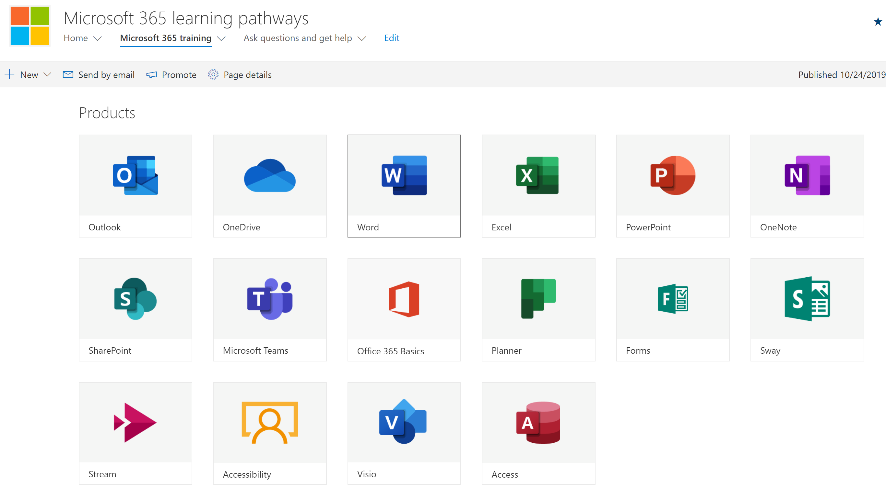
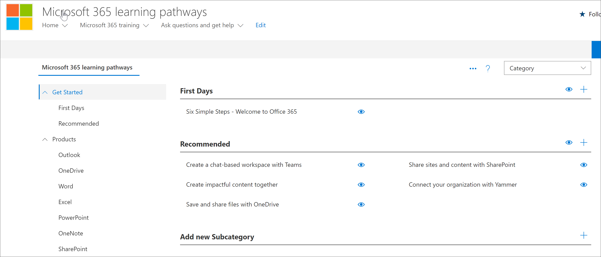

# Planear el contenido de las rutas de aprendizaje
Antes de profundizar en la Microsoft 365 de aprendizaje, es una buena idea tardar algún tiempo en realizar una encuesta sobre el contenido, las herramientas y las capacidades de aprendizaje disponibles. Nuestro objetivo es ayudarle a que los usuarios de su organización se acelen y sean productivos de la forma más rápida y eficaz posible. Cuando se trata de planear caminos de aprendizaje, se recomienda un proceso de tres pasos:

1. **Revise los recursos disponibles:** tanto los recursos proporcionados a través de las rutas de aprendizaje como los recursos disponibles en su organización. Los mejores planes de aprendizaje combinan recursos y recursos de Microsoft de su organización.
2. **Conozca las capacidades de la herramienta Caminos de aprendizaje:** le proporcionaremos un recorrido rápido. 
3. **Crear un plan de contenido:** revise las Guías de adopción disponibles para ayudarle con la creación de un plan general.

## Revisar los recursos disponibles
Antes de crear un plan de contenido para Microsoft 365 de aprendizaje, tómese un tiempo para descubrir todos los recursos disponibles.  

### Revisar las rutas de aprendizaje SharePoint sitio
La Microsoft 365 de caminos de aprendizaje SharePoint un sitio de comunicación con un elemento web que está conectado a un catálogo en línea. El SharePoint es totalmente personalizable, incluidos el nombre del sitio, el logotipo, las páginas, los elementos de menú, los temas y los iconos. Tómese un tiempo para hacer clic en los iconos y los elementos de menú para descubrir lo que está disponible en el sitio de rutas de aprendizaje.

### Revisar el contenido del catálogo en línea con el elemento web
El elemento web, de forma predeterminada, se agrega a una serie de páginas del SharePoint de comunicación. El conjunto completo de contenido se proporciona en la Microsoft 365 de aprendizaje. La Microsoft 365 de aprendizaje hospeda el elemento web caminos de aprendizaje configurado para mostrar toda la formación disponible para las rutas de aprendizaje. 

**Para ver la página Microsoft 365 aprendizaje**
1. Haga clic en Microsoft 365 elemento de menú de aprendizaje. 
1. Desplácese hacia abajo en la página para ver todas las categorías y subcategorías.
2. Patea los neumáticos un poco. Haga clic en algunas subcategorías y, a continuación, haga clic en unas cuantas listas de reproducción para conocer cómo se organiza el contenido de las rutas de aprendizaje. 

### Ver la página administración
La página Administración proporciona una lista del contenido disponible. Aquí es donde puedes ocultar contenido, crear nuevas listas de reproducción y agregar, editar y quitar listas de reproducción. Haz clic en las distintas categorías y listas de reproducción para ver el resumen completo del contenido disponible. 

**Para ver la página Administración.**
1. En el sitio de rutas de aprendizaje, elija la flecha desplegable menú Inicio y, a continuación, haga clic en Administración de caminos de aprendizaje.  
2. A continuación, haga clic en las distintas categorías, subcategorías y listas de reproducción para obtener una sensación de la cantidad de contenido disponible. 

   

### Conozca las capacidades de Microsoft 365 Learning Pathways
Con Microsoft 365 de aprendizaje, puede tener contenido proporcionado por Microsoft combinado con el contenido que cree para dirigirse a directivas y procedimientos específicos que son exclusivos de su organización. Como práctica recomendada, intente aprovechar el contenido proporcionado por Microsoft tanto como sea posible. Microsoft actualiza activos individuales de forma periódica y actualiza el inventario completo de contenido de forma trimestral. Normalmente, una organización creará un 10-20 % de contenido único y, a continuación, dejará el 80 % restante a Microsoft para mantenerse actualizado. En las listas siguientes se describe cómo se organiza el contenido de las rutas de aprendizaje, junto con las directrices para el contenido que se puede modificar o crear. Las instrucciones para personalizar el contenido se proporcionan en la sección Personalización de caminos de aprendizaje del Centro de éxito de administración.

- **Categorías:** son contenedores para subcategorías. Microsoft proporciona categorías y no se pueden crear ni modificar.
- **Subcategorías:** son contenedores para listas de reproducción. Microsoft proporciona subcategorías que no puede modificar, pero puede crear sus propias subcategorías. 
- **Lista de** reproducción: son contenedores para activos. Microsoft proporciona listas de reproducción que no puedes modificar, pero puedes crear tus propias listas de reproducción.  
- **Activos:** son las páginas de aprendizaje de la lista de reproducción. Microsoft proporciona activos en listas de reproducción que no puedes modificar, pero puedes crear tus propios activos y agregarlos a playlists.est

### Revisar recursos adicionales de Microsoft
Microsoft proporciona recursos de ayuda y aprendizaje que puede aprovechar al planear el contenido de las rutas de aprendizaje.  

-  [Office Ayuda y aprendizaje](https://support.office.com)
-  [Centro de aprendizaje de Office 365](https://support.office.com/office-training-center)

### Revisar los recursos de aprendizaje de la organización
Hacer un balance del contenido de aprendizaje que ya está disponible en su organización.
Por ejemplo, es posible que su organización ya tenga guías de inicio rápido personalizadas, hojas de trucos o páginas SharePoint dedicadas Microsoft 365 preparación, HelpDesk, incorporación o aprendizaje. Los SharePoint existentes se pueden incorporar a las listas de reproducción del Portal de Microsoft 365 o mezclarse con contenido de Microsoft en una lista de reproducción para crear una lista de reproducción dirigida para su organización. Para obtener más información acerca de cómo mezclar el contenido de su organización con el contenido de Microsoft, vea [Personalizar las rutas de aprendizaje](custom_overview.md). Personalización de la sección caminos de aprendizaje del Centro de éxito de administración.

### Aprovechar los recursos de adopción
Ten en cuenta que puedes empezar a usar las rutas de aprendizaje en cuestión de días, pero lo mejor es realizar una planeación avanzada antes de ejecutar una estrategia de campaña de aprendizaje para incorporar una nueva tecnología o un conjunto de servicios. Desarrollar un plan de contenido y usar caminos de aprendizaje es realmente parte de un esfuerzo más amplio en la planeación de una estrategia general de administración de cambios, por lo que proporcionamos materiales de adopción que puede aprovechar para planear su estrategia general. Como parte del esfuerzo de planeación, consulte [Recursos de adopción](https://resources.techcommunity.microsoft.com/adoption/).

### Crear un plan de aprendizaje e iterar 
Muchas empresas que han implantado correctamente Caminos de aprendizaje han adoptado campañas de aprendizaje centradas en escenarios o tecnologías específicas. Por ejemplo, "Ser más colaborativo: usar Teams" o "Ser más móvil con Outlook móvil". Puede ver ejemplos de posibles campañas de aprendizaje con el [kit de adopción descargable.](https://teamworktools.azurewebsites.net/m365lp/m365lpadoptionkit.zip)

 
