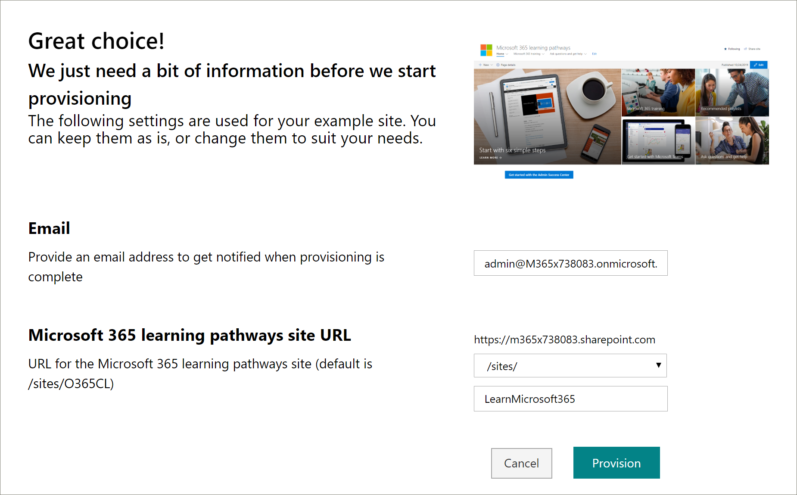

# Aprovisionar caminos de aprendizaje de Microsoft 365

Con el servicio de aprovisionamiento de SharePoint Online, un administrador de inquilinos de Office 365 puede iniciar el proceso de aprovisionamiento con unos pocos clics sencillos. El servicio de aprovisionamiento es la forma recomendada para aprovisionar rutas de aprendizaje. Es rápido y sencillo, y tarda solo unos minutos en iniciar el proceso. Sin embargo, antes de empezar con el servicio de aprovisionamiento, asegúrese de que cumple con los requisitos previos para el aprovisionamiento.

> [!IMPORTANT]
> A partir de 5/21/2019, Microsoft 365 Learning Pathways es el nuevo nombre de la solución anteriormente conocida como aprendizaje personalizado para Office 365. Si ya ha aprovisionado el aprendizaje personalizado para Office 365 o una versión anterior de las rutas de aprendizaje de Microsoft 365 en su organización y desea actualizar la solución, siga las instrucciones de actualización de la solución en los [caminos de aprendizaje de Microsoft 365 Archivo Léame](https://github.com/pnp/custom-learning-office-365). Si está aprovisionando los caminos de aprendizaje de Microsoft 365 por primera vez, consulte las [instrucciones para aprovisionar rutas de aprendizaje de microsoft 365]( https://docs.microsoft.com/en-us/office365/customlearning/custom_provision) en la documentación de Microsoft 365 Learning Pathways.  

## Requisitos previos
 
Para configurar correctamente los caminos de aprendizaje de Microsoft 365 con el servicio de aprovisionamiento, la persona que realiza el aprovisionamiento debe cumplir los siguientes requisitos previos: 
 
- La persona que aprovisiona rutas de aprendizaje debe ser un administrador de inquilinos del inquilino en el que se aprovisionarán las rutas de aprendizaje.  
- Un catálogo de aplicaciones del espacio empresarial debe estar disponible en la opción de aplicaciones del centro de administración de SharePoint. Si su organización no tiene un catálogo de aplicaciones del espacio empresarial de SharePoint, consulte la [documentación de SharePoint Online](https://docs.microsoft.com/en-us/sharepoint/use-app-catalog) para crear uno.  
- La persona que aprovisiona las rutas de aprendizaje debe ser un propietario de la colección de sitios del catálogo de aplicaciones del espacio empresarial. Si la persona que aprovisiona las rutas de aprendizaje no es un propietario de la colección de sitios del catálogo de aplicaciones, [complete estas instrucciones](addappadmin.md) y continúe. 

### Para aprovisionar rutas de aprendizaje

1. Vaya a la [Página de solución de caminos de aprendizaje de Microsoft 365](https://provisioning.sharepointpnp.com/details/3df8bd55-b872-4c9d-88e3-6b2f05344239).
2. Haga clic en **Agregar al espacio empresarial**. Si no ha iniciado sesión en su espacio empresarial, el servicio de aprovisionamiento le pedirá sus credenciales de administrador de inquilinos. 
3. En el cuadro de diálogo permisos solicitados, seleccione **consentimiento en nombre de su organización** y, después, seleccione **Aceptar**.

El servicio de aprovisionamiento requiere estos permisos para crear el catálogo de aplicaciones del espacio empresarial, instalar la aplicación en el catálogo de aplicaciones del espacio empresarial y aprovisionar la plantilla del sitio. No hay ningún impacto general en el espacio empresarial y estos permisos se usan explícitamente para el propósito de la instalación de la solución. Debe aceptar estos permisos para continuar con la instalación.

4. Complete los campos en la página de información de aprovisionamiento según corresponda para su instalación. Como mínimo, escriba la dirección de correo electrónico donde desea obtener las notificaciones sobre el proceso de aprovisionamiento y la dirección URL de destino para el que se va a aprovisionar el sitio.  
> [!NOTE]
> Haga que la dirección URL de destino del sitio sea descriptiva para los empleados, como "/sites/MyTraining" o "/teams/LearnMicrosoft365".

6. Haga clic en **aprovisionar** cuando esté listo para instalar las rutas de aprendizaje en su entorno de espacio empresarial.  El proceso de aprovisionamiento llevará hasta 15 minutos. Recibirá una notificación por correo electrónico (a la dirección de correo electrónico de notificación que escribió en la página de aprovisionamiento) cuando el sitio esté preparado para el acceso. 

> [!IMPORTANT]
> El administrador de inquilinos que aprovisiona el sitio de caminos de aprendizaje debe ir al sitio y, a continuación, abrir **CustomLearningAdmin. aspx** para inicializar las propiedades de administración de rutas de aprendizaje. En este momento, el administrador de inquilinos también debe asignar propietarios al sitio. 

## Validar el aprovisionamiento correcto e inicializar la lista de CustomConfig

Cuando el aprovisionamiento haya finalizado, el administrador de inquilinos que aprovisionó el sitio recibirá un correo electrónico del servicio de aprovisionamiento de PnP. El correo electrónico contiene un vínculo al sitio. En este momento, el administrador de inquilinos debe ir al sitio mediante el vínculo proporcionado en el correo electrónico y configurar el sitio para el primer uso:

- Vaya a `<YOUR-SITE-COLLECTION-URL>sites/<YOUR-SITE-NAME>/SitePages/CustomLearningAdmin.aspx`. Al abrir **CustomLearningAdmin. aspx** se inicializa el elemento de lista **CustomConfig** que configura las rutas de aprendizaje para el primer uso. Debería ver una página similar a la siguiente:

## Agregar propietarios al sitio
Como administrador de inquilinos, es poco probable que sea la persona que va a personalizar el sitio, por lo que necesitará asignar algunos propietarios al sitio. Los propietarios tienen privilegios administrativos en el sitio para que puedan modificar las páginas del sitio y remarcar el sitio. También tienen la capacidad de ocultar y mostrar contenido entregado a través del elemento Web de caminos de aprendizaje. Además, tendrán la capacidad de crear listas de reproducción personalizadas y asignarlas a subcategorías personalizadas.  

1. En el menú **configuración** de SharePoint, haga clic en **permisos del sitio**.
2. Haga clic en **Configuración avanzada de permisos**.
3. Haga clic en **propietarios de rutas de aprendizaje de Microsoft 365**.
4. Haga clic en **nuevo** > **Agregar usuarios a este grupo**y, a continuación, agregue las personas que desea que sean propietarios. 
5. Agregue un vínculo para [explorar el sitio](custom_exploresite.md) en el mensaje de uso compartido y, a continuación, haga clic en **compartir**.

### Pasos siguientes
- Explore el [contenido predeterminado](custom_exploresite.md) proporcionado en el sitio y el elemento Web.
