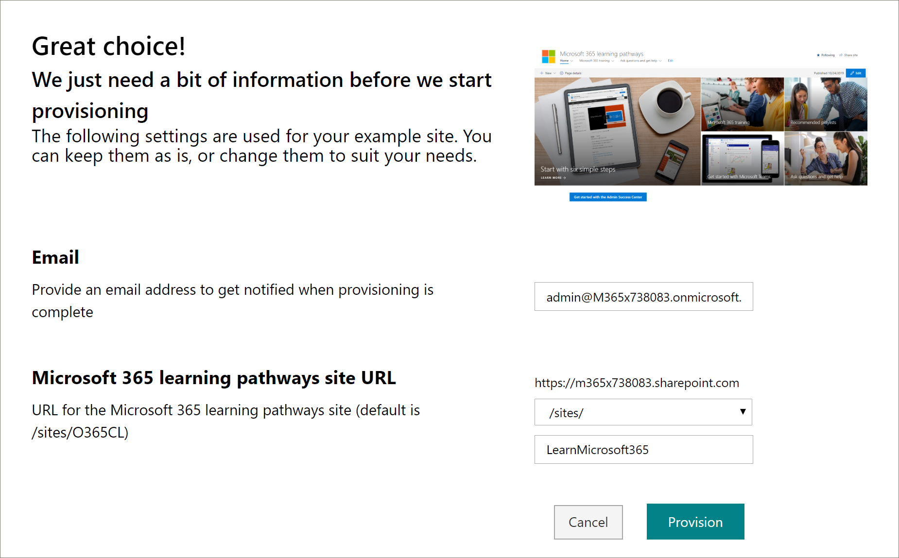
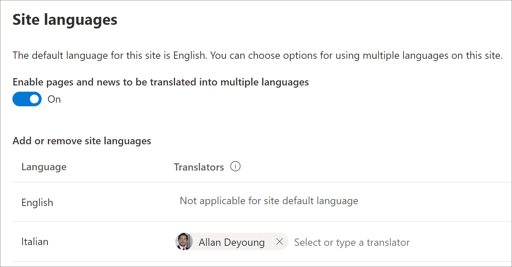

# Aprovisionar una nueva solución multilingüe de caminos de aprendizaje
Las organizaciones que no tienen rutas de aprendizaje aprovisionadas en su inquilino pueden usar el servicio de aprovisionamiento de SharePoint para agregar la solución de rutas de aprendizaje multilingües. Con esta opción, la plantilla de SharePoint de rutas de aprendizaje se traduce a nueve idiomas y se puede usar con un mínimo de modificación. 

> [!IMPORTANT]
> Si ya tiene rutas de aprendizaje aprovisionadas en su espacio empresarial, se recomienda que siga la [ruta de actualización](custom_update_ml.md) para las rutas de aprendizaje. Si instala rutas de aprendizaje sobre una instancia existente en el espacio empresarial, se perderán los cambios realizados en la plantilla de sitio o las listas de reproducción de las rutas de aprendizaje.

## Requisitos previos para la compatibilidad multilingüe
 
Para configurar correctamente los caminos de aprendizaje de Microsoft 365 con el servicio de aprovisionamiento, la persona que realiza el aprovisionamiento debe cumplir los siguientes requisitos previos: 
 
- La persona que aprovisiona rutas de aprendizaje debe ser un administrador de inquilinos del inquilino en el que se aprovisionarán las rutas de aprendizaje.  
- Un catálogo de aplicaciones del espacio empresarial debe estar disponible en la opción de aplicaciones del centro de administración de SharePoint. Si su organización no tiene un catálogo de aplicaciones del espacio empresarial de SharePoint, consulte la [documentación de SharePoint Online](https://docs.microsoft.com/sharepoint/use-app-catalog) para crear uno. Debe esperar al menos dos horas después de crear el catálogo de aplicaciones antes de aprovisionar rutas de aprendizaje.  
- La persona que aprovisiona las rutas de aprendizaje debe ser un propietario de la colección de sitios del catálogo de aplicaciones del espacio empresarial. Si la persona que aprovisiona las rutas de aprendizaje no es un propietario de la colección de sitios del catálogo de aplicaciones, [complete estas instrucciones](addappadmin.md) y continúe. 

## Asegurarse de que la cuenta de administrador de inquilinos no tiene ningún idioma seleccionado
Antes de aprovisionar rutas de aprendizaje, asegúrese de que la cuenta de administrador del inquilino no tenga ningún idioma seleccionado. Esta es la manera de comprobar si la cuenta de administrador no tiene un idioma seleccionado. 
1.  Con el perfil de administración perimetral, vaya a office.com.
2.  Escriba las credenciales de usuario (si es necesario).
3.  En Microsoft 365, haga clic en **todas las aplicaciones** > Delve. 
4.  Haga clic en **yo**  >  **Actualizar perfil**.
5.  Desplácese hacia abajo en la página y haga clic en **Cómo puedo cambiar la configuración regional y de idioma**.
6.  Haga clic **aquí**y, a continuación, haga clic en los puntos suspensivos **...**.
7.  En **mis idiomas para mostrar**, no se mostrará **ningún idioma seleccionado**. Si hay un idioma seleccionado, anule la selección.

### Para aprovisionar rutas de aprendizaje

1. Vaya a la [Página de solución de caminos de aprendizaje de Microsoft 365](https://provisioning.sharepointpnp.com/details/3df8bd55-b872-4c9d-88e3-6b2f05344239).
2. Haga clic en **Agregar al espacio empresarial**. Si no ha iniciado sesión en el inquilino, el servicio de aprovisionamiento le pedirá sus credenciales de administrador de inquilinos. 
3. En el cuadro de diálogo permisos solicitados, seleccione **consentimiento en nombre de su organización** y, después, seleccione **Aceptar**.

El servicio de aprovisionamiento requiere estos permisos para crear el catálogo de aplicaciones del espacio empresarial, instalar la aplicación en el catálogo de aplicaciones del espacio empresarial y aprovisionar la plantilla del sitio. No hay ningún impacto general en el espacio empresarial. Estos permisos se usan explícitamente para el propósito de la instalación de la solución. Debe aceptar estos permisos para continuar con la instalación.

4. Rellene los campos de la página de información de aprovisionamiento según corresponda para su instalación. Como mínimo, debe escribir la dirección de correo electrónico en la que desea recibir notificaciones sobre el proceso de aprovisionamiento y el prefijo de la dirección URL del sitio que se aprovisionará.  
> [!NOTE]
> Haga que los empleados puedan usar la dirección URL de destino de manera fácil con nombres como "/sites/MyTraining" o "/teams/LearnMicrosoft365".

6. Haga clic en **aprovisionar** cuando esté listo para instalar las rutas de aprendizaje en su entorno de espacio empresarial.  El proceso de aprovisionamiento puede tardar hasta 15 minutos. Recibirá una notificación por correo electrónico cuando el sitio esté listo. 

> [!IMPORTANT]
> El administrador de inquilinos que aprovisiona el sitio de caminos de aprendizaje debe ir al sitio y, a continuación, abrir **CustomLearningAdmin. aspx** para inicializar las propiedades de administración de rutas de aprendizaje. En este momento, el administrador de inquilinos también debe asignar propietarios al sitio. 

## Validar el aprovisionamiento correcto e inicializar la lista de CustomConfig

Cuando el aprovisionamiento haya finalizado, el administrador de inquilinos que aprovisionó el sitio recibirá un correo electrónico del servicio de aprovisionamiento de PnP. El correo electrónico contiene un vínculo al sitio. En este momento, el administrador de inquilinos debe ir al sitio mediante el vínculo proporcionado en el correo electrónico y configurar el sitio para el primer uso:

- Vaya a `<YOUR-SITE-COLLECTION-URL>sites/<YOUR-SITE-NAME>/SitePages/CustomLearningAdmin.aspx`. Al abrir **CustomLearningAdmin. aspx** se inicializa el elemento de lista de **CustomConfig** que configura las rutas de aprendizaje para el primer uso. Debería ver una página similar a la siguiente:

## Agregar propietarios al sitio
Como administrador de inquilinos, es poco probable que sea la persona que va a personalizar el sitio, por lo que necesitará asignar algunos propietarios al sitio. Los propietarios tienen privilegios administrativos en el sitio para que puedan modificar las páginas del sitio y remarcar el sitio. También tienen la posibilidad de ocultar y mostrar contenido, y crear listas de reproducción y subcategorías personalizadas.  

1. En el menú **configuración** de SharePoint, haga clic en **permisos del sitio**.
2. Haga clic en **Configuración avanzada de permisos**.
3. Haga clic en **propietarios de rutas de aprendizaje de Microsoft 365**.
4. Haga clic en **nuevo**  >  **Agregar usuarios a este grupo**y, a continuación, agregue las personas que desea que sean propietarios. 
5. Agregue un vínculo para [explorar el sitio](custom_exploresite.md) en el mensaje de uso compartido y, a continuación, haga clic en **compartir**.

## Agregar traductores al sitio
Si va a usar traductores para el sitio, puede asignarles permisos. Los traductores requieren permisos de miembro o superior. 

## Elegir opciones para usar varios idiomas en el sitio
El servicio de aprovisionamiento de SharePoint crea el sitio de caminos de aprendizaje en nueve idiomas. Se aplican las siguientes recomendaciones:
- Desactivar los idiomas que no desea admitir
- Si no es compatible con un sitio multilingüe, desactive la característica multilingüe. Consulte la sección "desactivar la compatibilidad multilingüe" más adelante en este tema.

### Quitar idiomas que no desea admitir
Para las organizaciones que optan por admitir solo un idioma, además del idioma inglés predeterminado, recomendamos quitar los idiomas que no son compatibles. 
1. Desde el sitio de caminos de aprendizaje, seleccione **configuración** en la parte superior derecha de la página y, a continuación, seleccione **información del sitio**.
2. En la parte inferior del panel de información del sitio, seleccione **ver toda la configuración del sitio**.
3. En **Administración del sitio**, seleccione **configuración de idioma**.
4. En **Habilitar páginas y noticias para que se traduzcan a varios idiomas**, deslice el botón **de**alternancia a activado. Debe estar activado de forma predeterminada.
5. En Agregar o quitar idiomas del sitio, haga clic en **quitar** para quitar los idiomas que no necesite para el sitio. A continuación, se muestra un ejemplo de la página Configuración de idioma para mostrar el italiano compatible con el sitio, además del idioma inglés predeterminado.

> [!NOTE]
> Al quitar idiomas, no puede quitar el idioma inglés predeterminado. 

### Asignar traductores
Si va a traducir páginas, asigne opcionalmente uno o más traductores para cada idioma (excepto el idioma predeterminado del sitio). 
- En la columna **traductor** , empiece a escribir el nombre de una persona que quiera que sea un traductor y, a continuación, seleccione el nombre de la lista. 

> [!NOTE]
> Todos los usuarios de Active Directory de su organización pueden ser asignados como traductor. A las personas asignadas como traductores no se les concederán automáticamente los permisos adecuados. Cuando un usuario sin permisos de edición en un sitio intente obtener acceso al sitio, se le dirigirá a una página web donde puede solicitar acceso.

## Desactivar la compatibilidad multilingüe
Si no quiere un sitio multilingüe, por ejemplo, desea un sitio en inglés, se recomienda que desactive la característica multilingüe. 

1. Desde el sitio de caminos de aprendizaje, seleccione **configuración** en la parte superior derecha de la página y, a continuación, seleccione **información del sitio**.
2. En la parte inferior del panel de información del sitio, seleccione **ver toda la configuración del sitio**.
3. En **Administración del sitio**, seleccione **configuración de idioma**.
4. En **Habilitar páginas y noticias para que se traduzcan a varios idiomas**, deslice el botón **de**alternancia a activado. Debe estar activado de forma predeterminada.
- En **Habilitar páginas y noticias que se van a traducir**, seleccione **desactivado**. 

### Agregar idiomas
Las rutas de aprendizaje admiten 9 idiomas, pero se recomienda que agregue solo los idiomas que necesita para el sitio de caminos de aprendizaje. Puede agregar idiomas en cualquier momento. 
- En **Agregar o quitar idiomas del sitio**, escriba el nombre de un idioma en **seleccionar o escriba un idioma**o seleccione un idioma de la lista desplegable. Puede repetir este paso para agregar varios idiomas. Puede Agregar o quitar idiomas de su sitio en cualquier momento volviendo a esta página.

