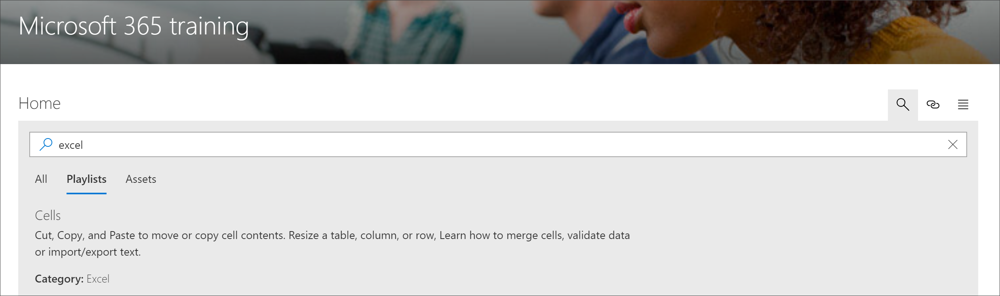

# Buscar contenido de rutas de aprendizaje de Microsoft 365Search for Microsoft 365 learning pathways content

Las rutas de aprendizaje de Microsoft 365 ofrecen la capacidad de buscar contenido por subcategoría, lista de reproducción o activo.Microsoft 365 learning pathways provides the ability to search for content by subcategory, playlist, or asset. 

> [!TIP]
> Rutas de aprendizaje de Microsoft 365 La búsqueda está en el ámbito del contenido de las rutas de aprendizaje, incluido el contenido proporcionado por Microsoft y cualquier contenido agregado a listas de reproducción o subcategorías personalizadas.Microsoft 365 learning pathways Search is scoped to learning pathways content, including the content provided by Microsoft and any content added to custom playlists or subcategories. Las páginas de SharePoint que no están en una lista de reproducción de caminos de aprendizaje no se incluyen en los resultados de búsqueda.SharePoint pages that are not in a learning pathways playlist are not included in Search results.     

- Haga clic **en el icono** Buscar y escriba una frase de búsqueda.Click the **Search** icon and type a Search phrase. 

