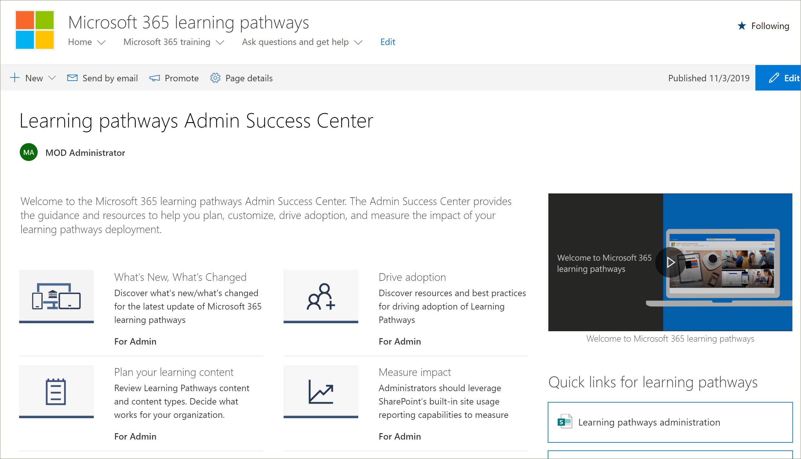

# Centro de éxito de administración de caminos de aprendizajeLearning pathways Admin Success Center

Bienvenido al Centro de éxito de administración de caminos de aprendizaje de Microsoft 365.Welcome to the Microsoft 365 learning pathways Admin Success Center. El Centro de éxito de administración proporciona instrucciones y recursos para ayudarle a planear, personalizar, impulsar la adopción y medir el impacto de la implementación de las rutas de aprendizaje.The Admin Success Center provides the guidance and resources to help you plan, customize, drive adoption, and measure the impact of your learning pathways deployment.

## Iniciar sesión en Office 365Sign in to Office 365 

1.  Abra el explorador web y vaya a office.com o a la ubicación del inicio de sesión de su organización.Open your Web browser and navigate to office.com or your organization’s sign-in location. 
2.  Inicie sesión con su nombre de usuario y contraseña.Sign in with your user name and password.
3.  Vaya a la ubicación del sitio mediante la dirección URL proporcionada por el administrador de inquilinos o seleccione SharePoint en la página principal de Office 365 y, a continuación, seleccione el sitio.Navigate to the location of the site using the URL supplied by your tenant administrator or select SharePoint from the Office 365 Home page, and then select the site. 

### Introducción al Centro de éxito de administraciónGet started with the Admin Success Center

El Centro de éxito de administración proporciona instrucciones y recursos para ayudarle a planear, personalizar, impulsar la adopción y medir el impacto de la implementación de las rutas de aprendizaje.The Admin Success Center provides the guidance and resources to help you plan, customize, drive adoption, and measure the impact of your learning pathways deployment. 

- En la página Inicio de las **rutas** de aprendizaje de Microsoft 365, haga clic en Introducción al Centro de éxito **de administración.**From the Microsoft 365 learning pathways **Home** page, click **Get started with the Admin Success Center**.

Las rutas de aprendizaje proporcionan instrucciones dentro del Centro de éxito de administración en la solución.Learning pathways provides guidance within the Admin Success Center in the solution. La documentación del Centro de éxito de administración también está disponible en este conjunto de documentación:Documentation for the Admin Success Center is also available in this documentation set: 

- [Planificar el contenido del aprendizajePlan your learning content](custom_plancontent.md)
- [Personalizar las formas de aprendizajeCustomize learning pathways](custom_overview.md)
- [Impulsar la adopciónDrive adoption](driveadoption.md)
- [Medir impactoMeasure impact](custom_measureimpact.md)

