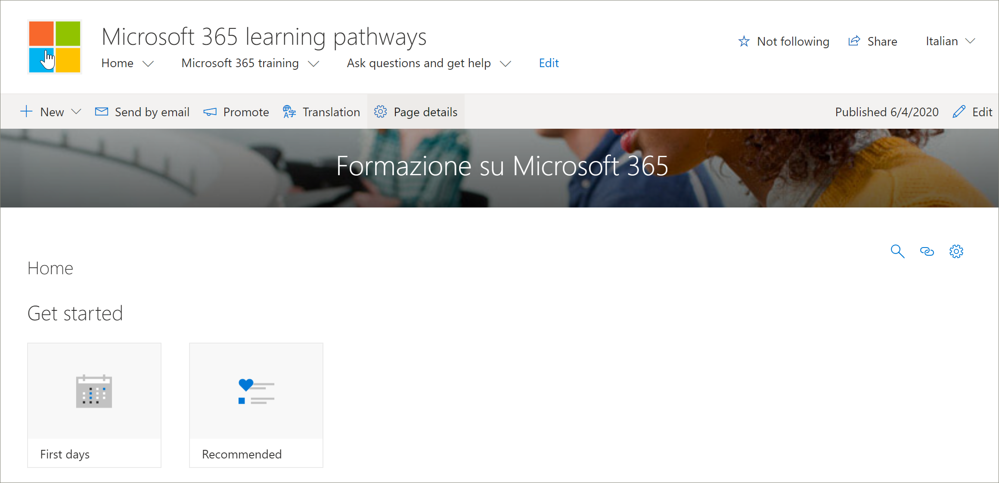

# Traducir páginas de sitioTranslate site pages
Antes de empezar a traducir el sitio de caminos de aprendizaje, es importante comprender algunos conceptos clave sobre cómo funciona la característica multilingüe con las rutas de aprendizaje.Before you start translating the learning pathways site, it’s important to understand a few key concepts of how the multilingual feature works with learning pathways. 
- Información del sitio: la navegación, el logotipo y las traducciones de nombres de sitio requieren que el sitio se vea y traduzca en el perfil de idioma del usuario.Site information - Navigation, logo, and site name translations require that the site is viewed, and translated, in the user’s language profile.  
- El elemento Web de rutas de aprendizaje debe visualizarse con el perfil de idioma del usuario para que aparezca en un idioma distinto del inglés.The learning pathways Web part must be viewed with user’s language profile for it to appear in a non-English language. El elemento Web y el contenido proporcionado por Microsoft ya se han traducido.The Web part and the Microsoft-supplied content are already translated for you. Para obtener más información acerca de los perfiles de idiomas, vea [cambiar la configuración regional y de Idioma personal](https://support.microsoft.com/en-us/office/change-your-personal-language-and-region-settings-caa1fccc-bcdb-42f3-9e5b-45957647ffd7).For more information about languages profiles, see [Change your personal language and regional settings](https://support.microsoft.com/en-us/office/change-your-personal-language-and-region-settings-caa1fccc-bcdb-42f3-9e5b-45957647ffd7).
- La forma de configurar las rutas de aprendizaje determina si las páginas traducidas están disponibles.The way you set up learning pathways determines whether you have translated pages available. Los sitios nuevos que se suministran con el servicio de libro de apariencia de Microsoft 365 tendrán páginas traducidas en nueve idiomas disponibles.New sites provisioned with the Microsoft 365 look book service will have translated pages in nine languages available. Los sitios o sitios actualizados que cree requerirán traducción manual.Updated sites or sites you create will require manual translation. Consulte [Opciones de instalación para rutas de aprendizaje multilingües](custom_setupoptions_ml.md).See [Setup options for multilingual learning pathways](custom_setupoptions_ml.md).
- Las características multilingües de SharePoint Online para los sitios de comunicación habilitan la compatibilidad multilingüe para las rutas de aprendizaje.Multilingual support for learning pathways is enabled by SharePoint Online multilingual features for communication sites. Para obtener información sobre las características multilingües de SharePoint Online, vea [crear sitios de comunicación multilingües, páginas y noticias](https://support.office.com/article/2bb7d610-5453-41c6-a0e8-6f40b3ed750c).To learn about SharePoint Online multilingual features, see [Create multilingual communication sites, pages, and news](https://support.office.com/article/2bb7d610-5453-41c6-a0e8-6f40b3ed750c). 

## Trabajar con un sitio recién aprovisionadoWorking with a newly provisioned site
Si ha aprovisionado un nuevo sitio de caminos de aprendizaje del servicio de libro de apariencia de Microsoft 365, las páginas traducidas ya estarán disponibles para usted.If you provisioned a new learning pathways site from the Microsoft 365 look book service, the translated pages are already available to you. De forma predeterminada, el sitio proporciona las páginas siguientes:By default, the site provides the following pages:

- Home. aspxHome.aspx
- Start-with-Six-Simple-Steps. aspxStart-with-Six-Simple-Steps.aspx
- Get-started-with-Microsoft-365. aspxGet-started-with-Microsoft-365.aspx
- Get-started-with-Microsoft-Teams. aspxGet-started-with-Microsoft-Teams.aspx
- Get-started-with-SharePoint. aspxGet-started-with-SharePoint.aspx
- Get-started-with-OneDriive. aspxGet-started-with-OneDriive.aspx
- Ask-Questions-and-Get-Help. aspxAsk-questions-and-get-help.aspx
- Calendario de eventos de aprendizaje. aspxTraining events calendar.aspx
- Become-a-Champion. aspxBecome-a-Champion.aspx
- Recommended-Playlists. aspxRecommended-Playlists.aspx
- Centro de éxito de administración de caminos de aprendizajeLearning pathways Admin Success Center

## Ver las páginas traducidas desde el sitio recién aprovisionadoView translated pages from the newly provisioned site
Para familiarizarse con el sitio de caminos de aprendizaje traducidos, echemos un vistazo a algunas páginas traducidas.To get familiar with the translated learning pathways site, let's take a look at a few translated pages.

### Ver la Página principal traducidaView the translated Home page
En la Página principal de rutas de aprendizaje, seleccione un idioma en la lista desplegable de idioma, como se muestra en el siguiente ejemplo.From the learning pathways Home page, select a language from the language dropdown as shown in the following example. En el ejemplo, verá que se ha seleccionado italiano en la esquina superior derecha y se traducen todos los elementos de la página.In the example, you see Italian selected in the upper right corner and all the page elements are translated.

### Ver la página de aprendizaje de Microsoft 365 traducidaView the translated Microsoft 365 training page
Ahora, echemos un vistazo a la página de aprendizaje de 365 de Microsoft.Now let's take a look at the Microsoft 365 training page. 

1. En la página de **Inicio** del sitio de caminos de aprendizaje, haga clic en **aprendizaje de Microsoft 365**.From the learning pathways site **Home** page, click **Microsoft 365 training**.
2. En la esquina superior derecha de la página, selecciona un idioma.In the upper-right corner of the page, select a language. En este ejemplo, se selecciona italiano.In this example, Italian is selected.

¿Qué traducciones están visibles cuando se selecciona el idioma?What translations are visible when the language is selected?
- La página de SharePoint se traduce como se muestra en el gráfico anterior.The SharePoint page is translated as shown in the graphic above. Observe que el texto del titular de página ahora está en Italiano.Notice the text for the page banner is now in Italian.

¿Qué traducciones no son visibles?What’s translations aren't visible?
- El nombre del sitio está en inglésThe site name is in English
- La navegación del sitio está en inglésThe site navigation is in English
- El elemento Web de rutas de aprendizaje está en inglésThe learning pathways web part is in English

## Ver el sitio completamente traducidoView the fully translated site 
Para ver un sitio completamente traducido en un idioma específico, incluidas las páginas del sitio, la navegación y el elemento Web, se debe establecer la configuración regional y de idioma del usuario para ese idioma.To view a fully translated site in a specific language, including the site pages, navigation, and web part, the user’s personal language and regional settings must be set for that language. Para obtener más información sobre cómo establecer la configuración regional y de idioma, consulte [cambiar la configuración regional y de Idioma personal](https://support.microsoft.com/en-us/office/change-your-personal-language-and-region-settings-caa1fccc-bcdb-42f3-9e5b-45957647ffd7).For more information on setting language and regional settings, see [Change your personal language and regional settings](https://support.microsoft.com/en-us/office/change-your-personal-language-and-region-settings-caa1fccc-bcdb-42f3-9e5b-45957647ffd7). Se recomienda usar una cuenta independiente o tener a otro usuario con la configuración de idioma diferente para ver las páginas traducidas.It's recommended that you use a separate account or have another user with the different language settings view the translated pages.  

## Trabajar con un sitio actualizado o manualmente de caminos de aprendizaje instaladoWorking with an updated or manually installed learning pathways site
Si actualizó un sitio existente de caminos de aprendizaje o instaló manualmente el elemento Web en un sitio existente, deberá traducir manualmente las páginas del sitio.If you updated an existing Learning Pathways site or manually installed the web part to an existing site, you'll need to manually translate the site pages. El contenido y el elemento Web de rutas de aprendizaje ya están traducidos y se mostrarán en el idioma preferido del usuario.The learning pathways web part and content are already translated and will appear in the user's preferred language. Para traducir páginas, consulte las instrucciones siguientes "crear páginas para los idiomas que desee".To translate pages, see the following instructions "Create pages for the languages you want". 

## Crear páginas para los idiomas que deseeCreate pages for the languages you want
Una vez que haya habilitado el sitio para características multilingües y haya elegido los idiomas que desea que estén disponibles, puede crear las páginas de traducción que desee.Once you've enabled your site for multilingual features and you've chosen the languages you want to make available, you can create the translation pages you want. 

1. Vaya a la página de idioma predeterminada que desea que esté disponible en otro idioma.Go to the default language page you want to make available in another language.
2. En la barra superior, seleccione **traducción**.On the top bar, select **Translation**.
3. Seleccione **crear** para los idiomas que desee.Select **Create** for the languages you want.

> [!IMPORTANT]
> Después de crear las páginas de traducción, debe publicar (o volver a publicar) la página idioma predeterminado para asegurarse de que:After you create the translation pages, you must publish (or republish) the default language page to ensure that:
>- Las páginas de traducción se muestran en el sitio de idioma correspondiente.Translation pages are shown in the corresponding language site.
>- Las páginas de traducción se muestran correctamente en el elemento Web noticias y los elementos Web de contenido resaltados.Translation pages display correctly in the News web part and the Highlighted content web parts.
>- La lista desplegable de idioma que se encuentra en la parte superior del sitio incluye todos los idiomas habilitados.The language dropdown at the top of the site includes all of the languages you enabled.
>- Los traductores reciben una notificación de la solicitud de traducción.Translators are notified of the translation request.

Después de crear las páginas, el estado de la página (Borrador guardado, publicado, etc.) se muestra en el panel de traducción junto a cada idioma.After you create the page(s), the status of the page (draft saved, published, and so on) is shown in the translation pane next to each language. Además, se notificará al traductor que ha asignado por correo electrónico que se ha solicitado una traducción.Also, the translator(s) you assigned will be notified in email that a translation is requested.

### Ver el sitio completamente traducido en un idioma específicoView the fully translated site in a specific language
Para ver un sitio completamente traducido en un idioma específico, incluidas las páginas del sitio, la navegación y el elemento Web, se debe establecer la configuración regional y de idioma del usuario para ese idioma.To view a fully translated site in a specific language, including the site pages, navigation, and web part, the user’s personal language and regional settings must be set for that language. Para obtener más información sobre cómo establecer la configuración regional y de idioma, consulte [cambiar la configuración regional y de Idioma personal](https://support.microsoft.com/en-us/office/change-your-personal-language-and-region-settings-caa1fccc-bcdb-42f3-9e5b-45957647ffd7).For more information on setting language and regional settings, see [Change your personal language and regional settings](https://support.microsoft.com/en-us/office/change-your-personal-language-and-region-settings-caa1fccc-bcdb-42f3-9e5b-45957647ffd7). Tenga en cuenta que es mejor usar una cuenta independiente o tener otro usuario con la configuración de idioma diferente para ver las páginas traducidas.Note that it’s best to use a separate account or have another user with the different language settings view the translated pages.

## ¿Qué hace un traductor?What does a translator do?
 Una vez configurado el sitio en inglés, un usuario con español como idioma preferido personal, por ejemplo, edita y traduce manualmente el título, la navegación y el contenido del pie de página en español.After the site is set up in English, a user with Spanish as their preferred personal language, for example, manually edits and translates the title, navigation, and footer content into Spanish. Un usuario con alemán como idioma personal preferido hace lo mismo para alemán.A user with German as their preferred personal language does the same for German. Una vez que se traduzca el contenido, se mostrará para todos los usuarios de los idiomas preferidos.Once the content is translated, it will display for all users of those preferred languages. El elemento Web selecciona el idioma preferido del usuario y muestra el contenido traducido en ese idioma.The Web part picks up the user's preferred language and shows the content translated in that language. 

Los traductores traducen manualmente las copias de la página idioma predeterminado a los idiomas especificados.Translators manually translate the copies of the default language page into the language(s) specified. Cuando se crean las copias de las páginas, los traductores reciben una notificación en el correo electrónico si se ha especificado un traductor.When the copies of the page(s) are created, translators are notified in email if a translator has been specified. El correo electrónico incluye un vínculo a la página idioma predeterminado y la página de traducción que se acaba de crear.The email includes a link to the default language page and the newly created translation page. El traductor hará lo siguiente:The translator will:
1. Seleccione el botón **iniciar traducción** en el correo electrónico.Select the **Start translating** button in the email.
2. Seleccione **Editar** en la parte superior derecha de la página y traduzca el contenido.Select **Edit** on the top right of the page, and translate the content.
3. Cuando haya terminado, seleccione **Guardar como borrador** (si no está listo para hacerlo visible para los lectores) o si la página está lista para que esté visible para todos los usuarios que usan ese idioma en el sitio, seleccione **publicar** o publicar **noticias**.When done, select **Save as draft** (if you're not ready to make it visible to readers) or if the page is ready to be visible to everyone who is using that language on the site, select **Publish** or **Post news**.

Para obtener más información sobre el proceso de traducción, consulte [crear sitios de comunicación multilingües, páginas y noticias](https://support.office.com/en-us/article/2bb7d610-5453-41c6-a0e8-6f40b3ed750c).For more information about the translation process, see [Create multilingual communication sites, pages, and news](https://support.office.com/en-us/article/2bb7d610-5453-41c6-a0e8-6f40b3ed750c). 

## Actualizar la página de idioma predeterminadoUpdating the default language page
Cuando se actualiza la página idioma predeterminado, se debe volver a publicar la página.When the default language page is updated, the page must be republished. A continuación, los traductores de las páginas de traducción reciben una notificación por correo electrónico de que se ha realizado una actualización para que se puedan realizar actualizaciones en las páginas de traducción individuales.Then, the translator(s) for the translation pages are notified in email that an update has been made so updates can be made to the individual translation pages.

## Configurar un nombre de sitio multilingüe, navegación y pie de páginaSet up a multilingual site name, navigation and footer
Para mostrar el nombre del sitio, la navegación y el pie de página del sitio en los diferentes idiomas que ha hecho disponibles, cada uno debe traducirse manualmente.To show the site name, navigation, and footer of your site in the different languages you've made available, each must be translated manually.

Por ejemplo, supongamos que ha creado un sitio de comunicación con un idioma predeterminado de inglés y que ha habilitado el sitio para los idiomas español y alemán.For example, let's say you've created a  communication site with an English default language, and you've enabled the site for Spanish and German languages. Al crear un sitio, se configura el nombre y la descripción del sitio en el idioma predeterminado (en este caso, Inglés).When you create a site, you set up the site name and description in the default language (in this case, English). También puede actualizar el nombre y la descripción del sitio después de la creación del sitio.You can also update the site name and description after site creation. A continuación, se crean los nodos de navegación y el contenido del pie de página en inglés.Then you create the navigation nodes and footer content in English.

Una vez que el sitio está configurado en inglés, un usuario con español como su idioma preferido personal editar y traduce manualmente el título, la descripción, la navegación y el contenido del pie de página en español.After the site is set up in English, a user with Spanish as their preferred personal language manually edits and translates the title, description, navigation and footer content into Spanish. Un usuario con alemán como idioma personal preferido hace lo mismo para alemán.A user with German as their preferred personal language does the same for German. Una vez que se traduzca el contenido, se mostrará para todos los usuarios de los idiomas preferidos.Once the content is translated, it will display for all users of those preferred languages. 

> [! Notas[!NOTES]
>- Los usuarios que traducen el contenido del sitio para sus idiomas preferidos deben ser miembros del grupo propietarios del sitio o tener permisos de sitio equivalentes.Users who translate the site content for their preferred languages should be members of the Owners group for the site or have equivalent site permissions.
>- Si se realiza un cambio en el nombre del sitio, en la navegación o en el pie de página en el idioma predeterminado, el elemento traducido correspondiente en otro idioma no se actualizará automáticamente a menos que elija sobrescribir las traducciones de sitios existentes.If a change is made to the site name, navigation, or footer in the default language, the corresponding translated item in another language is not automatically updated unless you choose to overwrite existing site translations. Si lo hace, el elemento traducido se reemplazará por la actualización en el idioma predeterminado y tendrá que volver a traducirse manualmente.If you do that, the translated item is replaced by the update in the default language and would have to be manually translated again. Para sobrescribir las traducciones, vaya a la página idiomas del sitio para el idioma predeterminado y seleccione Mostrar configuración avanzada.To overwrite translations, go to the Site languages page for the default language, and select Show advanced settings. A continuación, deslice el botón de alternancia a activado Sobrescribir traducciones.Then, slide the toggle for Overwrite translations to On. Esta opción no se aplica a contenido de páginas o noticias.This option does not apply to page or news content.

### Para ver el sitio completamente traducido en un idioma específicoTo view the fully translated site in a specific language
Para ver un sitio completamente traducido en un idioma específico, incluidas las páginas del sitio, la navegación y el elemento Web, se debe establecer la configuración regional y de idioma del usuario para ese idioma.To view a fully translated site in a specific language, including the site pages, navigation, and web part, the user’s personal language and regional settings must be set for that language. Para obtener más información sobre cómo establecer la configuración regional y de idioma, consulte [cambiar la configuración regional y de Idioma personal](https://support.microsoft.com/en-us/office/change-your-personal-language-and-region-settings-caa1fccc-bcdb-42f3-9e5b-45957647ffd7).For more information on setting language and regional settings, see [Change your personal language and regional settings](https://support.microsoft.com/en-us/office/change-your-personal-language-and-region-settings-caa1fccc-bcdb-42f3-9e5b-45957647ffd7). Se recomienda usar una cuenta independiente o tener a otro usuario con la configuración de idioma diferente para ver las páginas traducidas.It’s recommended that you use a separate account or have another user with the different language settings view the translated pages.

## Más informaciónFor more information
- Para obtener más información sobre cómo traducir las páginas del sitio de comunicación de SharePoint, vea [crear sitios de comunicación multilingües, páginas y noticias](https://support.office.com/en-us/article/2bb7d610-5453-41c6-a0e8-6f40b3ed750c).For more information about translating SharePoint communication site pages, see [Create multilingual communication sites, pages, and news](https://support.office.com/en-us/article/2bb7d610-5453-41c6-a0e8-6f40b3ed750c).
- Para obtener más información acerca de la personalización de las rutas de aprendizaje, consulte [Customizing Learning Pathways](custom_overview.md).For more information about customizing learning pathways, see [Customize Learning Pathways](custom_overview.md).  
