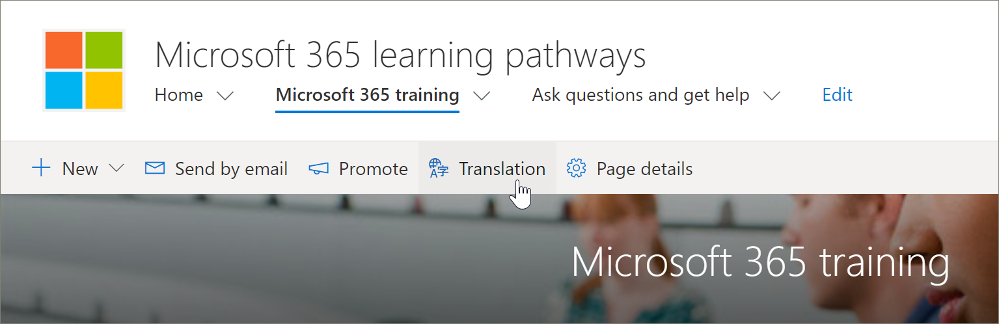
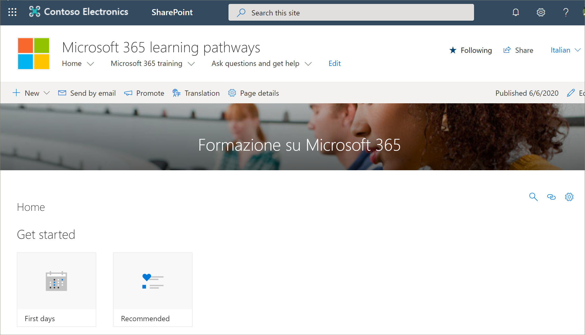

# Traducir páginas de sitio
Ya sea que haya actualizado una versión existente de las rutas de aprendizaje a la versión 4,0 o que haya aprovisionado un nuevo sitio, el proceso de traducción de las páginas del sitio es el mismo. Sin embargo, hay algunas cosas que debe tener en cuenta. 
- Cuando se aprovisiona una versión multilingüe de caminos de aprendizaje de 4,0, las páginas del sitio se traducen para usted en 9 idiomas. 
- Cuando la solución de rutas de aprendizaje se actualiza a la versión multilingüe de 4,0, las páginas del sitio SharePoint de rutas de aprendizaje permanecen sin cambios. Las traducciones deben realizarse manualmente. 

De forma predeterminada, el sitio de caminos de aprendizaje proporciona las páginas siguientes:

- Home. aspx
- Start-with-Six-Simple-Steps. aspx
- Get-started-with-Microsoft-365. aspx
- Get-started-with-Microsoft-Teams. aspx
- Get-started-with-SharePoint. aspx
- Get-started-with-OneDriive. aspx
- Ask-Questions-and-Get-Help. aspx
- Calendario de eventos de aprendizaje. aspx
- Become-a-Champion. aspx
- Recommended-Playlists. aspx
- Centro de éxito de administración de caminos de aprendizaje

## Crear páginas para los idiomas que desee
Una vez que haya habilitado el sitio para características multilingües y haya elegido los idiomas que desea que estén disponibles, puede crear las páginas de traducción que desee. Para ayudar a demostrar algunos conceptos importantes, usaremos la página de aprendizaje de 365 de Microsoft como ejemplo. Para ello:

1.  En la página **principal** de rutas de aprendizaje, haga clic en **aprendizaje de Microsoft 365**.  
2.  En la barra superior, seleccione **traducción**.

3. Si desea crear una página para la traducción en cada uno de los idiomas disponibles para el sitio, seleccione **crear para todos los idiomas**. De lo contrario, seleccione **crear** solo para los idiomas que desee. En este ejemplo, seleccionaremos el italiano.
4.  Haga clic en **Vista**. La página ya está lista para la traducción. 

### Un concepto importante que debe conocer
Observe que, en el siguiente ejemplo, la página se ha traducido a italiano. Pero el título del sitio, la navegación y el elemento Web siguen apareciendo en inglés. 

 Una vez que el sitio esté configurado en inglés, un usuario con español, por ejemplo, como su idioma personal preferido, edita y traduce manualmente el título, la navegación y el contenido del pie de página en español. Un usuario con alemán como idioma personal preferido hace lo mismo para alemán. Una vez que se traduzca el contenido, se mostrará para todos los usuarios de los idiomas preferidos. El elemento Web selecciona el idioma preferido del usuario y muestra el contenido traducido en ese idioma. 

> [!IMPORTANT]
> Importante: después de crear las páginas de traducción, debe publicar (o volver a publicar) la página predeterminada en idioma inglés para asegurarse de que:
- Las páginas de traducción se muestran en el sitio de idioma correspondiente
- Las páginas de traducción se muestran correctamente en el elemento Web noticias y los elementos Web de contenido resaltados
- La lista desplegable de idioma que se encuentra en la parte superior del sitio incluye todos los idiomas que ha habilitado
- Los traductores reciben una notificación de la solicitud de traducción.

## ¿Qué hace un traductor?
Los traductores traducen manualmente las copias de la página idioma predeterminado a los idiomas especificados. Cuando se crean las copias de las páginas, los traductores reciben notificaciones por correo electrónico. El correo electrónico incluye un vínculo a la página idioma predeterminado y la página de traducción que se acaba de crear. El traductor hará lo siguiente:
1. Seleccione el botón **iniciar traducción** en el correo electrónico.
2. Seleccione **Editar** en la parte superior derecha de la página y traduzca el contenido.
3. Cuando termine, seleccione **Guardar como borrador** (si no está listo para hacerlo visible para los lectores) o, si la página está lista para que esté visible para todos los usuarios que usan ese idioma en el sitio, seleccione **publicar** o publicar **noticias**.

Para obtener más información sobre el proceso de traducción, consulte [crear sitios de comunicación multilingües, páginas y noticias](https://support.office.com/en-us/article/2bb7d610-5453-41c6-a0e8-6f40b3ed750c). 

## Actualizar la página de idioma predeterminado
Cuando se actualiza la página idioma predeterminado, se debe volver a publicar la página. A continuación, los traductores de las páginas de traducción reciben una notificación por correo electrónico de que se ha realizado una actualización para que se puedan realizar actualizaciones en las páginas de traducción individuales.

## Siguientes pasos
- [Traducir listas de reproducción personalizadas](custom_translate_pl_ml.md)
- [Ocultar y mostrar contenido de multiligual](custom_translate_pl_ml.md)
