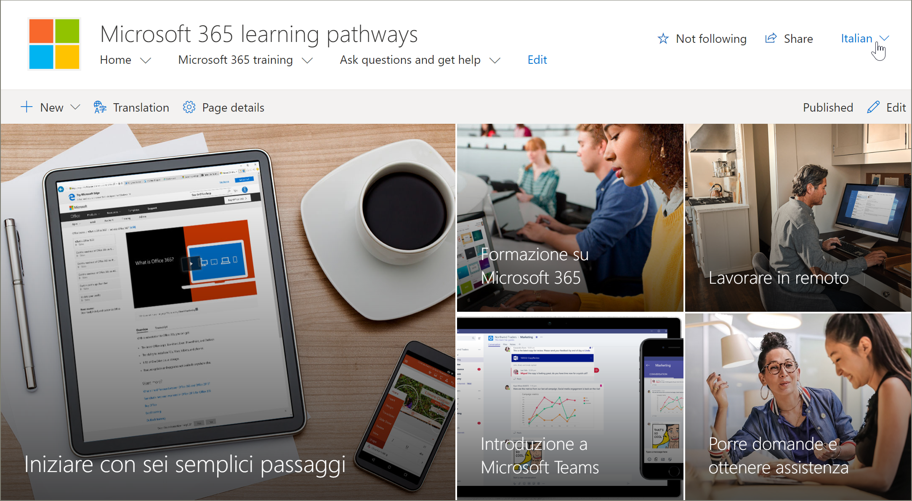

# Traducir páginas del sitio
Antes de empezar a traducir el sitio de caminos de aprendizaje, es importante comprender algunos conceptos clave sobre cómo funciona la característica multilingüe con las rutas de aprendizaje. 
- Información del sitio: la navegación, el logotipo y las traducciones de nombres de sitio requieren que el sitio se vea y traduzca en el perfil de idioma del usuario.  
- El elemento Web de rutas de aprendizaje debe visualizarse con el perfil de idioma del usuario para que aparezca en un idioma distinto del inglés. El elemento Web y el contenido proporcionado por Microsoft ya se han traducido. Para obtener más información acerca de los perfiles de idiomas, vea [cambiar la configuración regional y de Idioma personal](https://support.microsoft.com/office/change-your-personal-language-and-region-settings-caa1fccc-bcdb-42f3-9e5b-45957647ffd7).
- La forma de configurar las rutas de aprendizaje determina si las páginas traducidas están disponibles. Los sitios nuevos que se suministran con el servicio de libro de apariencia de Microsoft 365 tendrán páginas traducidas en nueve idiomas disponibles. Los sitios o sitios actualizados que cree requerirán traducción manual. Consulte [Opciones de instalación para rutas de aprendizaje multilingües](custom_setupoptions_ml.md).
- Las características multilingües de SharePoint Online para los sitios de comunicación habilitan la compatibilidad multilingüe para las rutas de aprendizaje. Para obtener información sobre las características multilingües de SharePoint Online, vea [crear sitios de comunicación multilingües, páginas y noticias](https://support.office.com/article/2bb7d610-5453-41c6-a0e8-6f40b3ed750c). 

## Trabajar con un sitio recién aprovisionado
Si ha aprovisionado un nuevo sitio de caminos de aprendizaje del servicio de libro de apariencia de Microsoft 365, las páginas traducidas ya estarán disponibles para usted. De forma predeterminada, el sitio proporciona las páginas siguientes:

- Home. aspx
- Start-with-Six-Simple-Steps. aspx
- Get-started-with-Microsoft-365. aspx
- Get-started-with-Microsoft-Teams. aspx
- Get-started-with-SharePoint. aspx
- Get-started-with-OneDriive. aspx
- Ask-Questions-and-Get-Help. aspx
- Calendario de eventos de aprendizaje. aspx
- Become-a-Champion. aspx
- Recommended-Playlists. aspx
- Centro de éxito de administración de caminos de aprendizaje

## Ver las páginas traducidas desde el sitio recién aprovisionado
Para familiarizarse con el sitio de caminos de aprendizaje traducidos, echemos un vistazo a algunas páginas traducidas.

### Ver la Página principal traducida
En la Página principal de rutas de aprendizaje, seleccione un idioma en la lista desplegable de idioma, como se muestra en el siguiente ejemplo. En el ejemplo, verá que se ha seleccionado italiano en la esquina superior derecha y se traducen todos los elementos de la página.

### Ver la página de aprendizaje de Microsoft 365 traducida
Ahora, echemos un vistazo a la página de aprendizaje de 365 de Microsoft. 

1. En la página de **Inicio** del sitio de caminos de aprendizaje, haga clic en **aprendizaje de Microsoft 365**.
2. En la esquina superior derecha de la página, selecciona un idioma. En este ejemplo, se selecciona italiano.

¿Qué traducciones están visibles cuando se selecciona el idioma?
- La página de SharePoint se traduce como se muestra en el gráfico anterior. Observe que el texto del titular de página ahora está en Italiano.

¿Qué traducciones no son visibles?
- El nombre del sitio está en inglés
- La navegación del sitio está en inglés
- El elemento Web de rutas de aprendizaje está en inglés

## Ver el sitio completamente traducido 
Para ver un sitio completamente traducido en un idioma específico, incluidas las páginas del sitio, la navegación y el elemento Web, se debe establecer la configuración regional y de idioma del usuario para ese idioma. Para obtener más información sobre cómo establecer la configuración regional y de idioma, consulte [cambiar la configuración regional y de Idioma personal](https://support.microsoft.com/office/change-your-personal-language-and-region-settings-caa1fccc-bcdb-42f3-9e5b-45957647ffd7). Se recomienda usar una cuenta independiente o tener a otro usuario con la configuración de idioma diferente para ver las páginas traducidas.  

## Trabajar con un sitio actualizado o manualmente de caminos de aprendizaje instalado
Si actualizó un sitio existente de caminos de aprendizaje o instaló manualmente el elemento Web en un sitio existente, deberá traducir manualmente las páginas del sitio. El contenido y el elemento Web de rutas de aprendizaje ya están traducidos y se mostrarán en el idioma preferido del usuario. Para traducir páginas, consulte las instrucciones siguientes "crear páginas para los idiomas que desee". 

## Crear páginas para los idiomas que desee
Una vez que haya habilitado el sitio para características multilingües y haya elegido los idiomas que desea que estén disponibles, puede crear las páginas de traducción que desee. 

1. Vaya a la página de idioma predeterminada que desea que esté disponible en otro idioma.
2. En la barra superior, seleccione **traducción**.
3. Seleccione **crear** para los idiomas que desee.

> [!IMPORTANT]
> Después de crear las páginas de traducción, debe publicar (o volver a publicar) la página idioma predeterminado para asegurarse de que:
>- Las páginas de traducción se muestran en el sitio de idioma correspondiente.
>- Las páginas de traducción se muestran correctamente en el elemento Web noticias y los elementos Web de contenido resaltados.
>- La lista desplegable de idioma que se encuentra en la parte superior del sitio incluye todos los idiomas habilitados.
>- Los traductores reciben una notificación de la solicitud de traducción.

Después de crear las páginas, el estado de la página (Borrador guardado, publicado, etc.) se muestra en el panel de traducción junto a cada idioma. Además, se notificará al traductor que ha asignado por correo electrónico que se ha solicitado una traducción.

### Ver el sitio completamente traducido en un idioma específico
Para ver un sitio completamente traducido en un idioma específico, incluidas las páginas del sitio, la navegación y el elemento Web, se debe establecer la configuración regional y de idioma del usuario para ese idioma. Para obtener más información sobre cómo establecer la configuración regional y de idioma, consulte [cambiar la configuración regional y de Idioma personal](https://support.microsoft.com/office/change-your-personal-language-and-region-settings-caa1fccc-bcdb-42f3-9e5b-45957647ffd7). Tenga en cuenta que es mejor usar una cuenta independiente o tener otro usuario con la configuración de idioma diferente para ver las páginas traducidas.

## ¿Qué hace un traductor?
 Una vez configurado el sitio en inglés, un usuario con español como idioma preferido personal, por ejemplo, edita y traduce manualmente el título, la navegación y el contenido del pie de página en español. Un usuario con el alemán como su idioma personal preferido hace lo mismo con el alemán. Una vez traducido el contenido, se mostrará a todos los usuarios de esos idiomas preferidos. El elemento Web selecciona el idioma preferido del usuario y muestra el contenido traducido en ese idioma. 

Los traductores traducen manualmente las copias de la página idioma predeterminado a los idiomas especificados. Cuando se crean las copias de las páginas, los traductores reciben una notificación en el correo electrónico si se ha especificado un traductor. El correo electrónico incluye un vínculo a la página idioma predeterminado y la página de traducción que se acaba de crear. El traductor hará lo siguiente:
1. Seleccione el botón **iniciar traducción** en el correo electrónico.
2. Seleccione **Editar** en la parte superior derecha de la página y traduzca el contenido.
3. Cuando haya terminado, seleccione **Guardar como borrador** (si no está listo para hacerlo visible para los lectores) o si la página está lista para que esté visible para todos los usuarios que usan ese idioma en el sitio, seleccione **publicar** o publicar **noticias**.

Para obtener más información sobre el proceso de traducción, consulte [crear sitios de comunicación multilingües, páginas y noticias](https://support.office.com/article/2bb7d610-5453-41c6-a0e8-6f40b3ed750c). 

## Actualizar la página de idioma predeterminado
Cuando se actualiza la página idioma predeterminado, se debe volver a publicar la página. A continuación, los traductores de las páginas de traducción reciben una notificación por correo electrónico de que se ha realizado una actualización para que se puedan realizar actualizaciones en las páginas de traducción individuales.

## Configurar un nombre de sitio multilingüe, navegación y pie de página
Para mostrar el nombre del sitio, la navegación y el pie de página de su sitio en los diferentes idiomas que ha puesto a disposición, cada uno debe ser traducido manualmente.

Por ejemplo, digamos que ha creado un sitio de comunicación con un idioma por defecto, el inglés, y ha habilitado el sitio para los idiomas español y alemán. Cuando se crea un sitio, se establece el nombre del sitio y la descripción en el idioma predeterminado (en este caso, el inglés). También puede actualizar el nombre y la descripción del sitio después de su creación. Luego crea los nodos de navegación y el contenido del pie de página en inglés.

Después de que el sitio se configura en inglés, un usuario con el español como su idioma personal preferido edita manualmente y traduce el título, la descripción, la navegación y el contenido del pie de página al español. Un usuario con el alemán como su idioma personal preferido hace lo mismo con el alemán. Una vez traducido el contenido, se mostrará a todos los usuarios de esos idiomas preferidos. 

> [! Notas
>- Los usuarios que traducen el contenido del sitio para sus idiomas preferidos deben ser miembros del grupo propietarios del sitio o tener permisos de sitio equivalentes.
>- Si se realiza un cambio en el nombre del sitio, en la navegación o en el pie de página en el idioma predeterminado, el elemento traducido correspondiente en otro idioma no se actualizará automáticamente a menos que elija sobrescribir las traducciones de sitios existentes. Si lo hace, el elemento traducido se reemplazará por la actualización en el idioma predeterminado y tendrá que volver a traducirse manualmente. Para sobrescribir las traducciones, vaya a la página idiomas del sitio para el idioma predeterminado y seleccione Mostrar configuración avanzada. A continuación, deslice el botón de alternancia a activado Sobrescribir traducciones. Esta opción no se aplica a contenido de páginas o noticias.

### Para ver el sitio completamente traducido en un idioma específico
Para ver un sitio completamente traducido en un idioma específico, incluidas las páginas del sitio, la navegación y el elemento Web, se debe establecer la configuración regional y de idioma del usuario para ese idioma. Para obtener más información sobre cómo establecer la configuración regional y de idioma, consulte [cambiar la configuración regional y de Idioma personal](https://support.microsoft.com/office/change-your-personal-language-and-region-settings-caa1fccc-bcdb-42f3-9e5b-45957647ffd7). Se recomienda usar una cuenta independiente o tener a otro usuario con la configuración de idioma diferente para ver las páginas traducidas.

## Más información
- Para obtener más información sobre cómo traducir las páginas del sitio de comunicación de SharePoint, vea [crear sitios de comunicación multilingües, páginas y noticias](https://support.office.com/article/2bb7d610-5453-41c6-a0e8-6f40b3ed750c).
- Para obtener más información acerca de la personalización de las rutas de aprendizaje, consulte [Customizing Learning Pathways](custom_overview.md).  
