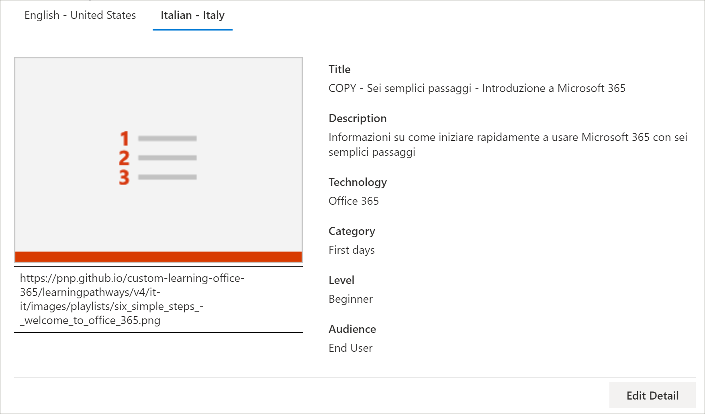
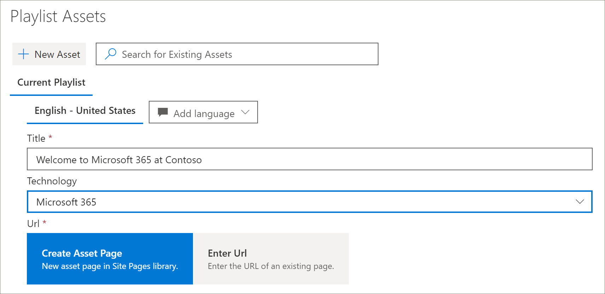
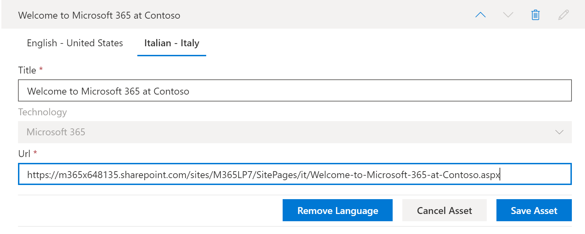
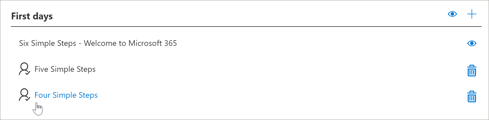
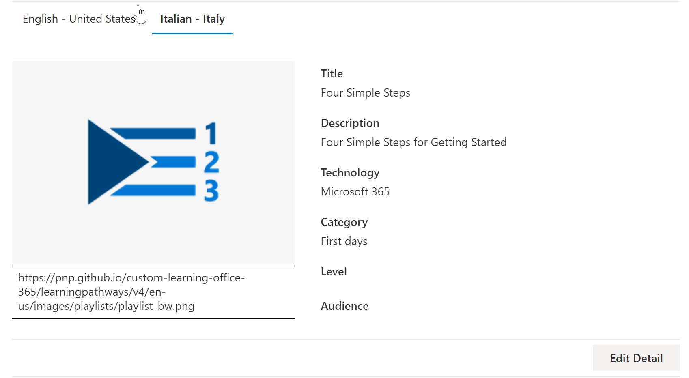

# Traducir listas de reproducción personalizadas de formas de aprendizaje
Con caminos de aprendizaje, la forma de trabajar con listas de reproducción personalizadas depende de cómo configure las rutas de aprendizaje.  

- Si ha aprovisionado un nuevo sitio multilingüe de caminos de aprendizaje, puede copiar o crear una nueva lista de reproducción y traducir la lista de reproducción a los idiomas compatibles con el sitio.
- Si actualizó un sitio de caminos de aprendizaje existente que tiene listas de reproducción personalizadas preexistentes, puede traducir las listas de reproducción existentes en los idiomas que admita el sitio. También puede copiar y crear listas de reproducción nuevas. 

> [!IMPORTANT]
> - Las listas de reproducción suministradas por Microsoft ya se han traducido y no se pueden modificar a menos que cree una copia de la lista de reproducción. 

## Crear o copiar una lista de reproducción y convertirla en traducida
Si ha aprovisionado un nuevo sitio multilingüe de caminos de aprendizaje o ha actualizado el sitio con el elemento Web multilingüe, puede copiar o crear una lista de reproducción personalizada y traducir los activos de la lista de reproducción y la lista de reproducción a los idiomas admitidos por el sitio. 

### Copiar una lista de reproducción y convertirla en traducida
Para mostrar cómo crear una nueva lista de reproducción personalizada y traducirla, usaremos la característica copiar lista de reproducción de rutas de aprendizaje.

1.  En el menú de **Inicio** de rutas de aprendizaje, haga clic en **Administración de rutas de aprendizaje**. 
2.  En **rutas de aprendizaje de microsoft 365**, seleccione **primeros días**y, a continuación, seleccione **seis pasos sencillos-Bienvenido a Microsoft 365**. 
3. Haga clic en **copiar lista de reproducción**, desplácese hacia abajo en la página y haga clic en **Editar detalle**.   
4. Cambiar el título de la lista de reproducción. En este ejemplo, cambiaremos el título de la lista de reproducción a **cinco pasos sencillos**. Los idiomas disponibles dependerán de los idiomas admitidos que se hayan seleccionado para el sitio. Para agregar idiomas adicionales, necesita agregar idiomas admitidos adicionales al sitio.   
5. Haga clic en **Guardar detalle**. 
6. Haga clic en un idioma a la derecha del idioma predeterminado (en este caso, Inglés) para ver los detalles de la lista de reproducción copiada. Los detalles del nuevo idioma reflejan la lista de reproducción copiada original y requieren traducción.
7. Cree una nota para notificar al traductor de los detalles de la lista de reproducción que se va a traducir.  

> [!IMPORTANT]
> Las notificaciones de traductor no están integradas en listas de reproducción personalizadas. Los traductores deberán recibir una notificación manual. Los traductores traducen manualmente las copias de los detalles del idioma predeterminado en los idiomas especificados. Deberá notificar al traductor las traducciones necesarias para obtener detalles de la lista de reproducción. Se recomienda que finalice todos los cambios en la lista de reproducción, incluida la adición, modificación o eliminación de activos de la lista de reproducción y, a continuación, notifique al traductor las traducciones necesarias para obtener detalles y activos de la lista de reproducción.

## Crear activos multilingües en una lista de reproducción personalizada
Los activos de una lista de reproducción que suministra Microsoft no son editables y no requieren traducción. Los activos proporcionados por Microsoft estarán disponibles en los idiomas admitidos por el sitio. Para los activos personalizados que crea o los activos personalizados existentes, puede Agregar los idiomas admitidos por el sitio.  Echemos un vistazo a cómo agregar idiomas para los activos personalizados nuevos y existentes en una lista de reproducción. 

### Crear un nuevo activo multilingüe para una lista de reproducción
En estas instrucciones se supone que está usando la lista de reproducción de pasos sencillos en el ejemplo de este tema. 

**Para crear el activo**
1. Para los cinco pasos sencillos de la lista de reproducción, en **activos**, seleccione **+ nuevo recurso** y rellene los detalles del activo. 
- En **título**, escriba "Bienvenido a Microsoft 365 en Contoso". 
- Para **tecnología**, seleccione **Microsoft 365**.

2. Seleccione **crear activo**y, a continuación, seleccione **Guardar activo**.

**Para abrir el activo**
1. Seleccione el recurso que ha creado y, a continuación, haga clic en **abrir**.  
2. Realice los cambios en la página como desee. Por ahora, puede cambiar el título de la página y agregar texto a la página como se muestra en el ejemplo siguiente y, a continuación, hacer clic en **publicar**. 
3. Haga clic en **traducción**.
4. Seleccione **crear** para el idioma o los idiomas que desee. Para este ejemplo, seleccionaremos el italiano.
5. Seleccione **vista**. Ahora debería ver una página similar a la del ejemplo siguiente en función de los idiomas admitidos.

6. Haga clic en **Publicar**.
7. Para la página de traducción que ha creado, copie la dirección URL del explorador y vuelva a la página de administración de rutas de aprendizaje.

**Para agregar un idioma para el activo de traducción que ha creado** 
1. Vuelva a la página de administración de rutas de aprendizaje y seleccione el icono de edición (lápiz) para el activo "cinco pasos sencillos" que ha abierto. 
2. Haga clic en **Agregar idioma**y, a continuación, seleccione un idioma. En este ejemplo, hemos seleccionado el italiano. 
3. Escriba la dirección URL de la Página traducida que ha creado. Debería ver una página similar a la del ejemplo siguiente. 

4. Haga clic en **Guardar activo**.

## Agregar idiomas para los activos y las listas de reproducción personalizados existentes
Si ha actualizado las rutas de aprendizaje para la compatibilidad multilingüe y tiene recursos y listas de reproducción personalizadas existentes, puede Agregar los idiomas admitidos para las listas de reproducción y los activos. En estas instrucciones se supone que tiene una lista de reproducción personalizada a la que puede agregar idiomas. Si no tiene una lista de reproducción personalizada, vea "crear o copiar una lista de reproducción" anteriormente en este tema. 

> [!IMPORTANT]
> - Las listas de reproducción suministradas por Microsoft ya se han traducido y no se pueden modificar a menos que cree una copia de la lista de reproducción. Solo puede agregar idiomas para listas de reproducción personalizadas. 
> - Para agregar idiomas para los activos y las listas de reproducción personalizados, se debe habilitar la compatibilidad multilingüe y los idiomas. Para obtener más información, vea [establecer la configuración de idioma](https://docs.microsoft.com/office365/customlearning/custom_update_ml#set-language-settings). 

### Para agregar idiomas para una lista de reproducción existente
1.  En el menú de **Inicio** de rutas de aprendizaje, haga clic en **Administración de rutas de aprendizaje**. 
2.  Seleccione una lista de reproducción personalizada. Una lista de reproducción personalizada se identifica mediante el icono de contactos con la marca de verificación, como se muestra en el siguiente ejemplo.
 
3. Seleccione **Editar detalle**. Es posible que deba desplazarse hacia abajo para buscar el botón **editar detalles** .   
4. Seleccione **Agregar idioma** y, a continuación, seleccione un idioma.  
5. Seleccione **Guardar detalle**.
 Los idiomas disponibles dependerán de los idiomas admitidos que se hayan seleccionado para el sitio. Para agregar idiomas adicionales, necesita agregar idiomas admitidos adicionales al sitio.   
5. Haga clic en un idioma a la derecha del idioma predeterminado (en este caso, Inglés) para ver los detalles de la lista de reproducción copiada. Los detalles del nuevo idioma reflejan la lista de reproducción copiada original y requieren traducción.
 
7. Cree una nota para notificar al traductor de los detalles de la lista de reproducción que se va a traducir.  

**Para abrir el activo**
1. Seleccione el recurso que ha creado y, a continuación, haga clic en **abrir**.  
2. Realice los cambios en la página como desee. Por ahora, puede cambiar el título de la página y agregar texto a la página como se muestra en el ejemplo siguiente y, a continuación, hacer clic en **publicar**. 
3. Haga clic en **traducción**.
4. Seleccione **crear** para el idioma o los idiomas que desee. Para este ejemplo, seleccionaremos el italiano.
5. Seleccione **vista**. Ahora debería ver una página similar a la del ejemplo siguiente en función de los idiomas admitidos.

6. Haga clic en **Publicar**.
7. Para la página de traducción que ha creado, copie la dirección URL del explorador y vuelva a la página de administración de rutas de aprendizaje.

## Notificar al traductor
Cuando haya terminado de crear los activos de traducción, notifíquelo al traductor de las traducciones necesarias. El traductor hará lo siguiente:
- Traduzca los detalles de la lista de reproducción.
- Traduzca los detalles de activos.
- Traduzca las páginas de idiomas agregadas para un activo.
- Notificar al solicitante las traducciones de que las traducciones están listas para revisión

## Agregar idiomas para una lista de reproducción personalizada existente
Si ha actualizado las rutas de aprendizaje para la compatibilidad multilingüe y tiene recursos y listas de reproducción personalizadas existentes, puede Agregar los idiomas admitidos para las listas de reproducción y los activos. 

> [!IMPORTANT]
> - Las listas de reproducción suministradas por Microsoft ya se han traducido y no se pueden modificar a menos que cree una copia de la lista de reproducción. Solo puede agregar idiomas para listas de reproducción personalizadas. 
> - Para agregar idiomas para los activos y las listas de reproducción personalizados, se debe habilitar la compatibilidad multilingüe y los idiomas. Para obtener más información sobre cómo habilitar la compatibilidad multilingüe y las opciones, consulte [establecer la configuración de idioma](https://docs.microsoft.com/office365/customlearning/custom_update_ml#set-language-settings). 

## Instrucciones para el traductor
Al agregar idiomas a las listas de reproducción, debe notificar a los traductores los cambios. Puede dirigir el traductor al siguiente 

### Traducir lista de reproducción detalles
En el menú de **Inicio** de rutas de aprendizaje, haga clic en **Administración de rutas de aprendizaje**. 
1. Haga clic en la lista de reproducción personalizada que requiere traducción y, a continuación, en los idiomas. 
2. Haga clic en **Editar detalle**, realice las traducciones de la lista de reproducción y, a continuación, haga clic en 
3. Haga clic en **Guardar detalle**. 
4. Notificar al solicitante de conversión que la traducción está completa. 

### Traducir detalles de activos
En el menú de **Inicio** de rutas de aprendizaje, haga clic en **Administración de rutas de aprendizaje**. 
1. Haga clic en la lista de reproducción personalizada que requiere traducción. 
2. Desplácese hacia abajo por la página y, a continuación, en activos, seleccione Editar para el recurso que desea editar y, a continuación, seleccione el idioma. 
3. Realice las traducciones del activo y, a continuación, haga clic en **Guardar activo**.  

### Traducir la página de idioma agregada para el activo
En el menú de **Inicio** de rutas de aprendizaje, haga clic en **Administración de rutas de aprendizaje**. 
1. Haga clic en la lista de reproducción personalizada que requiere traducción. 
2. Desplácese hacia abajo por la página y, a continuación, en activos, seleccione el recurso, seleccione el idioma y, a continuación, haga clic en abrir. 
3. Realice las traducciones de la página y, a continuación, haga clic en **publicar**.   

## Más información
- Para obtener más información acerca de la personalización de las rutas de aprendizaje, consulte [Customizing Learning Pathways](custom_overview.md). 

