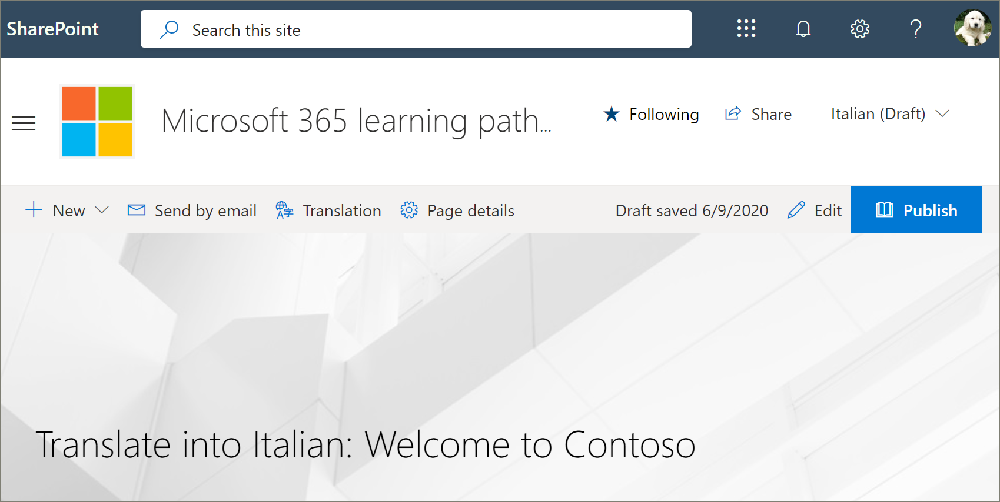
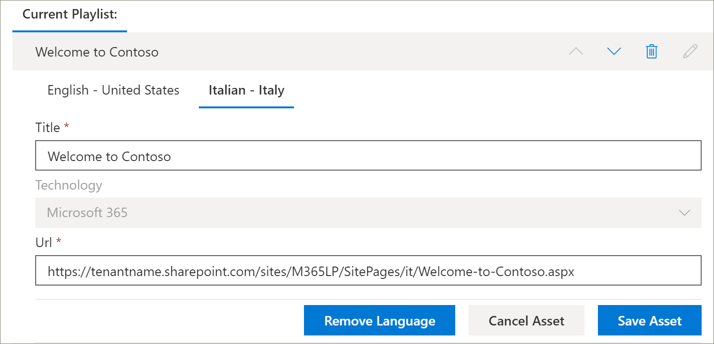

# Traducir una lista de reproducción personalizada de rutas de aprendizajeTranslate a learning pathways custom playlist
Si ha creado listas de reproducción personalizadas de rutas de aprendizaje para el sitio, puede traducir las listas de reproducción a los idiomas habilitados para este sitio.If you've created learning pathways custom playlists for your site, you can translate the playlists into the languages enabled for this site.

1.  En el menú de **Inicio** de rutas de aprendizaje, haga clic en **Administración de rutas de aprendizaje**.From the learning pathways **Home** menu, click **Learning pathways administration**. 
2.  Haga clic en la lista de reproducción personalizada.Click the custom playlist. En este ejemplo, usaremos **cinco pasos sencillos: Bienvenido a contoso**.In this example, we'll use **Five Simple Steps - Welcome to Contoso**. 
3.  Haga clic en **Editar detalle**y, a continuación, en el cuadro **Agregar idioma** , seleccione un idioma.Click **Edit Detail**, then in the **Add language** box, select a language. En este ejemplo, usaremos **Italiano – Italia**.In this example, we'll use **Italian – Italy**. 
5.  Haga clic en **Guardar detalle**.Click **Save Detail**. 

> [!IMPORTANT]
> Las notificaciones de traductor no están integradas en listas de reproducción personalizadas.Translator notifications are not built into custom playlists. Los traductores deberán recibir una notificación manual.Translators will need to be notified manually. 

## ¿Qué hace un traductor?What does a translator do?
Los traductores traducen manualmente las copias de la página idioma predeterminado a los idiomas especificados.Translators manually translate the copies of the default language page into the language(s) specified. Deberá notificar al traductor las traducciones necesarias para obtener detalles de la lista de reproducción.You will need to notify the translator of the translations required for playlist details. Se recomienda que finalice todos los cambios en la lista de reproducción, incluida la adición, modificación o eliminación de activos de la lista de reproducción y, a continuación, notifique al traductor las traducciones necesarias.It's recommended that you finish all playlist changes,including adding, editing, or deleting playlist assets, then notify the translator of the required translations.

## Traducir los activos de la lista de reproducción personalizadaTranslate the assets in the custom playlist
Los activos de una lista de reproducción que suministra Microsoft no son editables y no requieren traducción.Any assets in a playlist that are supplied by Microsoft are not editable and do not require translation. Si ha agregado activos personalizados desde el sitio de SharePoint de su espacio empresarial, dichos activos necesitarán traducción.If you’ve added custom assets from your tenant's SharePoint site, those assets will require translation. Echemos un vistazo a cómo traducir un activo personalizado en una lista de reproducción.Let's take a look at how to translate a custom asset in a playlist.

### Adición de un idioma para un activo existenteAdd a language for an existing asset
1. En **activos**, seleccione el icono **Editar** junto al activo personalizado.Under **Assets**, select the **Edit** icon next to the custom asset. 
2. Seleccione un idioma en el cuadro **Agregar idioma** y, a continuación, seleccione **Guardar activo**.Select a language from the **Add language** box, and then select **Save Asset**.

### Adición de una página de idioma para un activo existenteAdd a language page for an existing asset
1. En la lista de activos, haga clic en el activo en inglés y, a continuación, haga clic en **abrir**.In the asset list, click the English asset, and then click **Open**.
2. En la barra superior, seleccione **traducción**.On the top bar, select **Translation**.
3. En la lista desplegable Idioma, seleccione el idioma para el recurso, seleccione **crear**y, a continuación, **Ver**.From the language dropdown, select the language for the asset, select **Create**, and then **View**. La página debería tener ahora un aspecto similar a este.Your page should now look something like this. 

4. Haga clic en **publicar**y, a continuación, copie la dirección URL de la página.Click **Publish**, and then copy the URL for the page. Debe tener un aspecto similar a este, con el código de idioma en la dirección URL.It should look something like this, with the language code in the URL.
https://tenantname.sharepoint.com/sites/M365LP/SitePages/it/Welcome-to-Contoso.aspx.https://tenantname.sharepoint.com/sites/M365LP/SitePages/it/Welcome-to-Contoso.aspx.
5. Vuelva a la página de administración de SharePoint, agregue la dirección URL del idioma para el activo y, a continuación, haga clic en **Guardar**.Return to the SharePoint Administration page, add the URL for the language for the asset, and then click **Save**. 

6.  Desplácese hacia arriba en la página y haga clic en **cerrar lista de reproducción**.Scroll up the page and click **Close Playlist**.

## ¿Qué hace el traductor?What the translator does?
El traductor hará lo siguiente:The translator will:
- Traduzca los detalles de la lista de reproducción.Translate playlist details.
- Traduzca los detalles de activos.Translate asset details.
- Traduzca las páginas de idiomas agregadas para el activo.Translate added language pages for asset.
- Notificar al solicitante las traducciones de que las traducciones están listas para revisiónNotify the requestor of the translations that the translations are ready for review

### Traducir lista de reproducción detallesTranslate playlist details
En el menú de **Inicio** de rutas de aprendizaje, haga clic en **Administración de rutas de aprendizaje**.From the Learning Pathways **Home** menu, click **Learning pathways administration**. 
1. Haga clic en la lista de reproducción personalizada que requiere traducción y, a continuación, en los idiomas.Click the custom playlist that requires translation, then click the languages. 
2. Haga clic en **Editar detalle**, realice las traducciones de la lista de reproducción y, a continuación, haga clic enClick **Edit Detail**, make the translations for the playlist, then click 
3. Haga clic en **Guardar detalle**.Click **Save Detail**. 
4. Notificar al solicitante de conversión que la traducción está completa.Notify the translation requestor that the translation is complete. 

### Traducir detalles de activosTranslate asset details
En el menú de **Inicio** de rutas de aprendizaje, haga clic en **Administración de rutas de aprendizaje**.From the Learning Pathways **Home** menu, click **Learning pathways administration**. 
1. Haga clic en la lista de reproducción personalizada que requiere traducción.Click the custom playlist that requires translation. 
2. Desplácese hacia abajo por la página y, a continuación, en activos, seleccione Editar para el recurso que desea editar y, a continuación, seleccione el idioma.Scroll down the page, then under Assets, select edit for the asset you want to edit, then select the language. 
3. Realice las traducciones del activo y, a continuación, haga clic en **Guardar activo**.Make the translations for the asset, and then click **Save Asset**.  

## Traducir la página de idioma agregada para el activoTranslate the added language page for the asset
En el menú de **Inicio** de rutas de aprendizaje, haga clic en **Administración de rutas de aprendizaje**.From the Learning Pathways **Home** menu, click **Learning pathways administration**. 
1. Haga clic en la lista de reproducción personalizada que requiere traducción.Click the custom playlist that requires translation. 
2. Desplácese hacia abajo por la página y, a continuación, en activos, seleccione el recurso, seleccione el idioma y, a continuación, haga clic en abrir.Scroll down the page, then under Assets, select the asset, select the language, and then click Open. 
3. Realice las traducciones de la página y, a continuación, haga clic en **publicar**.Make the translations for the page, and then click **Publish**.  

## Crear una nueva lista de reproducción de MultilangualCreate a new multilangual playlist
Para obtener instrucciones sobre cómo crear una nueva lista de reproducción para un sitio, vea [crear una lista de reproducción personalizada](custom_createnewplaylist.md).For instructions on how to create a new playlist for a site, see [Create a Custom Playlist](custom_createnewplaylist.md). Una vez que haya creado la lista de reproducción y los activos, consulte esta documentación para obtener instrucciones sobre cómo traducir la lista de reproducción y los activos.After you've created the playlist and assets, refer back to this documentation for instruction on how to translate the playlist and assets. 