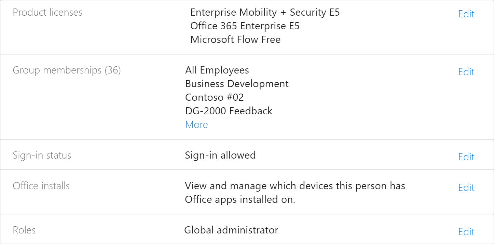
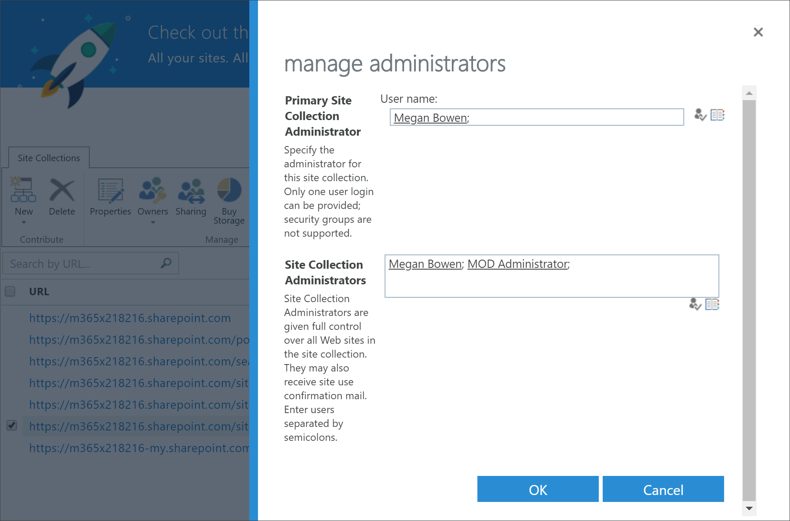
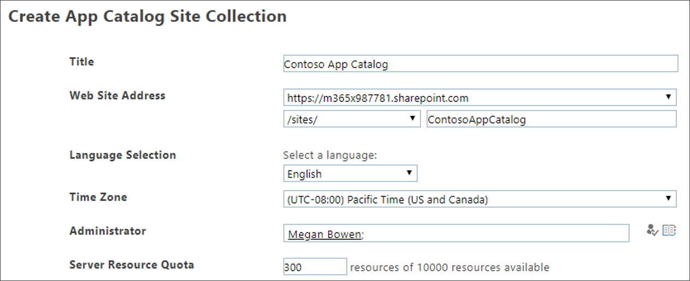

# Solucionar problemas Microsoft 365 de aprendizaje

A continuación se presentan sugerencias de solución de problemas que pueden producirse con Microsoft 365 de aprendizaje o el servicio SharePoint aprovisionamiento en línea.

## Cómo saber si tiene permisos de administrador de inquilinos

Inicie sesión en el servicio SharePoint aprovisionamiento en línea y el aprovisionamiento de Learning requiere permisos de administrador de inquilinos. Si tiene problemas de inicio de sesión con SharePoint servicio de aprovisionamiento en línea, asegúrese de que se le ha asignado el rol de administrador global. La solución de Learning personalizada requiere permisos de administrador de inquilinos, lo que se conoce Office 365 rol de administrador global. Este es el modo de determinar si se le asignó el rol Administrador global.

1.  Inicie sesión en Office.com.
2.  Haga clic **en Administrador**
3.  En **Usuarios**, seleccione **Usuarios activos**
4.  Buscar su nombre
5.  Haga clic en su nombre en Resultados de búsqueda. Debería ver El administrador global de su rol.

### Si no tiene el rol de administrador global
- Busque un administrador global en su organización y haga que esa persona inicie sesión en el servicio o que le asigne el rol de administrador global.

## Solución de problemas del Catálogo de aplicaciones de inquilino
Las Learning personalizadas requieren que se aprovisione un Catálogo de aplicaciones en el espacio empresarial de destino. La creación de un catálogo de aplicaciones requiere permisos de administrador global. Estos son los pasos para solucionar problemas comunes del Catálogo de aplicaciones:

### Cómo saber si tienes un catálogo de aplicaciones de inquilino 
Para empezar, asegúrese de que tiene permisos de administrador global. Consulta los pasos para los permisos de administrador de inquilinos anteriores.

1. Desde Office 365, haga clic en **Administrador**, haga clic en la flecha expandir >, haga clic **en Mostrar** todos los centros  >  **de**  >  **administración SharePoint**.
2. Haz **clic en Classic Admin SharePoint Center**  >  **apps** App  >  **Catalog**.
3. En **Aplicaciones,** debería ver un icono titulado **Distribuir aplicaciones para SharePoint**. Si ve el icono, tiene un Catálogo de aplicaciones de inquilinos. Vea la **sección Cómo asegurarse de que es una intercalación** de sitios... a continuación. Si no ves el icono, deberás crear un catálogo de aplicaciones de inquilino para tu inquilino. Consulta la **sección Cómo crear un catálogo de aplicaciones de** inquilino a continuación.

### Cómo asegurarse de que es propietario de una colección de sitios en el Catálogo de aplicaciones de inquilinos 
Para aprovisionar Microsoft 365 aprendizaje, deberás ser propietario de una colección de sitios en el Catálogo de aplicaciones de inquilinos. Este es el modo de determinar si es un propietario.

1. Desde Office 365, haga clic en **Administrador**, haga clic en la flecha expandir >, haga clic **en Mostrar** todos los centros  >  **de**  >  **administración SharePoint**.
2. Haga **clic en Centro SharePoint administración** clásica y, a continuación, seleccione el catálogo de **aplicaciones**.
3. Seleccione **Propietario** y, a continuación, asegúrese de que es un propietario de la colección de sitios. Debería tener un aspecto parecido a este.
 

### Cómo crear un Catálogo de aplicaciones de inquilinos si no existe uno 
1. Inicie sesión en Office 365 con su cuenta de SharePoint de administración en línea.
2. Haga clic en **Administrador**.
3. En **Centros de administración,** **haga clic SharePoint**. 
4. Haga clic **en Catálogo de**  >  **aplicaciones**.
5. Haga **clic en Crear un nuevo sitio de catálogo de** aplicaciones y, a continuación, haga clic en **Aceptar**. 
6.  Escribe la información del Catálogo de aplicaciones. Es posible que desee incluir más de un administrador. A continuación se muestra un ejemplo.  

7.  Eso es todo. Ya ha terminado. Pero antes de pasar al aprovisionamiento de Learning, debe esperar al menos 30 minutos para asegurarse de que la creación del Catálogo de aplicaciones se haya completado. 

> [!IMPORTANT]
> Espere al menos 30 minutos después de crear el Catálogo de aplicaciones de inquilinos antes de aprovisionar el Learning. Esto garantiza que el proceso de aprovisionamiento del Catálogo de aplicaciones se haya completado en SharePoint. 