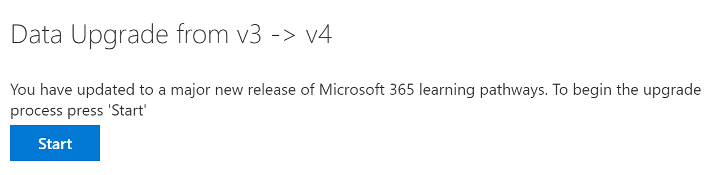

# Actualización de formas de aprendizajeUpdate learning pathways
Si tiene un sitio de caminos de aprendizaje existente, puede actualizarlo para la compatibilidad multilingüe.If you have an existing Learning Pathways site, you can update it for multilingual support. Para actualizar las rutas de aprendizaje a la versión multilingüe de 4,0, cargue el paquete de elementos Web, customlearning. sppkg, en el catálogo de aplicaciones del espacio empresarial de SharePoint.To update learning pathways to the multilingual 4.0 version, you upload the web part package, customlearning.sppkg, to the SharePoint tenant App Catalog. Al actualizar rutas de aprendizaje:When you update learning pathways:  

- Se mantienen todos los activos y listas de reproducción personalizados creados anteriormenteAny previously created custom playlists and assets are maintained
- Se mantiene la configuración para ocultar o mostrar contenidoSettings to hide or show content are maintained
- La plantilla de SharePoint de rutas de aprendizaje permanece sin cambiosThe learning pathways SharePoint template is left unchanged
- Las páginas del sitio de las rutas de aprendizaje no se traducen.The learning pathways site pages aren't translated. Este trabajo debe realizarse manualmenteThis work must be done manually

## Leer la introducción multilingüe de las rutas de aprendizajeRead the learning pathways multilingual overview
Para obtener información sobre cómo funciona la compatibilidad multilingüe para las rutas de aprendizaje, lea la [información general sobre las rutas de aprendizaje multilingües](custom_overview.md).To learn about how multilingual support works for learning pathways, read the [Learning pathways multilingual overview](custom_overview.md). 

## Requisitos previos para la actualizaciónPrerequisites to update
Antes de actualizar las rutas de aprendizaje, es necesario cumplir los siguientes requisitos previos:Before updating learning pathways, the following prerequisite must be met:
- La persona que actualice las rutas de aprendizaje debe ser un propietario de la colección de sitios del catálogo de aplicaciones del espacio empresarial.The person updating learning pathways must be a site collection owner of the tenant App Catalog. Si la persona que aprovisiona las rutas de aprendizaje no es un propietario de la colección de sitios del catálogo de aplicaciones, [complete estas instrucciones](addappadmin.md) y continúe.If the person provisioning learning pathways isn't a site collection owner of the App Catalog, [complete these instructions](addappadmin.md) and continue. 

## Establecer la configuración de idiomaSet language settings 
Antes de actualizar las rutas de aprendizaje, establezca la configuración de idioma del sitio.Before updating learning pathways, set the site language settings. Para habilitar la compatibilidad multilingüe con el sitio de caminos de aprendizaje, puede configurar las **páginas y noticias de habilitar para que se traduzcan en varios idiomas** y, a **continuación, agregar**los idiomas que desea que sean compatibles con el sitio.To enable multilingual support for the learning pathways site, you can set the **Enable pages and news to be translated into multiple languages** to **On**, and then add the languages you want to support for the site.
1.  Desde el sitio de caminos de aprendizaje, seleccione **configuración** de la parte superior derecha y, a continuación, seleccione **información del sitio**.From the Learning Pathways site, select **Settings** from the top right, and then select **Site information**.
2.  En la parte inferior del panel de información del sitio, seleccione **ver toda la configuración del sitio**.At the bottom of the site information pane, select **View all site settings**.
3.  En **Administración del sitio**, seleccione **configuración de idioma**.Under **Site Administration**, select **Language settings**.
4.  En **Habilitar páginas y noticias para que se traduzcan a varios idiomas**, establezca el modificador para alternar.Under **Enable pages and news to be translated into multiple languages**, set the toggle switch. 
- Para un sitio de multiligual, deslice el botón de alternancia a **activado**y, a continuación, vaya a la sección agregar idiomas.For a multiligual site, slide the toggle to **On**, and then proceed to the Add Languages section. 
- Para un sitio de solo inglés, deslice el botón de alternancia a **desactivado**.For an English-only site, slide the toggle to **Off**.

### Agregar idiomasAdd languages
Las rutas de aprendizaje admiten nueve idiomas, solo debe agregar los idiomas que necesite.Learning pathways supports nine languages, you should add only the languages you need. En los ejemplos que se usan en esta documentación, se agregará italiano.In the examples used in this documentation, Italian will be added. 
- En **Agregar o quitar idiomas del sitio**, escriba el nombre de un idioma en **seleccionar o escriba un idioma**o seleccione un idioma de la lista desplegable.Under **Add or remove site languages**, start typing a language name in **Select or type a language**, or choose a language from the dropdown. Puede repetir este paso para agregar varios idiomas.You can repeat this step to add multiple languages. Puede Agregar o quitar idiomas de su sitio en cualquier momento volviendo a esta página.You can add or remove languages from your site at any time by going back to this page.
 
### Asignar traductoresAssign translators
Al definir la configuración de idioma para las rutas de aprendizaje, puede asignar traductores.When defining Language settings for learning pathways, you can assign translators. Los traductores deben tener configurado un perfil de idioma extranjero.Translators should have a foreign language profile set up. Para obtener más información acerca de los perfiles de idiomas externos, consulte [crear sitios de comunicación multilingües, páginas y noticias](https://support.office.com/article/2bb7d610-5453-41c6-a0e8-6f40b3ed750c).For more information about foreign language profiles, see [Create multilingual communication sites, pages, and news](https://support.office.com/article/2bb7d610-5453-41c6-a0e8-6f40b3ed750c).  
- Para un idioma compatible, haga clic en **seleccionar o escriba un traductor** y, a continuación, seleccione un traductor.For a supported language, click **Select or type a translator** and then select a translator. 

## Actualizar el paquete de elementos Web de rutas de aprendizajeUpdate the learning pathways web part package
En este paso, carga el elemento Web caminos de aprendizaje 4,0 en el catálogo de aplicaciones de SharePoint y, a continuación, navega a la página de administración de caminos de aprendizaje para iniciar el proceso de actualización.In this step, you upload the learning pathways 4.0 web part to the SharePoint App Catalog, and then navigate to the learning pathways Administration page to start the update process.

### Cargar el paquete de elementos WebUpload the web part package
1.  Vaya al [repositorio de aprendizaje personalizado de github](https://github.com/pnp/custom-learning-office-365/tree/master/webpart), seleccione **customlearning. sppkg** y, a continuación, descárguelo en una unidad local de su PC.Go to the [GitHub custom learning repository](https://github.com/pnp/custom-learning-office-365/tree/master/webpart), select **customlearning.sppkg** and then download it to a local drive on your PC.
2.  Si aún no ha iniciado sesión, inicie sesión en su inquilino con una cuenta de administrador de inquilinos o de administración de la colección de sitios.If you’re not already signed in, sign into your tenant with a Tenant Admin or Site Collection Admin account. 
3.  Haga clic en **Administración**,  >  **Mostrar todas**  >  **SharePoint**  >  **las características más**de SharePoint.Click **Admin** > **Show All** > **SharePoint** > **More Features**. 
4.  En **aplicaciones**, haga clic en **abrir**.Under **Apps**, click **Open**. 
5.  Haga clic en **Catálogo**  >  **de aplicaciones distribuir aplicaciones para SharePoint**.Click **App Catalog** > **Distribute Apps for SharePoint**. 
6.  Haga clic en **cargar**  >  **archivos de selección**.Click **Upload** > **Choose Files**. 
7.  Seleccione el archivo **customlearning. sppkg** que ha descargado y haga clic en **Aceptar**  >  **implementar**.Select the **customlearning.sppkg** file you downloaded, click **OK** > **Deploy**. 

### Completar la actualizaciónComplete the update
1.  Desde el sitio de caminos de aprendizaje, seleccione **aprendizaje de rutas de aprendizaje** en el menú de **Inicio** .From the Learning Pathways site, select **Learning pathways administration** from the **Home** menu. 
2.  Verá un mensaje en el que se le preguntará si desea actualizar.You’ll see a prompt asking if you want to update. 

3.  Haga clic en **Iniciar**.Click **Start**. 
4. Una vez finalizada la actualización, haga clic en **cerrar**.When the update is complete, click **Close**. 

### Siguientes pasosNext Steps
- Explore el [contenido predeterminado](custom_exploresite.md) proporcionado en el sitio y el elemento Web.Explore the [default content](custom_exploresite.md) provided in the site and web part.
- Para obtener más información acerca de la conversión de páginas del sitio, consulte [translate site pages](custom_translate_page_ml.md).For more information about translating site pages, see [Translate site pages](custom_translate_page_ml.md). 

