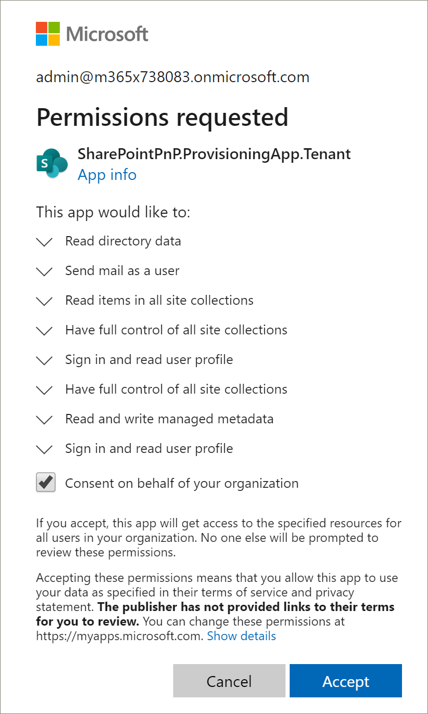
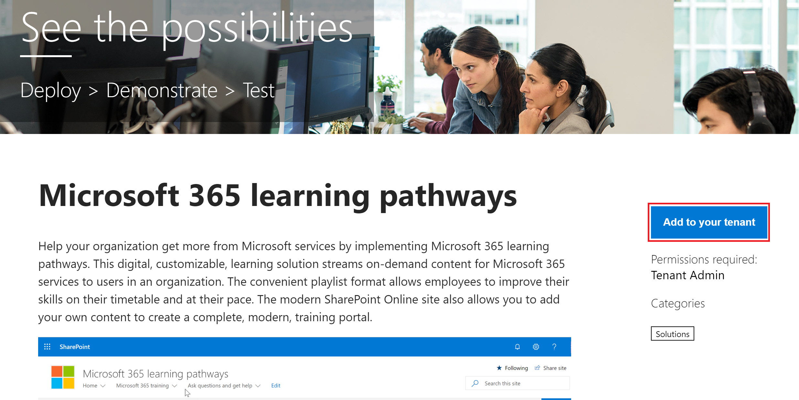

# Aprovisionar aprendizaje personalizadoProvision Custom Learning

Con el servicio de aprovisionamiento de SharePoint Online, un administrador de inquilinos de Office 365 puede iniciar el proceso de aprovisionamiento con unos pocos clics sencillos.With the SharePoint Online Provisioning Service, an Office 365 Tenant Administrator can start the provisioning process with a few simple clicks. El servicio de aprovisionamiento es la forma recomendada para aprovisionar aprendizaje personalizado.The Provisioning Service is the recommended way to provision Custom Learning. Es rápido y sencillo, y tarda solo unos minutos en iniciar el proceso.It's fast, easy, and takes only a few minutes to start the process. Sin embargo, antes de empezar con el servicio de aprovisionamiento, asegúrese de que cumple con los requisitos previos para el aprovisionamiento.Before getting started with the Provisioning Service, however, make sure you've met the prerequisites for provisioning.

## Requisitos previosPrerequisites
 
Para configurar correctamente el aprendizaje personalizado con el servicio de aprovisionamiento de [SharePoint Online](https://provisioning.sharepointpnp.com)provisioning, la persona que realiza el aprovisionamiento debe cumplir los siguientes requisitos previos:To successfully set up Custom Learning with the Provisioning Service [SharePoint Online Provisioning Service](https://provisioning.sharepointpnp.com), the person doing the provisioning must meet the following pre-requisites: 
 
- La persona que aprovisiona el aprendizaje personalizado debe ser un administrador de inquilinos del inquilino en el que se aprovisionará el aprendizaje personalizado.The person provisioning Custom Learning must be a Tenant Administratorof the tenant where Custom Learning will be provisioned.  
- Un catálogo de aplicaciones del espacio empresarial debe estar disponible en la opción de aplicaciones del centro de administración de SharePoint.A tenant App Catalog must be available within the Apps option of the SharePoint Admin Center. Si su organización no tiene un catálogo de aplicaciones del espacio empresarial de SharePoint, consulte la [documentación de SharePoint Online](https://docs.microsoft.com/en-us/sharepoint/use-app-catalog) para crear uno.If your organization does not have an SharePoint tenant App catalog, refer to the [SharePoint Online documentation](https://docs.microsoft.com/en-us/sharepoint/use-app-catalog) to create one.  
- La persona que aprovisiona el aprendizaje personalizado debe ser un propietario de la colección de sitios del catálogo de aplicaciones del espacio empresarial.The person provisioning Custom Learning must be a Site Collection Owner of the Tenant App Catalog. Si la persona que aprovisiona el aprendizaje personalizado no es un propietario de la colección de sitios del catálogo de aplicaciones, [complete estas instrucciones](addappadmin.md) y continúe.If the person provisioning Custom Learning is not a Site Collection Owner of the App Catalog [complete these instructions](addappadmin.md) and continue. 

### Para aprovisionar aprendizaje personalizadoTo provision Custom Learning

1. Vaya a http://provisioning.sharepointpnp.com e **inicie sesión** desde la esquina superior derecha de la Página principal.Go to http://provisioning.sharepointpnp.com and **sign in** from the upper right hand corner of the home page.  Inicie sesión con las credenciales del inquilino de destino donde tiene previsto instalar la plantilla de sitio.Sign in with the  credentials for the targeted tenant where you plan to install the site template.

2. Borre el **consentimiento en nombre de su organización** y seleccione **Aceptar**.Clear the **Consent on behalf of your organization** and select **Accept**.

3. Seleccione **aprendizaje personalizado para Office 365** en la galería de soluciones.Select **Custom Learning for Office 365** from the solution gallery.

4. En la Página principal de la solución, seleccione **Agregar al espacio empresarial** .From the solution home page select **Add to your Tenant**

5. Complete los campos en la página de información de aprovisionamiento según corresponda para su instalación.Complete the fields on the provisioning information page as appropriate for your installation. Como mínimo, escriba la dirección de correo electrónico donde desea obtener las notificaciones sobre el proceso de aprovisionamiento y la dirección URL de destino para el que se va a aprovisionar el sitio.At a minimum enter the email address where you wish to get notifications about the provisioning process and the destination URL for your site to be provisioned to.  
> [!NOTE]
> Haga que la dirección URL de destino del sitio sea descriptiva para los empleados, como "/sites/MyTraining" o "/teams/LearnOffice365".Make the destination URL for your site something friendly to your employees such as "/sites/MyTraining" or "/teams/LearnOffice365".

6. Seleccione **provisión** cuando esté listo para instalar aprendizaje personalizado en su entorno de espacio empresarial.Select **Provision** when ready to install Custom Learning into your tenant environment.  El proceso de aprovisionamiento llevará hasta 15 minutos.The provisioning process will take up to 15 minutes. Recibirá una notificación por correo electrónico (a la dirección de correo electrónico de notificación que escribió en la página de aprovisionamiento) cuando el sitio esté preparado para el acceso.You will be notified via email (to the notification email address you entered on the Provisioning page) when the site is ready for access.

> [!IMPORTANT]
> El administrador de inquilinos que aprovisiona el sitio de aprendizaje personalizado debe ir al sitio y, a continuación, abrir CustomLearningAdmin. aspx para inicializar las propiedades de administración de aprendizaje personalizadas.The Tenant Admin who provisions the Custom Learning site must go to the site, and then open CustomLearningAdmin.aspx to initialize Custom Learning Admin properties. En este momento, el administrador de inquilinos también debe asignar propietarios al sitio.At this time, the Tenant Admin should also assign Owners to the site. 

## Validar el éxito del aprovisionamientoValidate Provisioning Success

Cuando el aprovisionamiento haya finalizado, el administrador de inquilinos recibirá un correo electrónico del servicio de aprovisionamiento de PnP.When provisioning is complete, the Tenant Admin receives an email from the PnP Provisioning Service. El administrador puede copiar el vínculo en el sitio proporcionado en el correo electrónico y, a continuación, seguir las instrucciones para ir al sitio.The admin can copy the link to the site provided in the email, and then follow the instructions to go to the site. Como alternativa, el administrador de inquilinos puede navegar a <YOUR-SITE-COLLECTION-URL>/SitePages/CustomLearningAdmin. aspx.Alternately, the tenant admin can navigate to <YOUR-SITE-COLLECTION-URL>/SitePages/CustomLearningAdmin.aspx. Esto inicializa el elemento de lista CustomConfig que configura el aprendizaje personalizado para su primer uso.This initializes the CustomConfig list item that sets up Custom Learning for its first use. La persona que abre la página por primera vez debe ser un administrador de inquilinos, un administrador de la colección de sitios o el propietario del sitio.The person who first opens this page must be a Tenant Admin,Site Collection Admin, or Owner of the site. Debería ver una página similar a la siguiente:You should see a page that looks like this: 

## Agregar propietarios al sitioAdd Owners to Site
Como administrador de inquilinos, es poco probable que sea la persona que va a personalizar el sitio, por lo que necesitará asignar propietarios al sitio.As the Tenant Admin, it's unlikely you'll be the person customizing the site, so you'll need to assign Owners to the site. Los propietarios tienen privilegios administrativos en el sitio para que puedan modificar las páginas del sitio y remarcar el sitio.Owners have administrative privileges on the site so they can modify site pages and rebrand the site. También tienen la posibilidad de ocultar y mostrar contenido entregado a través del elemento Web de aprendizaje personalizado.They also have the ability to hide and show content delivered through the Custom Learning Web part. También tendrán la capacidad de crear una lista de reproducción personalizada y asignarlas a subcategorías personalizadas.They'll also have the ability to build custom playlist and assign them to custom subcategories.  

1. En el menú **configuración** de SharePoint, haga clic en **permisos del sitio**.From the SharePoint **Settings** menu, click **Site Permissions**.
2. Haga clic en **Configuración avanzada de permisos**.Click **Advanced Permission Settings**.
3. Haga clic en **aprendizaje personalizado para los propietarios de Office 365**.Click **Custom learning for Office 365 Owners**.
4. Haga clic en **nuevo** > **Agregar usuarios a este grupo**, agregue a los usuarios que desea que sean propietarios y, a continuación, haga clic en **compartir**.Click **New** > **Add Users to this group**, add the people you want to be Owners, and then click **Share**.

8. Haga clic en la **siguiente** opción en la esquina superior derecha de la página para seguir el sitio.Click the **Following** option in the upper right hand corner of the page to follow the site.  

### Pasos siguientesNext Steps
- Explore el [contenido predeterminado](sitecontent.md) incluido en el elemento Web.Explore the [default content](sitecontent.md) included in the webpart.
