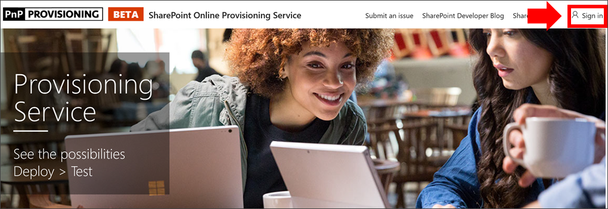

# Aprovisionar Learning

Con el SharePoint de aprovisionamiento en línea, un administrador Office 365 inquilino puede iniciar el proceso de aprovisionamiento con unos pocos clics. El servicio de aprovisionamiento es la forma recomendada de aprovisionar las Learning. Es rápido, fácil y tarda solo unos minutos en iniciar el proceso. Sin embargo, antes de empezar a usar el servicio de aprovisionamiento, asegúrese de que ha cumplido los requisitos previos para el aprovisionamiento.

## Requisitos previos
 
Para configurar correctamente los Learning personalizados con el servicio de [aprovisionamiento SharePoint servicio](https://provisioning.sharepointpnp.com)de aprovisionamiento en línea , la persona que realiza el aprovisionamiento debe cumplir los siguientes requisitos previos: 
 
- La persona que aprovisiona la Learning debe ser un administrador de inquilinos del espacio empresarial donde se aprovisionarán Learning personalizados.  
- Un catálogo de aplicaciones de inquilino debe estar disponible en la opción Aplicaciones del Centro SharePoint administración. Si su organización no tiene un catálogo de aplicaciones SharePoint inquilino, consulte la documentación [SharePoint Online](/sharepoint/use-app-catalog) para crear uno.  
- La persona que aprovisiona Learning debe ser un propietario de la colección de sitios del Catálogo de aplicaciones de inquilino. Si la persona que aprovisiona el Learning no es un propietario de la colección de sitios del Catálogo de [aplicaciones, complete estas instrucciones](addappadmin.md) y continúe. 

### Para aprovisionar datos personalizados Learning

1. Vaya a e inicie sesión desde la esquina superior http://provisioning.sharepointpnp.com derecha de la página principal.   Inicie sesión con las credenciales del inquilino de destino donde tiene previsto instalar la plantilla de sitio.

2. Desactive el **consentimiento en nombre de su organización** y seleccione **Aceptar**.

   

3. Seleccione **Custom Learning para Office 365** de la galería de soluciones.

   

4. En la página principal de la solución, **seleccione Agregar a su inquilino**

      

5. Rellene los campos de la página de información de aprovisionamiento según corresponda para su instalación. Como mínimo, escriba la dirección de correo electrónico en la que desea obtener notificaciones sobre el proceso de aprovisionamiento y la dirección URL de destino del sitio al que se aprovisionará.  
   > [!NOTE]
   > Haga que la dirección URL de destino del sitio sea algo descriptivo para sus empleados, como "/sites/MyTraining" o "/teams/LearnOffice365".

   

6. Seleccione **Aprovisionar** cuando esté listo para instalar Learning personalizados en el entorno de inquilino.  El proceso de aprovisionamiento tardará 15 minutos como máximo. Recibirá una notificación por correo electrónico (en la dirección que haya introducido en la página de aprovisionamiento para recibir notificaciones) cuando el sitio esté preparado para el acceso.

> [!IMPORTANT]
> El administrador de inquilinos que aprovisiona el sitio Learning personalizado debe ir al sitio y, a continuación, abrir CustomLearningAdmin.aspx para inicializar las propiedades de administrador Learning personalizadas. En este momento, el administrador de inquilinos también debe asignar propietarios al sitio. 

## Validar el éxito del aprovisionamiento

Una vez completado el aprovisionamiento, el administrador de inquilinos recibe un correo electrónico del servicio de aprovisionamiento pnP. El administrador puede copiar el vínculo al sitio proporcionado en el correo electrónico y, a continuación, seguir las instrucciones para ir al sitio. Como alternativa, el administrador de inquilinos puede navegar a YOUR-SITE-COLLECTION-URL/SitePages/CustomLearningAdmin.aspx. Esto inicializa el elemento de lista CustomConfig que configura custom Learning para su primer uso. La persona que abre esta página por primera vez debe ser un administrador de inquilinos, un administrador de la colección de sitios o el propietario del sitio. Debería ver una página con este aspecto: 

## Agregar propietarios al sitio
Como administrador de inquilinos, es poco probable que seas la persona que personalización del sitio, por lo que tendrás que asignar propietarios al sitio. Los propietarios tienen privilegios administrativos en el sitio para que puedan modificar las páginas del sitio y cambiar el nombre del sitio. También tienen la capacidad de ocultar y mostrar el contenido entregado a través del elemento Learning web personalizado. También tendrán la capacidad de crear listas de reproducción personalizadas y asignarlas a subcategorías personalizadas.  

1. En el menú SharePoint **Configuración,** haga clic en **Permisos del sitio**.
2. Haga **clic en Permisos Configuración**.
3. Haga **clic Aprendizaje personalizado para Office 365 propietarios**.
4. Haga **clic en** Agregar nuevos usuarios a este grupo, agregue las personas que desea que sean  >  propietarios y, a continuación, haga clic en **Compartir**.

8. Haga clic **en la opción** Siguiente en la esquina superior derecha de la página para seguir el sitio.  
