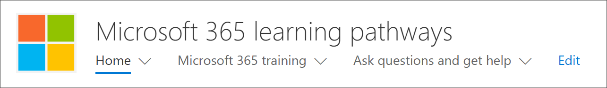
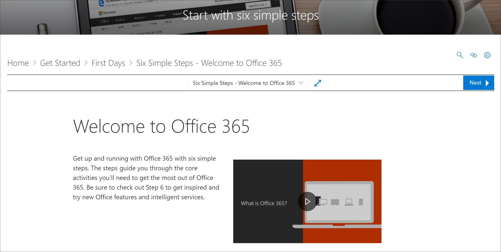

# ¿Dónde está el elemento Web de aprendizaje personalizado?Where's the Custom Learning web part?

Cuando se aprovisiona un aprendizaje personalizado en su organización, el sitio de aprendizaje personalizado y el elemento Web se agregan al espacio empresarial de SharePoint de la organización.When Custom Learning is provisioned in your organization, the Custom Learning site and web part are added to your organization’s SharePoint tenant. Como parte del aprovisionamiento, el elemento Web de aprendizaje personalizado se agrega a las siguientes páginas del sitio de aprendizaje personalizado:As part of the provisioning, the Custom Learning web part is added to the following pages of the Custom Learning site:

- Start-with-Six-Simple-Steps. aspxStart-with-Six-Simple-Steps.aspx 
- Recommended-Playlists. aspxRecommended-Playlists.aspx
- Get-Started with-Office 365. aspxGet-started with-Office 365.aspx
- Get-started-with-Microsoft-Teams. aspxGet-started-with-Microsoft-Teams.aspx
- Get-started-with-OneDrive. aspxGet-started-with-OneDrive.aspx
- Get-started-with-SPO. aspxGet-started-with-SPO.aspx

Para cada página, el elemento Web se configura de forma diferente para mostrar las categorías, subcategorías, listas de reproducción o activos diseñados para admitir la intención de la página.For each page, the Web part is configured differently to show the categories, subcategories, playlists or asset designed to support the intent of the page. El elemento Web de aprendizaje personalizado, como le mostraremos en secciones posteriores, se puede Agregar a casi cualquier página de SharePoint y filtrar para mostrar todas las categorías, o subcategorías, listas de reproducción o simplemente activos específicos.The Custom Learning web part, as we’ll show you in later sections, can be added to just about any SharePoint page and filtered to show specific all categories, or subcategories, playlists, or just assets. Vamos a echar un vistazo.Let's take a look. 

## Ver listas de reproducción de Microsoft TeamsView Microsoft Teams playlists

Este es un ejemplo de la página Introducción a **Microsoft Teams** con el elemento Web filtrado para mostrar las listas de reproducción de aprendizaje para Teams.Here’s an example of the **Get Started with Microsoft Teams** page with the Web part filtered to show the learning playlists for Teams. 

- En la Página principal de aprendizaje personalizado, seleccione Introducción **a Microsoft Teams**.From the Custom Learning Home page, select **Get started with Microsoft Teams**.

- Haga clic en el menú **Inicio** en el menú del sitio de aprendizaje personalizado para volver a la Página principal del sitio.Click the **Home** menu on the Custom Learning site menu to return to the site Home page.

## Ver la lista de reproducción de los seis pasos sencillosView the Six Simple Steps playlist

El elemento Web de la página **Start-with-Six-simple-Steps. aspx** está configurado para mostrar el primer recurso de la lista de reproducción de seis pasos sencillos.The web part on the **Start-with-Six-Simple-Steps.aspx** page is configured to show the first asset in the Six Simple Steps playlist. 

- En la Página principal de aprendizaje personalizado, haga clic en **comenzar con seis pasos sencillos**.From the Custom Learning Home page,  click **Start with six simple steps**. 

## Ver todo el aprendizaje de Office 365View all Office 365 training

El elemento Web de la página de **aprendizaje de Office 365** está configurado para mostrar todas las categorías y subcategorías disponibles en el catálogo de aprendizaje personalizado.The Web part on the **Office 365 training** page is configured to show all the categories and subcategories available from the Custom Learning catalog. Esto incluye las subcategorías de Microsoft junto con las subcategorías que cree para su organización.This includes subcategories from Microsoft along with any subcategories that you create for your organization.

- En la Página principal de aprendizaje personalizado, haga clic en **Office 365 Training**.From the Custom Learning Home page, click **Office 365 training**. Aparece la página con el elemento web configurado para mostrar todas las categorías y subcategorías disponibles en el catálogo de aprendizaje personalizado.The page appears appears with the Web part configured to show all the categories and subcategories available from the Custom Learning catalog.

- Haga clic en el menú **Inicio** en el menú del sitio de aprendizaje personalizado para volver a la Página principal del sitio.Click the **Home** menu on the Custom Learning site menu to return to the site Home page.

