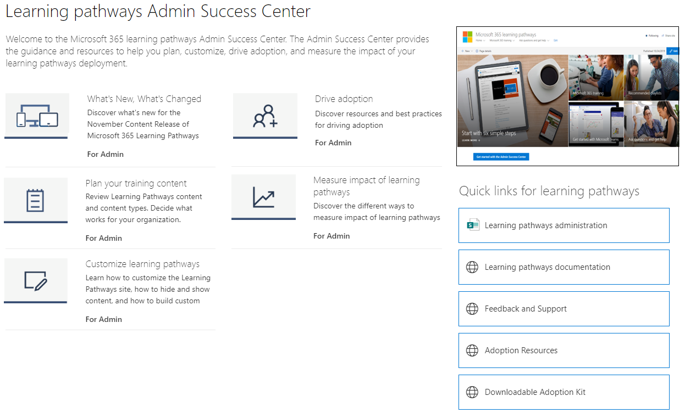

# ¿Dónde está el elemento web de formas de aprendizaje de Microsoft 365? 

Cuando las rutas de aprendizaje se aprovisionan en la organización, el sitio y el elemento web de las rutas de aprendizaje se agregan al inquilino de SharePoint de la organización. Como parte del aprovisionamiento, el elemento web de aprendizaje de Microsoft 365 se agrega a las páginas siguientes del sitio de rutas de aprendizaje de Microsoft 365:

- Start-with-Six-Simple-Steps.aspx 
- Recommended-Playlists.aspx
- Introducción a-Office 365.aspx
- Get-started-with-Microsoft-Teams.aspx
- Get-started-with-OneDrive.aspx
- Get-started-with-SharePoint.aspx
- Caminos de aprendizaje Centro de éxito de administración.aspx

Para cada página, el elemento web se configura de forma diferente para mostrar las categorías, subcategorías, listas de reproducción o activos diseñados para admitir el propósito de la página. El elemento web caminos de aprendizaje, como le mostraremos en secciones posteriores, se puede agregar a casi cualquier página de SharePoint y filtrarse para mostrar categorías, subcategorías, listas de reproducción o simplemente activos específicos. Echemos un vistazo. 

## Ver listas de reproducción de Microsoft Teams

Este es un ejemplo de la página Introducción a **Microsoft Teams** con el elemento web filtrado para mostrar las listas de reproducción de aprendizaje de Teams. 

- En la página principal de caminos de aprendizaje, seleccione **Introducción a Microsoft Teams**.

- Haga clic **en el menú** Inicio del menú del sitio caminos de aprendizaje para volver a la página principal del sitio.

## Ver la lista de reproducción Seis pasos simples

El elemento web de la **página Start-with-Six-Simple-Steps.aspx** está configurado para mostrar el primer activo de la lista de reproducción Seis pasos simples. 

- En la página principal de caminos de aprendizaje, haga clic **en Inicio con seis pasos sencillos.** 

## Ver todo el aprendizaje de Microsoft 365

El elemento web de la página de aprendizaje **de Microsoft 365** está configurado para mostrar todas las categorías y subcategorías disponibles en el catálogo de rutas de aprendizaje. Esto incluye subcategorías de Microsoft junto con las subcategorías que cree para su organización.

- En la página principal de caminos de aprendizaje, haga clic **en Aprendizaje de Microsoft 365**. La página aparece con el elemento web configurado para mostrar todas las categorías y subcategorías disponibles en el catálogo de aprendizaje personalizado.

- Haga clic **en el menú** Inicio del menú del sitio caminos de aprendizaje para volver a la página principal del sitio.

## Ver el elemento web en la página Centro de éxito de administración

El elemento web de la página Centro de **éxito** de administración está configurado para filtrar todas las listas de reproducción disponibles para el Centro de éxito de administración. Como se muestra en el ejemplo siguiente, el elemento web se agrega a una página que también contiene vínculos rápidos a recursos de administración. 

- En la página principal de caminos de aprendizaje, haga clic **en Introducción al Centro de éxito de administración.** . 

- Haga clic **en el menú** Inicio del menú del sitio caminos de aprendizaje para volver a la página principal del sitio.

