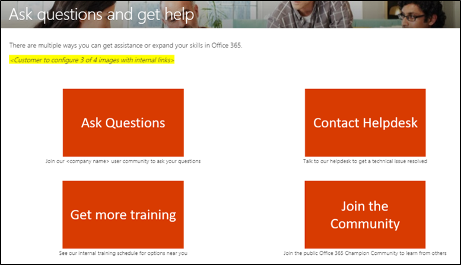
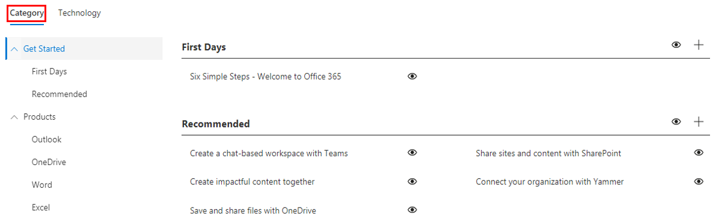

# Personalización de la experiencia de aprendizajeCustomize the Training Experience

Se trata de una prueba de cuatro.This is a test four. De forma predeterminada, la experiencia del sitio y el elemento Web incluyen contenido para todos los servicios de Office 365 y Windows 10.By default both the site experience and the webpart include content for all Office 365 and Windows 10 services.  Si solo todos o algunos de estos servicios están disponibles en su empresa, puede ajustar el contenido que estará disponible para los usuarios.If only all or some of these services are available in your company you can adjust what content is available to your users.  

Hay varios tipos de personalizaciones disponibles para los propietarios de este sitio.There are several kinds of customizations that are available to the owners of this site. 

- [Personalización de páginas webCustomize web pages](#customizing-web-pages)
- [Personalización de los servicios disponiblesCustomize available services](#customize-available-services)
- [Personalizar y compartir listas de reproducciónCustomize and share playlists](customplaylist.md)

Algunas o todas estas personalizaciones se pueden completar antes de iniciar el sitio en la comunidad de usuarios.Some or all of these customizations can be completed before you launch the site to your user community.  

> [!TIP]
> Recopilar comentarios de los empleados y completar periódicamente personalizaciones adicionales.Gather feedback from your employees and periodically complete additional customizations.  Agregue listas de reproducción, las páginas web de destino a roles específicos o Active el nuevo contenido de aprendizaje al iniciar nuevos servicios.Add playlists, target webpages to specific roles or turn on new training content when launching new services. 

## Personalización de páginas webCustomizing web pages

Puede personalizar completamente el sitio web de aprendizaje personalizado.You can fully customize the Custom Learning web site. Si no está familiarizado con la creación de páginas en sitios modernos de SharePoint Online, le sugerimos que revise [el artículo personalizar el sitio de SharePoint](https://support.office.com/article/customize-your-sharepoint-site-320b43e5-b047-4fda-8381-f61e8ac7f59b) en support.Office.com.If you are not familiar with creating pages within modern SharePoint Online sites we suggest you review [Customize your SharePoint site](https://support.office.com/article/customize-your-sharepoint-site-320b43e5-b047-4fda-8381-f61e8ac7f59b) article on support.office.com. 

### Personalizar la página **preguntas y obtener ayuda**Customize the **Ask Questions and Get Help** page

Como punto de partida para personalizar el sitio, seleccione formular preguntas y obtener ayuda en la barra de menús y, a continuación, haga clic en el botón Editar de SharePoint y cambie las imágenes y los vínculos.As a starting point for customizing the site, select Ask questions and get help from the menu bar, then click the SharePoint Edit button and change the images and the links. 

## Personalización de los servicios disponiblesCustomize available services

1.  Vaya a la página Administración de aprendizaje personalizada en el sitio Web Navigate to the Custom Learning Administration page within the website 
1. Seleccione **tecnología** para ver la lista completa de servicios incluidos en la solución.Select **Technology** to see the full list of services that are included in the solution
1. Seleccione una tecnología y **haga clic en el símbolo del ojo** para ocultar este contenido.Select a technology and **click the eye symbol** to hide this content.  Vuelva a hacer clic en el símbolo del ojo para mostrar el contenido de la experiencia.Click the eye symbol again to show the content within the experience. 

El mismo proceso puede repetirse en las categorías de listas de reproducción de la experiencia.The same process can be repeated for categories of playlists within the experience.  Simplemente, seleccione la opción categoría para mostrar u ocultar las listas de reproducción.Simply select the Category option to show/hide playlists. 

### Siguientes pasosNext Steps

- [Personalizar y compartir listas de reproducciónCustomize and Share Playlists](customplaylist.md)
- [Fomentar el usoDrive Adoption](driveadoption.md) 