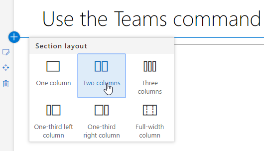
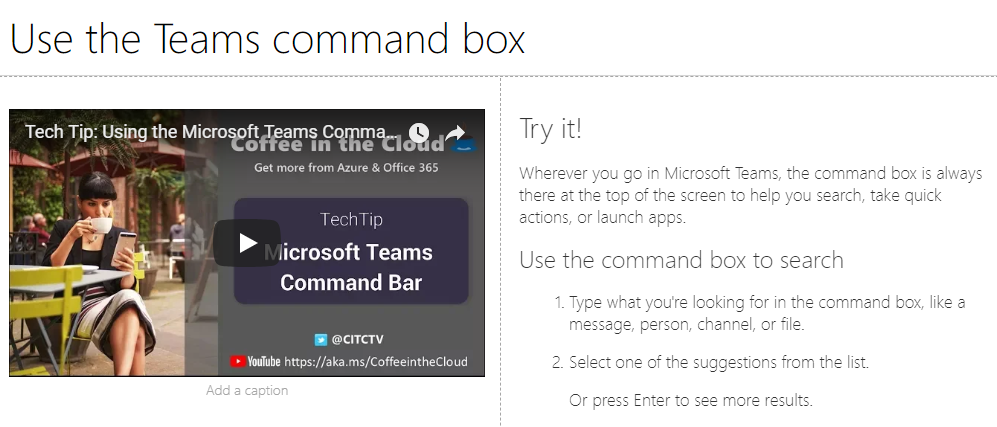
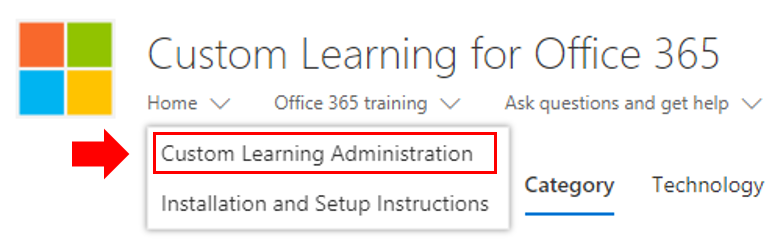
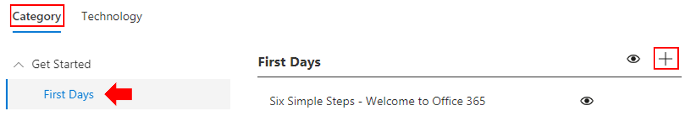
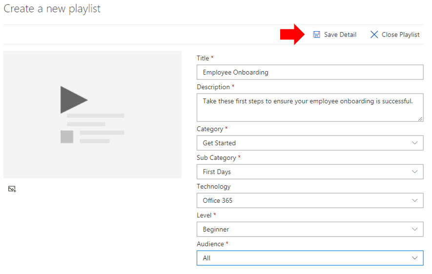
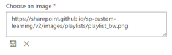
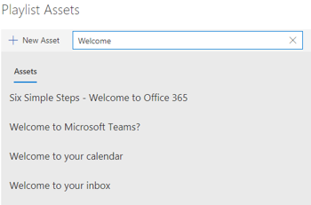
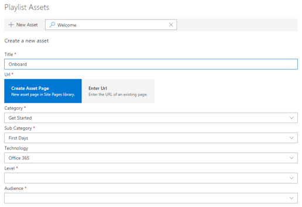

# Personalizar y compartir listas de reproducción

## Crear una lista de reproducción

Una lista de reproducción es una conformidad de "activos". Un "activo" es una página de SharePoint o un elemento existente del contenido de aprendizaje de Microsoft. Cuando se crea una lista de reproducción, se seleccionan los activos que van juntos para crear una ruta de aprendizaje para el usuario.  

La ventaja de agregar páginas de SharePoint es que puede crear páginas de SharePoint con vídeos o vídeos de YouTube hospedados en la organización. También puede crear páginas con formularios u otro contenido de Office 365.  

#### Paso 1: crear una página de SharePoint para la lista de reproducción
En este ejemplo, primero crearemos una página de SharePoint para agregarla a la lista de reproducción. Crearemos una página con un elemento Web de vídeo de YouTube y un elemento Web de texto.  En estas instrucciones se da por sentado que usa el servicio de SharePoint Online. 

#### Crear una nueva página
1.  Seleccione el menú configuración > contenidos del sitio > páginas del sitio > nueva página del sitio de >.
2.  En el área título, escriba usar el cuadro de comandos de Microsoft Teams.
3.  Seleccione Agregar una sección nueva y, a continuación, seleccione dos columnas.

4.  En el cuadro de la izquierda, seleccione Agregar un nuevo elemento Web y, a continuación, seleccione incrustar. 
5.  En un explorador Web, vaya a esta dirección https://youtu.be/wYrRCRphrp0 URL y obtenga el código para insertar para el vídeo. 
6.  En el elemento Web de SharePoint, seleccione Agregar código para insertar y, a continuación, péguelo en el cuadro insertar. 
7.  En el cuadro derecho, seleccione Agregar un nuevo elemento Web y, a continuación, seleccione texto. 
8.  En un explorador Web, vaya a esta dirección URL https://support.office.com/en-us/article/13c4e429-7324-4886-b377-5dbed539193b : y copie el bloque de! Instrucciones de la página y pegarlas en el elemento Web de texto. La página debe tener un aspecto similar al siguiente. 

9.  Haga clic en **publicar**y, a continuación, copie la dirección URL de la página y péguela en el Bloc de notas

#### Paso 2: crear la lista de reproducción

1. Navegue a la página de **Administración de aprendizaje personalizada** en la experiencia del sitio. 
1. Asegurarse de que la **categoría** está seleccionada 
1. Haga clic en la categoría en la que desea que aparezca la nueva lista de reproducción
1. Junto al nombre de la categoría, haga clic en el 

1. ReLlene los valores como se muestra en el ejemplo siguiente y seleccione **crear**. 
- **Título** : nombre para mostrar de la lista de reproducción
- **Descripción** : información sobre lo que se aprenderá
- **Categoría** : preseleccionado en función de la selección inicial
- **Subcategoría** : preseleccionado en función de la selección inicial
- **Tecnología** : seleccionar según corresponda
- **Nivel** : principiante, Intermidate o avanzado
- **Audiencia** : Esto permite destinar contenido en función de una lista predefinida de roles proporcionados por Microsoft.

6. Haga clic en **Guardar detalle**

> [!TIP]
> Puede personalizar la imagen del icono de la lista de reproducción.  Haga clic en el icono de imagen e inserte una dirección URL de una imagen previamente cargada.  Asegúrese de que la imagen se encuentra dentro de la colección de sitios de aprendizaje personalizada o en otra ubicación en la que todos los usuarios tendrán acceso al archivo.  

#### Paso 3: agregar activos a la lista de reproducción
En este paso, agregará los activos existentes de Microsoft y la página de SharePoint que ha creado a la lista de reproducción. 

1. Una vez que haya guardado los detalles de la lista de reproducción, puede usar la búsqueda de activos existentes.
1. **Escriba un término de búsqueda** para ver una lista de activos predefinidos que están disponibles desde otras listas de reproducción. **Haga clic en el nombre** de un activo para incluirlo en la nueva lista de reproducción. 

También puede Agregar la página de SharePoint que creó anteriormente o crear una a partir de cero en la experiencia.

1. Haga clic en la opción **nuevo activo** en el cuadro de diálogo activos de la lista de reproducción
1. Asigne un **título**al activo. Una vez escritas, las opciones 
1. Ahora puede crear una nueva página de activos en SharePoint Online o especificar en la dirección URL de una página existente para agregarla a la lista de reproducción personalizada. 
1. **** Los campos Category, **Sub Category** y **Technology** se rellenarán previamente en función de las selecciones anteriores de esta lista de reproducción.
1. Realice las selecciones adecuadas para nivel y audiencia para este activo individual.  
1. Haga clic en **Guardar activo** para agregarlo a la lista de reproducción personalizada
1. Repita estos pasos, ya sea buscando o agregando páginas individuales, hasta que la lista de reproducción haya finalizado. 
1. Haga clic en **cerrar lista de reproducción** para guardar

La lista de reproducción con este contenido estará ahora disponible en cualquier lugar en el que haya instalado o incrustado el elemento Web de aprendizaje personalizado. 

> [!NOTE]
> Si comete un error después de cerrar la lista de reproducción, puede eliminarla de la categoría haciendo clic en la X junto al nombre de la lista de reproducción.  

#### Cosas que debe considerar

Las listas de reproducción personalizadas se pueden usar para ayudar a los usuarios finales en diversas tareas.  ¿Tiene un formulario de solicitud de tiempo de espera?  Un formulario para solicitar equipamiento de hardware?  Los activos de formación existentes se pueden programar en la experiencia.  

## Compartir listas de reproducción

1. Navegar a cualquier lista de reproducción de la experiencia del elemento Web o del sitio
1. En la esquina superior izquierda verá tres iconos
1. Haga clic en el icono que representa un vínculo
1. Copiar la dirección URL a la lista de reproducción

 ahora, esta dirección URL puede insertarse en la navegación del sitio o usarse en otras comunicaciones para llevar a sus empleados directamente a esa lista de reproducción. 

### Pasos siguientes: [impulsar la adopción](driveadoption.md)
