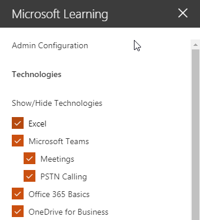

# Personalizar los servicios y las listas de reproducción

De forma predeterminada la experiencia del sitio y el elemento Web incluyen contenido para todos los servicios de Office 365.  Si sólo hay todos o algunos de estos servicios están disponibles en su compañía puede ajustar el contenido que está disponible para los usuarios.  En este artículo se va a personalizar el contenido del elemento Web.  

## Personalizar el contenido del elemento Web

El elemento Web de aprendizaje personalizado proporciona dos características claves:
- Mostrar u ocultar tecnologías
- Crear una lista de reproducción

### Ocultar o mostrar categorías de tecnología

Para ocultar y mostrar el contenido en el elemento Web: 
1.  Haga clic en el menú desplegable en el elemento Web, a continuación, haga clic en Mostrar u ocultar tecnologías

2. Seleccione un checkox para ocultar o mostrar una tecnología y seleccione **Aplicar**.

### Crear una lista de reproducción

Una lista de reproducción es un compliation de "activos". Un "activo" es una página de SharePoint o un elemento existente de contenido de aprendizaje de Microsoft. Cuando se crea una lista de reproducción seleccione los activos que van conjuntamente para crear una ruta de aprendizaje para el usuario.  

La ventaja de la adición de las páginas de SharePoint es que puede crear las páginas de SharePoint con un YouTube vídeos o vídeos que se hospeda en su organización. También puede crear las páginas con formularios u otro contenido de Office 365.  

#### Paso 1: Crear una página de SharePoint para la lista de reproducción
En este ejemplo, crearemos en primer lugar una página de SharePoint para agregar a la lista de reproducción. Crearemos una página con un elemento web de vídeo de YouTube y el elemento web de texto.  Estas instrucciones suponen que está utilizando el servicio de SharePoint Online. 

#### Crear una nueva página
1.  Seleccione la configuración menú > contenidos del sitio > las páginas del sitio > nuevo > página del sitio.
2.  En el área de título, escriba Use el cuadro de comando de los equipos
3.  Seleccione la sección Agregar una nueva y, a continuación, seleccione dos columnas.

4.  En el cuadro izquierdo, seleccione Agregar un nuevo elemento web y, a continuación, seleccione incrustar. 
5.  En un explorador Web, vaya a esta dirección URL https://youtu.be/wYrRCRphrp0 y obtener el código para insertar el vídeo. 
6.  En el elemento SharePoint Web, seleccione Agregar incrustar código y, a continuación, péguelo en el cuadro Insertar. 
7.  En el cuadro de la derecha, seleccione Agregar un nuevo elemento web y, a continuación, seleccione texto. 
8.  En un explorador Web, vaya a esta dirección URL: https://support.office.com/en-us/article/13c4e429-7324-4886-b377-5dbed539193b y copie el bloque Try se! Instrucciones de la página y péguelas en el elemento Web de texto. La página debe tener un aspecto similar al siguiente. 

9.  Haga clic en publicar y, a continuación, copie la dirección URL de la página y péguelo en el Bloc de notas

#### Paso 2: Crear la lista de reproducción
1.  Vaya a donde ha instalado el elemento Web de aprendizaje personalizado. En la experiencia del sitio completo está hospedado en la página de recursos de aprendizaje de Office 365. 
2.  En el menú desplegable, seleccione Crear nueva lista de reproducción. 

3.  Rellene los valores como se muestra en el ejemplo siguiente y seleccione **crear**. 

#### Paso 3: Agregar activos a la lista de reproducción
En este paso, agregará los activos existentes de Microsoft y la página de SharePoint que creó para la lista de reproducción. 

1.  Haga clic en el botón menú y, a continuación, haga clic en Agregar activo existente.

2.  Filtrar en aplicaciones de Office 365 > formación de equipos de Microsoft
3.  Agregar Welcome to Microsoft Teams, obtener su equipo y en funcionamiento e iniciar chats y realizar llamadas.
4.  Seleccione el menú botón > crear activos.
5.  Tipo de utilizar el cuadro de comando de los equipos en el cuadro Título de activos. 
6.  Pegue el uso de SharePoint la URL de página del cuadro del comando de los equipos que copió en el campo de contenido activo. 
7.  Navegar a la > de las listas de reproducción personalizadas de página principal > ahora su primer días con los equipos > utilizar el cuadro de comando de los equipos. La página debe tener un aspecto similar al siguiente. 

La lista de reproducción con este contenido ahora estará disponible en cualquier lugar tiene instalado / incrustado el elemento Web de aprendizaje personalizado. 

#### Aspectos a tener en cuenta

Listas de reproducción personalizadas se pueden usar para ayudar a los usuarios finales en un vareity de tareas.  ¿Dispone de un tiempo desactiva el formulario de solicitud?  ¿Un formulario para solicitar equipamiento de hardware?  Los activos de aprendizaje existentes se pueden programar en la experiencia.  
