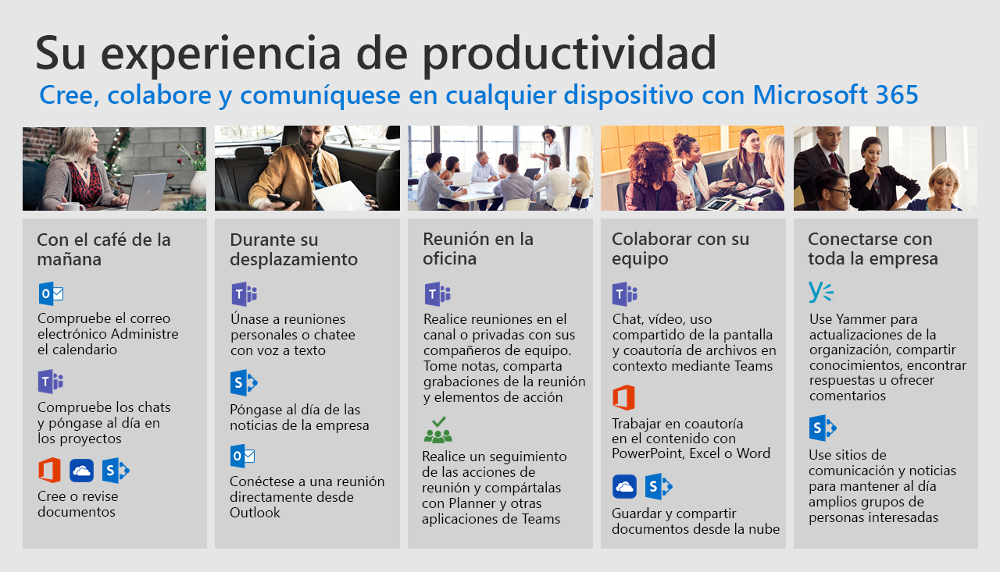

# Día de la vida con Office 365Day in the Life with Office 365

Use los servicios en la nube de Office 365 para mejorar el trabajo en equipo en cualquier dispositivo.  Realice los pasos necesarios para simplificar la colaboración, la comunicación y la creación de contenido a medida que avanza por el día.Use Office 365 cloud services to improve your teamwork on any device.  Take steps to streamline your collaboration, communication and content creation as you go through your day.  

Siga estos escenarios comunes para obtener más información sobre cómo mejorar la productividad con Office 365.Follow us through these common scenarios to learn more about improving your productivity with Office 365.

- [Durante la mañanaDuring morning coffee](ditl_coffee.md)
- [En el AutomuteOn your commute](ditl_commute.md)
- [Reunión en la oficinaMeeting at the office](ditl_meeting.md)
- [Colaborar con su equipoCollaborating with your team](ditl_collab.md)
- [Conexión a través de la compañíaConnecting across the company](ditl_connect.md)

> [!TIP]
> Si no tiene algunos de los productos que se muestran en nuestros ejemplos en su experiencia de Office 365 hable con su administrador que puede ayudarle a obtener acceso a nuestros servicios.If you do not have some of the products shown in our examples in your experience of Office 365 speak to your administrator who can help you get access to our services. 