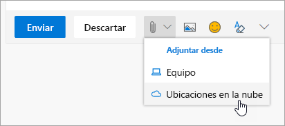

# Colaborar con compañerosCollaborating with Colleagues

Es 2:00 PM y la hora de colaborar con compañeros.It's 2:00 PM and time to collaborate with colleagues. Office 365 ofrece las mejores oportunidades para la colaboración, lo que permite a Microsoft Teams trabajar juntos de varias formas.Office 365 provides best-in-class opportunities for collaboration, enabling teams to work together in a number of ways. 

## HerramientasTools
- Microsoft TeamsMicrosoft Teams
- Office OnlineOffice Online
- OneNoteOneNote
- SharePoint & OneDriveSharePoint & OneDrive
- 
## Lista de comprobación para colaborar con compañerosChecklist for collaborating with colleagues
- Crear un equipo de Microsoft o unirse a él para colaborarCreate or join a Microsoft Team to collaborate
- Crear y compartir archivos desde OneDriveCreate and share files from OneDrive 
- Co-crear en Office 365Co-create in Office 365 
- Usar datos adjuntos de la nubeUse cloud attachments

## Crear un equipo de Microsoft o unirse a él para colaboraciónCreate or join a Microsoft Team for collaboration

Microsoft Teams y los canales son lugares donde los usuarios pueden colaborar compartiendo archivos, realizando un seguimiento de los elementos de acción del equipo y mucho más.Microsoft Teams and channels are places where people can collaborate by sharing files, tracking team action items and much more. Todos los equipos de Microsoft Teams tienen una integración en un sitio de SharePoint, un bloc de notas de OneNote y otros activos.Every Microsoft Teams has an integration into a SharePoint site, a OneNote notebook and other assets. Este servicio de Office 365 es el más adecuado para los usuarios que trabajan juntos con frecuencia en proyectos compartidos o en resultados.This service of Office 365 is best used for people who work together frequently on shared projects or outcomes. 

## Compartir archivos desde su OneDriveShare Files from your OneDrive
Los archivos que se guardaron en OneDrive para la empresa se pueden compartir con cualquier usuario desde el explorador o desde aplicaciones de escritorio de Office 365, como Word o Excel.Files that have been saved on OneDrive for Business can be shared with anyone either from the browser or Office 365 desktop applications like Word or Excel. Se puede compartir con personas que usen su nombre, alias o dirección de correo electrónico de la compañía.It is possible to share with individuals using their name, alias, or company email address. 

## Co-crear en Office 365Co-create in Office 365
La creación conjunta es cuando se trabaja simultáneamente con colegas en el mismo archivo.Co-creation is when we work simultaneously with colleagues on the same file. Esto es posible en las versiones basadas en Web de las aplicaciones principales de Office 365 y en las versiones de escritorio de esas aplicaciones desde Office 2016 o superior.This is possible in the web-based versions of the core Office 365 apps and in the desktop versions of those applications from Office 2016 onward.  Ahorrar tiempo y trabajar juntos en el mismo documento y Office sincronizará los cambios por usted, incluso si uno de los dos está sin conexión.Save time and work together on the same document and Office will synchronize those changes for you, even if one of you is offline. 

## Usar datos adJuntos de la nube-dejar de enviar la hoja de cálculo.Use Cloud Attachments - Stop Emailing that Spreadsheet!
¿Cuántas veces tuvo que buscar la versión correcta de un documento cuando se adjuntó a un correo electrónico?How many times have you had to hunt for the right version of a document when it was attached to an email? Ahora, en Office 365, puede compartir un vínculo al archivo, denominado "datos adjuntos en la nube", para que todos los usuarios editen la misma versión.Now in Office 365 you can share a link to the file, called a cloud attachment, so that everyone is editing the same version.  Puede elegir entre enviar un vínculo y si los usuarios pueden ver o editar el archivo.You can chose to either send a link and whether or not people can view or edit the file. 

