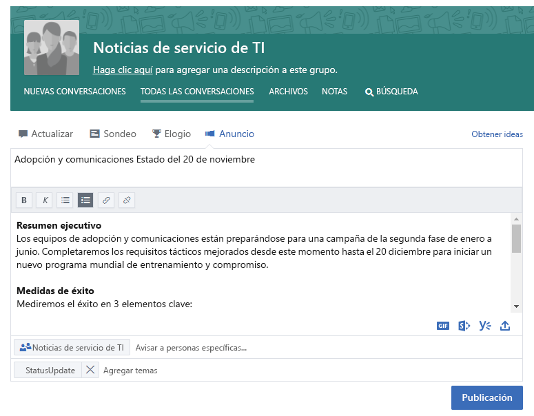
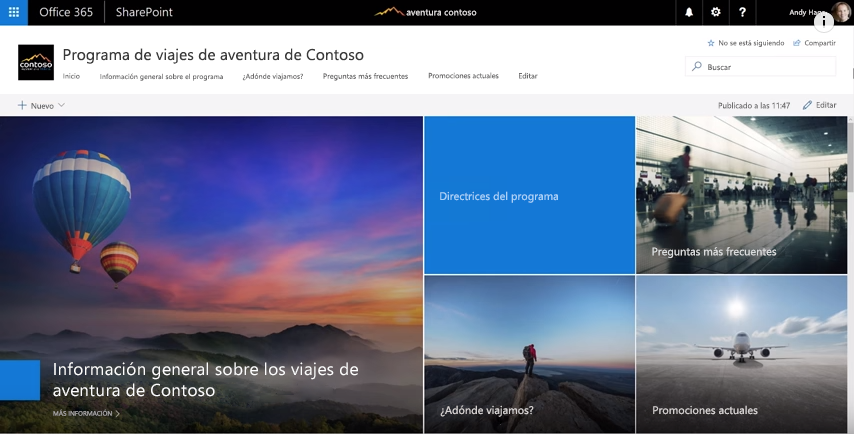
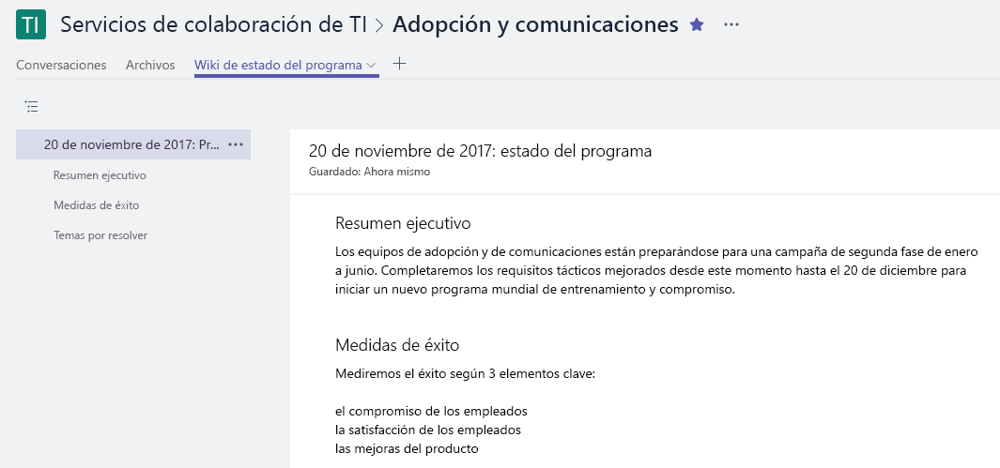

# Una conexión a través de toda la compañía

Ha sido un día muy ocupado, pero antes de salir de la oficina, debe asegurarse de que todas las personas interesadas en su trabajo estén informadas sobre lo que está sucediendo. Una parte importante de su trabajo es asegurarse de que todas las partes interesadas (dentro y fuera de su equipo) entiendan sus objetivos, progreso y resultados.  

## Herramientas
- SharePoint
- Yammer
- Outlook
- Microsoft Teams 

## Lista de comprobación para comunicarse en la compañía
- Entender a su audiencia y sus métodos de comunicación
- Los mensajes importante deben estar dirigidos a destinatarios según sus roles, por ejemplo, partes interesadas del proyecto, miembros del equipo o empleados
- Elegir herramientas de comunicación que se complementen entre sí, por ejemplo, si redacta una publicación para su comunidad de Yammer, envíe una alerta por correo electrónico  
- Redactar la información trabajando en coautoría con otras personas de su equipo
- Publicar la información y enviar una notificación a todas las partes interesadas 
 
## Seleccionar su método de comunicación
Use la siguiente información para decidir cuál es la mejor forma de comunicarse con su equipo. Equilibre el uso de nuevas tecnologías con anuncios de correo electrónico tradicionales mientras los usuarios se acostumbran a los nuevos métodos de comunicación. Tener un enfoque de comunicación coherente es una forma eficaz de impulsar el reconocimiento y los cambios en la organización. 

**Yammer**: puede fomentar la conversación en un amplio grupo de personas usando Yammer para compartir sus actualizaciones. Publique una actualización estándar o use la función Anuncios para asegurarse de que cada miembro reciba una copia de la actualización en su buzón. 

**SharePoint**: si desea ponerse en contacto con personas de fuera de su grupo de trabajo, considere la posibilidad de redactar un breve artículo sobre su estatuto y progreso que esté disponible en SharePoint Online a lo largo de lo que dure el proyecto. Use una página moderna en un sitio de grupo de SharePoint o, para programas más grandes, considere la posibilidad de crear un sitio de comunicación de SharePoint. 

Los sitios de comunicación de SharePoint ofrecen artículos de noticias que son visuales y flexibles y le permiten combinar imágenes, paneles y texto. La información estará disponible a través de cualquier explorador o a través de la aplicación móvil de SharePoint. Este video le dará una rápida introducción acerca de lo que estos potentes sitios pueden hacer. Para asegurarse de tener la mejor visibilidad posible, ancle el sitio de comunicación como una pestaña para el grupo de trabajo en Microsoft Teams.

**Microsoft Teams**: si este amplio grupo de personas ya forma parte de su grupo de trabajo en Microsoft Teams, ¿por qué no publicar una nota en su Canal general con los hechos clave y un vínculo a una página wiki con la actualización más detallada?  Las páginas wiki las pueden crear varias personas y mantenerse durante lo que dure el equipo. 

## Sugerencia para modernizar la comunicación

**Para los colegas que se enfocan más en el correo electrónico**: suscríbalos a las alertas de su grupo de Yammer o de la fuente de noticias de SharePoint.  Así recibirán una notificación en su correo electrónico cuando usted haya publicado nueva información y con un clic podrán llegar a la información de origen sin que usted tenga crear un correo electrónico diferente.  ¿Quiere ser chic?  Personalice las notificaciones con Microsoft Flow o PowerApps. Considere la posibilidad de hacer un almuerzo de trabajo para mostrarles a estos usuarios cómo usar Microsoft Teams, SharePoint o Yammer en sus dispositivos móviles. 

**¡Que todos hablen!** Fomente la participación activando los comentarios en las páginas del sitio de comunicación de SharePoint.  Si usa Yammer, asegúrese de que los usuarios participen en su comunidad chequeando periódicamente para responder las preguntas que pueda. 

**Comparta externamente**: Microsoft Teams, SharePoint y Yammer son compatibles con el uso compartido externo si el administrador lo permite en la instancia de Office 365.  Con el uso compartido externo puede compartir las actualizaciones con personas que trabajan para asociados, proveedores y, por supuesto, sus clientes.